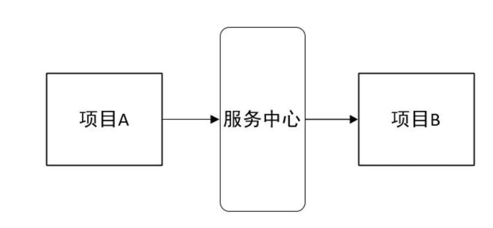
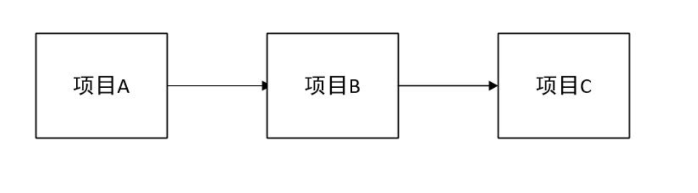

# eureka基础

## 1. 简介

Eureka 是 Netfix 开源的一款提供服务注册和发现的产品，他提供了完整的 Service Register 和Service Discovery实现。是SpringCloud 体系中最重要最核心的组件之一

## 2. 背景

### 2.1 服务中心

服务中心又称注册中心，管理各种服务功能包括服务的注册、发现、熔断、负载、降级等。

### 2.2 引入服务中心的变化

**情况1：项目A 调用项目B**

正常调用项目A 请求项目B

有了服务中心之后，任何一个服务都不能直接去调用，都需要服务中心来调用

**情况2：项目A 调用项目B,项目B 再调用项目C**

这时候调用的步骤就会分为两步

1. 第一步：项目A首先从服务中心请求项目B服务器

2. 第二步：项目B 再从服务中心请求项目C 服务

   

上面的项目只是两三个相互之间的简单调用，但是如果项目超过20个30个呢，画一张图来描述几十个项目之间的相互调用关系全是线条。任何其中一个项目改动，就会牵连好几个项目跟着重启，麻烦且容易出错

通过服务中心来获取服务，你**不需要关系调用的项目的IP 地址**，由几台服务器组成，**每次直接去服务中心获取可以使用的服务调用**就可以

## 3. Eureka

### 3.1 官方介绍

Eureka 是一个基于 REST 的服务，主要在AWS 云中使用，定位服务来进行中间层服务器的负载均衡和故障转移

### 3.2 介绍

Spring Cloud 封装了Netfix 公司开发的 Eureka 模块来实现服务注册与发现。

Eureka 采用了**C-S 的设计架构**，

- Eureka Server 作为服务注册功能的服务器，他是服务注册中心。
- 而系统中的其他微服务，使用Eureka 的客户端连接到Eureka Server ，并维持心跳连接

优势：

- 系统的维护人员就可以通过 Eureka Server 来监控系统中各个微服务是否正常运行
- Spring Cloud 的一些其他模块（Zuul）就可以通过 Eureka Server 来发现系统中的其他微服务，并执行相关逻辑

### 3.3 Eureka服务器和Eureka客户端

- Eureka 服务器：服务注册服务器

- Eureka 客户端：是一个java 客户端，用来简化与服务器的交互，作为轮询负载均衡器，并提供服务的故障切换支持。

### 3.4 Eureka 基本架构

上图简要描述了Eureka 的基本架构，由3个角色组成

1. Eureka Server

   - 提供服务注册和发现

2. Service Provider

   - 服务提供方

   - 将自身服务注册到Eureka，从而使服务消费放能够找到

3. Service coNSUMER

   - 服务消费放
   - 从Eureka获取注册服务列表，从而能够消费服务

   

## 参考文章

[springcloud(二)：注册中心Eureka](http://www.ityouknow.com/springcloud/2017/05/10/springcloud-eureka.html)