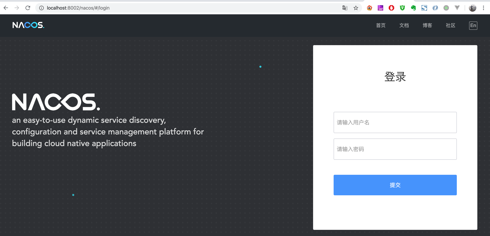

# nacos安装与使用

## 1. 下载最新版的Nacos

[官方下载地址](https://github.com/alibaba/nacos/releases)


## 2.解压

- 解压后的bin 目录下就是启动和关闭脚本

- conf下为nacos的配置文件
- target目录下为nacos的fat jar


## 3. 修改配置（可选）

修改conf/application.properties配置文件

例如：将应用端口改为8001

```
server.port=8001
```

## 4. 新建数据库

使用Navicat新建一个MySQL数据库，名字为febs_nacos：


然后导入[febs_nacos.sql](https://github.com/wuyouzhuguli/FEBS-Cloud/blob/master/febs-cloud/sql/febs_nacos.sql) SQL脚本，导入后，数据库表如下图所示:


接着修改nacos解压包目录下conf/application.properties配置文件，添加如下配置：

```
spring.datasource.platform=mysql
db.num=1
db.url.0=jdbc:mysql://localhost:3306/febs_nacos?characterEncoding=utf8&connectTimeout=1000&socketTimeout=3000&autoReconnect=true
db.user=root
db.password=123456
```

`spring.datasource.platform`指定数据库的类型，这里为mysql，`db.num`指定数据库的个数（nacos支持多数据源，比如MySQL主从），剩下的配置为数据库配置。

## 5. 启动

- Linux

  - 单机启动

    ```
	  sh startup.sh -m standalone
    ```

- Windowns

  修改好application.properties配置后，双击bin/startup.cmd启动nacos服务端

## 6.浏览

启动后使用浏览器访问：http://localhost:8001/nacos



默认*账号*:*nacos* 默认*密码*:*nacos*


## 7. 关闭服务

```
sh shutdown.sh
```

