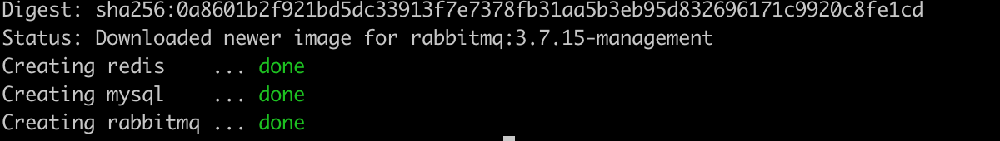
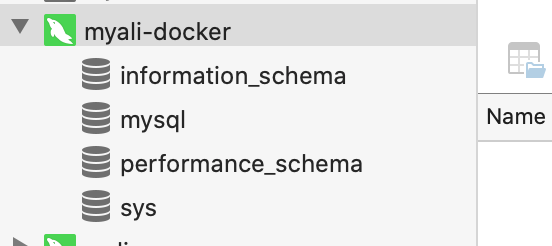
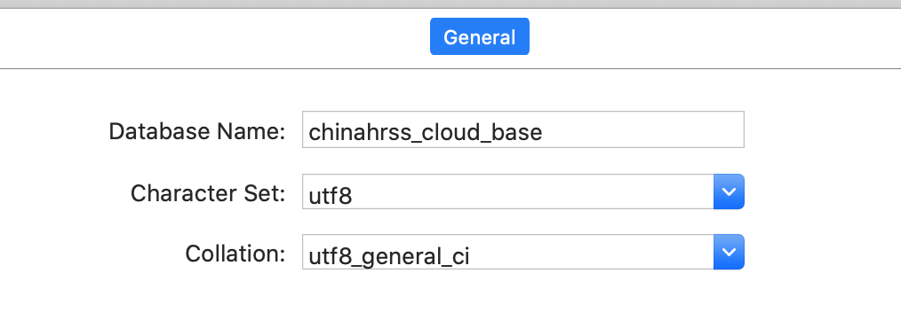
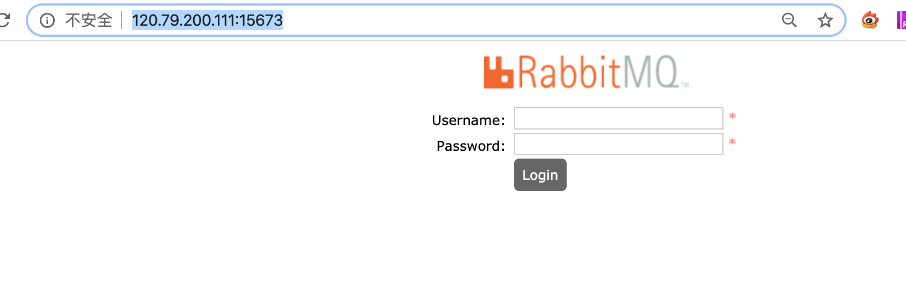
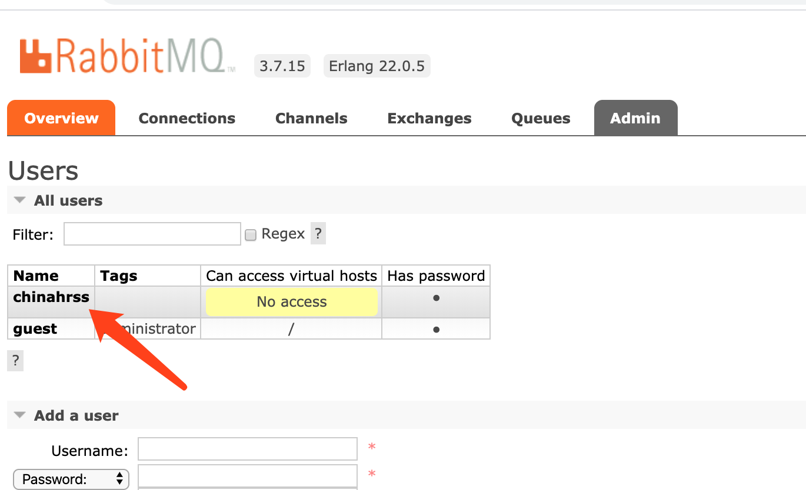
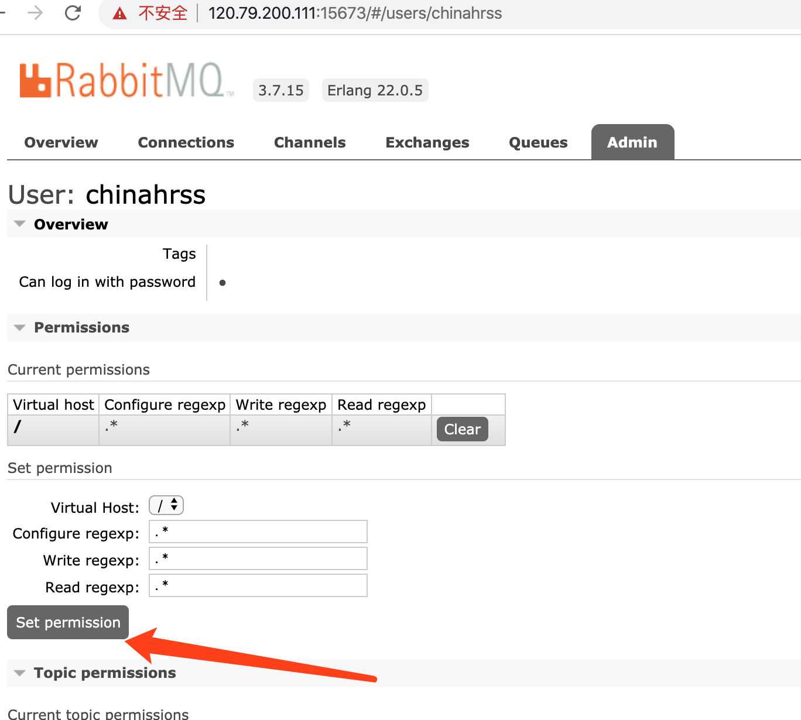

# chinahrss使用Docker Compose部署

我们使用Docker Compose 一键部署我们的微服务。主要分为三部分: 

- 部署ELK
- 部署第三方服务（MySQL、Redis和RabbitMQ）
- 部署自己编写的微服务

## 2. 部署第三方服务

### 2.1 创建存储第三方服务Docker Compose文件目录：

```
mkdir -p /chinahrss/third-part
```

### 2.2 新建docker-compose.yml文件

在该目录下新建一个docker-compose.yml文件：

```
vim /chinahrss/third-part/docker-compose.yml
```

内容如下

```
version: '3'

services:
  mysql:
    image: mysql:5.7.24
    container_name: mysql
    environment:
      MYSQL_ROOT_PASSWORD: 123456
    ports:
      - 13306:3306
    volumes:
      - /chinahrss/mysql/data:/var/lib/mysql #挂载 MySQL数据
  redis:
    image: redis:4.0.14
    container_name: redis
    command: redis-server /usr/local/etc/redis/redis.conf --appendonly yes
    volumes:
      - /chinahrss/redis/data:/data #挂载 Redis数据
      - /chinahrss/redis/conf/redis.conf:/usr/local/etc/redis/redis.conf #挂载 Redis配置
    ports:
      - 16379:6379
  rabbitmq:
    image: rabbitmq:3.7.15-management
    container_name: rabbitmq
    volumes:
      - /chinahrss/rabbitmq/data:/var/lib/rabbitmq #挂载 RabbitMQ数据
      - /chinahrss/rabbitmq/log:/var/log/rabbitmq #挂载 RabbitMQ日志
    ports:
      - 5673:5672
      - 15673:15672
```

因为原有的端口都被占用了，我改了端口。

- mysql：13306
- Redis：16379
- rabbitmq：5673 和 15673

### 2.3 创建挂载目录

```
mkdir -p /chinahrss/mysql/data /chinahrss/redis/data /chinahrss/redis/conf \
 /chinahrss/rabbitmq/data /chinahrss/rabbitmq/log
```

### 2.4 创建Redis配置文件`redis.conf`：

```
touch /chinahrss/redis/conf/redis.conf
```

因为我使用的是Redis默认配置，所以并没有在该配置文件里编写任何内容。

### 2.5 运行docker-compose

准备完毕后，将目录切换到/chinahrss/third-part，然后运行`docker-compose up -d`启动：



### 2.6 连接测试

### 2.6.1 Mysql连接测试

使用Navicat连接MySQL


连接成功



创建数据库



最后导入chinahrss_cloud_base SQL和zipkin相关SQL，导入后库表如下所示：


### 2.6.2 连接Redis

使用Redis Desktop Manager看看能否成功连接Redis：


### 2.6.3 连接RabbitMQ测试

浏览器访问 http://120.79.200.111:15673/



默认用户名和密码都为guest。在Admin标签页里新建一个用户，用户名为chinahrss，密码为123456，角色为管理员：


然后对chinahrss用户授权，点击chinahrss用户：



点击Set Permission按钮：



至此第三方服务都准备完毕，接下来开始部署我们自己的微服务。

## 3. 部署 nacos 

### 3.1 新建docker-compose.yml

在`/chinahrss/nacos` 目录下新建docker-compose.yml文件

```
vim /chinahrss/nacos/docker-compose.yml
```

内容如下

```
version: '3'

services:
  nacos:
    image: nacos/nacos-server:latest
    container_name: nacos-standalone-mysql
    environment:
      - "PREFER_HOST_MODE=hostname"
      - "MODE=standalone"
      - "SPRING_DATASOURCE_PLATFORM=mysql"
      - "MYSQL_MASTER_SERVICE_HOST=120.79.200.111"
      - "MYSQL_MASTER_SERVICE_DB_NAME=chinahrss_nacos"
      - "MYSQL_MASTER_SERVICE_PORT=13306"
      - "MYSQL_MASTER_SERVICE_USER=root"
      - "MYSQL_MASTER_SERVICE_PASSWORD=123456"
      - "MYSQL_SLAVE_SERVICE_HOST=120.79.200.111"
      - "MYSQL_SLAVE_SERVICE_PORT=13306"
    volumes:
      - /chinahrss/nacos/standalone-logs/:/home/nacos/logs
    ports:
      - 8001:8848
    restart: on-failure
```

注意事项

- mysql 的数据库必须要两个主从，两个一样也可以
- 端口我改成了8001

### 3.2 新建对应的数据库


### 3.3 启动nacos

```
docker-compose up -d
```

### 3.3 浏览nacos

http://120.79.200.111:8001/nacos/


## 3. 部署微服务

### 3.1 新建Docker Compose文件

```
mkdir -p /chinahrss/chinahrss-cloud
vim /chinahrss/chinahrss-cloud/docker-compose.yml
```

其内容如下所示：

```
version: '3'

services:
  febs-register:
    image: febs-register:latest # 指定基础镜像，就是上一节中我们自己构建的镜像
    container_name: febs-register # 容器名称
    volumes:
      - "/febs/log:/log" #日志挂载
    command:
      - "--febs-register=192.168.33.10" # 通过command指定地址变量值
      - "--febs-monitor-admin=192.168.33.10"
    ports:
      - 8001:8001 # 端口映射
  febs-monitor-admin:
    image: febs-monitor-admin:latest
    container_name: febs-monitor-admin
    volumes:
      - "/febs/log:/log"
    ports:
      - 8401:8401
  febs-gateway:
    image: febs-gateway:latest
    container_name: febs-gateway
    depends_on:
      - febs-register
    volumes:
      - "/febs/log:/log"
    command:
      - "--febs-register=192.168.33.10"
      - "--febs-monitor-admin=192.168.33.10"
    ports:
      - 8301:8301
  febs-auth:
    image: febs-auth:latest
    container_name: febs-auth
    depends_on:
      - febs-register
    volumes:
      - "/febs/log:/log"
    command:
      - "--mysql.url=192.168.33.10"
      - "--redis.url=192.168.33.10"
      - "--febs-register=192.168.33.10"
      - "--febs-monitor-admin=192.168.33.10"
  febs-server-system:
    image: febs-server-system:latest
    container_name: febs-server-system
    depends_on:
      - febs-register
    volumes:
      - "/febs/log:/log"
    command:
      - "--mysql.url=192.168.33.10"
      - "--rabbitmq.url=192.168.33.10"
      - "--febs-register=192.168.33.10"
      - "--febs-monitor-admin=192.168.33.10"
      - "--febs-gateway=192.168.33.10"
  febs-server-test:
    image: febs-server-test:latest
    container_name: febs-server-test
    depends_on:
      - febs-register
    volumes:
      - "/febs/log:/log"
    command:
      - "--rabbitmq.url=192.168.33.10"
      - "--febs-register=192.168.33.10"
      - "--febs-monitor-admin=192.168.33.10"
      - "--febs-gateway=192.168.33.10"
  zipkin-server:
    image: zipkin-server
    container_name: zipkin-server
    command:
      - "--server.port=8402"
      - "--zipkin.storage.type=mysql"
      - "--zipkin.storage.mysql.db=febs_cloud_base"
      - "--zipkin.storage.mysql.username=root"
      - "--zipkin.storage.mysql.password=123456"
      - "--zipkin.storage.mysql.host=192.168.33.10"
      - "--zipkin.storage.mysql.port=3306"
      - "--zipkin.collector.rabbitmq.addresses=192.168.33.10:5672"
      - "--zipkin.collector.rabbitmq.username=febs"
      - "--zipkin.collector.rabbitmq.password=123456"
    ports:
      - 8402:8402
```

