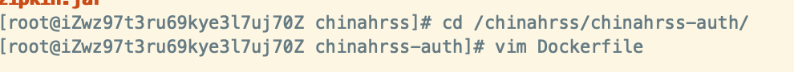
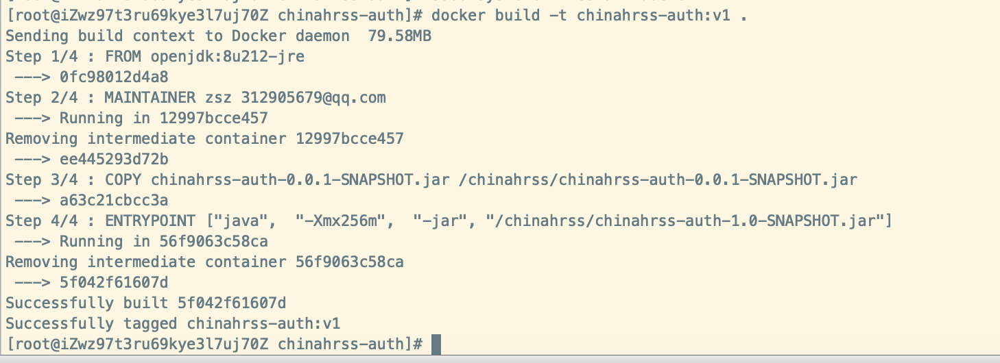

# chinahrss微服务Docker化

## 1.项目打包

项目根目录下执行

```
mvn clean package -Dmaven.test.skip=true
```

每个微服务（除了聚合模块）target目录下会有个可运行jar包，比如chinahrss-auth模块：


## 2. 服务器创建相关目录

```
mkdir -p /chinahrss/chinahrss-auth /chinahrss/chinahrss-gateway \
/chinahrss/chinahrss-monitor-admin /chinahrss/zipkin-server /chinahrss/chinahrss-register \
/chinahrss/chinahrss-server-system /chinahrss/chinahrss-server-test
```

## 3. 对文件夹授权

```
chmod 777 -R /chinahrss
```

## 4. 将jar上传到服务器

将文件上传到对应目录下，如本地的`chinahrss-auth-0.0.1-SNAPSHOT.jar` 就上传到 `/chinahrss/chinahrss-auth`

上传好后，运行一下目录，看是否都上传成功：

```
ls /chinahrss/chinahrss-auth /chinahrss/chinahrss-gateway \
/chinahrss/chinahrss-monitor-admin /chinahrss/zipkin-server /chinahrss/chinahrss-register \
/chinahrss/chinahrss-server-system /chinahrss/chinahrss-server-test
```


## 5. 构建Docker镜像

在 `/chinahrss/chinahrss-auth` 模块下创建一个Dockerfile



内容如下所示：

```dockerfile
FROM openjdk:8u212-jre
MAINTAINER zsz 312905679@qq.com

COPY chinahrss-auth-0.0.1-SNAPSHOT.jar /chinahrss/chinahrss-auth-0.0.1-SNAPSHOT.jar

ENTRYPOINT ["java",  "-Xmx256m",  "-jar", "/chinahrss/chinahrss-auth-1.0-SNAPSHOT.jar"]
```

上面脚本包含4条命令：

1. `FROM openjdk:8u212-jre`

   表示由`openjdk:8u212-jre`基础镜像构建。因为我们的项目使用的是JDK 1.8，所以我们要依赖于1.8版本的JDK镜像构建，openjdk官方Docker镜像仓库为https://hub.docker.com/_/openjdk?tab=tags，我挑了个体积相对较小的openjdk:8u212-jre；

2. `MAINTAINER zsz 312905679@qq.com`

   指定镜像的作者及联系方式；

3. `COPY chinahrss-auth-1.0-SNAPSHOT.jar /chinahrss/chinahrss-auth-1.0-SNAPSHOT.jar`

   表示将当前目录（/chinahrss/chinahrss-auth）下的chinahrss-auth-1.0-SNAPSHOT.jar拷贝到`openjdk:8u212-jre`镜像里的/chinahrss目录下，名称也为chinahrss-auth-0.0.1-SNAPSHOT.jar；

4. `ENTRYPOINT ["java", "-Xmx256m", "-jar", "/febs/febs-auth-1.0-SNAPSHOT.jar"]`

   表示运行`java -jar`运行镜像里的jar包，JVM内存最大分配为256m（因为要运行的微服务较多并且虚拟机内存只有6GB，所以内存分配小了点，实际可以根据宿主服务器的配置做出相应调整）。

DockerFile创建好后，在/chinahrss/chinahrss-auth目录下运行以下命令构建镜像：

```
docker build -t chinahrss-auth:v1 .
```

第一次构建的时候因为要下载`openjdk:8u212-jre`镜像，所以速度较慢，耐心等待即可，构建好后终端输出如下所示：



查看当前镜像：

```
docker images
```

