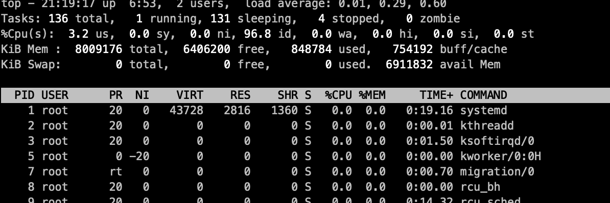

# 项目部署后调优

## 1. 背景

项目服务器配置为：2核8G ，当微服务启动起来后，整个cpu和内存都被占满了

## 2. 项目主要内容

- 第三方服务
  - redis
  - mysql
  - rabbitMQ
- elk和skywalking
- nacos注册中心
- 项目微服务体系
  - gateway模块
  - auth模块
  - monitor 相关的监控模块
  - system-service 等等内部模块

## 3. 操作流程

### 3.1 初始资源利用率

- CPU: 占用率1%左右
- 内存剩余：6.8G

### 3.2 开启第三方服务后（redis、mysql、rabbitMQ）

增加2%左右，增长得不多

### 3.3 elk和skywalking启动后

cpu暴增到了90%左右，内存消耗2G 左右

