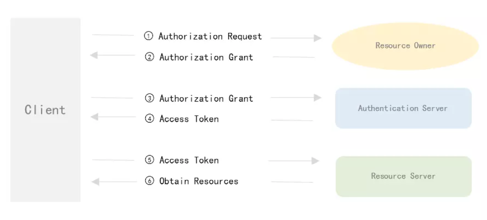

# Spring security OAuth2 深入解析

# 1. OAuth概要

### 1.1 OAuth 基本流程



基本组件

- **client**: 第三方应用（既App或向外提供接口）
- **Resource Owner**: 资源所有者（既用户）
- **Authentication Server**: 授权认证服务（发配Access Token）
- **Resource Server**： 资源服务器（存储用户资源信息等组员）

微信和QQ 都是使用这种OAuth2的基本流程

1. 第三方应用请求用户授权
2. 用户同意授权，并发挥一个授权码（code）
3. 第三方应用根据授权码（code）向授权认证服务进行授权；
4. 授权服务器根据授权码（code）。校验通过，并返回给第三方应用令牌（Access Token）;
5. 第三方应用根据令牌（Access Token）向资源服务请求相关资源
6. 资源服务器验证令牌（Access Token），校验通过，并返回第三方所请求的资源

### 1.2 服务类型

OAuth 在服务提供者上可分为两类：

- 授权认证服务： AuthenticationServer

  ```
  @Configuration
  @EnableAuthorizationServer
  public class CustomAuthenticationServerConfig extends AuthorizationServerConfigurerAdapter 
  ```

- 资源获取服务：ResourceServer

  ```
  @Configuration
  @EnableResourceServer
  public class CustomResourceServerConfig extends ResourceServerConfigurerAdapter
  ```

注：这两者有时候可能存在同一个应用程序中（既SOA架构）。在Spring OAuth 中可以简便的将**其分配到两个应用中（既微服务），而且可多个资源获取共享一个授权认证服务器**

### 1.3 授权认证服务

主要的操作：

1. 获取第三方应用发送的授权码（code）以及第三方应用标识
2. 根据授权码及标识进行校验
3. 校验通过，发送令牌（Access Token）

分析：

**1）第一步**：

- **授权码（code）**：第三方应用进行第一步“Authorization Request”时，请求参数redirect_uri 中的回调链接，服务会生成相关用户凭证，并在其回调链接上附带的code
- **第三方用户标识**：
  - client_id: 第三方用户的id（可理解为账号）
  - client_secret: 第三方应用和授权服务器之间的安全凭证（可理解为密码）

注：其中client_id 和 client_secret 都是授权服务器发送给第三方应用的，如：微信等一系列授权，在其平台上注册。获取其appid和secret同样道理

既然是账号密码，总不能以get请求，不安全，因此，OAuth2要求请求必须是POST请求，同时，还必须是HTTPS服务，以此保证获取到的安全凭证（Access Token）的安全性

**2）第二步**：

- 授权认证服务器根据标识校验第三方应用的真实性
- 授权认证服务器根据授权码（code）进行校验用户凭证

**3）第三步操作**

生成Access Token （MD5类型，uuid类型，jwt类型）

### 1.4 资源获取服务

主要的操作

- 校验Access Token
- 发放资源信息

## 2. Spring Security OAuth2 的使用

### 2.1 授权认证服务

Spirng OAuth2中，我们配置一个授权认证服务，我们最主要有以下三点：

1. 第三方用户客户端详情 -> Client
2. 令牌的生成管理 -> Access Token
3. 端点接入 -> endpoints

Spring 中有三个配置与这三点一一对应：

- ClientDetailsServiceConfigurer: 用来配置客户端详情服务
- AuthorizationServerSecurityConfigurer:用来配置令牌端点（Token EndPoint）的安全约束
- AuthorizationServerEndpointsConfigurer: 配置授权（authorization）以及令牌（token）的访问端点和令牌服务（token services）

#### 2.1.1 第三方用户客户端详情

除了上面说道的client_id 和 client_client_secret,还需要一些服务附带一些授权认证参数

1）**Grant Type**

其实OAuth2 不仅仅提供授权码（code）这种格式授权方式，还提供几个其他类型，其中用Grant Type 代表当前授权的类型。Grant Type包括

- authorization_code:传统的授权码模式
- Implicit:隐式授权模式
- password：资源所有者（既用户）密码模式
- client_credentials: 客户端凭证（客户端ID以及Key）模式
- refresh_token:获取access token时附带的用于刷新新的token模式

2）**scope**

其实授权赋予第三方用户可以在资源服务器获取资源，经常就是调用Api请求附带令牌，然后调用api有增删改查等功能，而scopes的值就是all（全部权限），read，write等权限。就是第三方访问资源的一个权限，访问范围。

3）**accessTokenValiditySeconds**

还可以设置accessTokenValiditySeconds属性来设置Access Token 的存活时间

```java
@Override
public void configure(ClientDetailsServiceConfigurer clients) throws Exception {

    clients.inMemory()
            .withClient("catalpaFlat")
            .secret("catalpaFlat-secret")
            .accessTokenValiditySeconds(7200)
            .authorizedGrantTypes("refresh_token","password")
            .scopes("all");
｝
```

#### 2.1.2 令牌的生成和管理

AccessToken的存在意义：

- 创建AccessToken，并保存，以备后续请求访问都可以认证成功并获取到资源
- AccessToken还有一个潜在功能，就是使用jwt生成token时候，可以用来加载一些信息，把一些相关权限等包含在AccessToken中

1） **AuthorizationServerTokenServices**

AuthorizationServerTokenServices 提供了对AccessToken 的相关创建、刷新、获取

```java
public interface AuthorizationServerTokenServices {

	OAuth2AccessToken createAccessToken(OAuth2Authentication authentication) throws AuthenticationException;

	
	OAuth2AccessToken refreshAccessToken(String refreshToken, TokenRequest tokenRequest)
			throws AuthenticationException;

	
	OAuth2AccessToken getAccessToken(OAuth2Authentication authentication);

}
```

2) **DefaultTokenServices**

AuthorizationServerTokenServices 竟然可以操作AccessToken，那么OAuth2就默认为我们提供了一个默认的DefaultTokenServices。包含了一些有用实现，可以使用他来修改令牌的格式和令牌的存储等，但是**生成的token**是随机数

3）**TokenStore**

创建AccessToken完之后，除了发放给第三方，肯定还得保存起来，才可以使用。因此TokenStore为我们完成这一操作，**将令牌（AccessToken）保存和持久化**。

okenStore也有一个默认的实现类InMemoryTokenStore，从名字就知道是通过保存到内存进而实现保存Access Token。 TokenStore的实现有多种类型，可以根据业务需求更改Access Token的保存类型：

- InMemoryTokenStore：这个是OAuth2默认采用的实现方式。在单服务上可以体现出很好特效（即并发量不大，并且它在失败的时候不会进行备份），大多项目都可以采用此方法。毕竟存在内存，而不是磁盘中，调试简易。
- JdbcTokenStore：这个是基于JDBC的实现，令牌（Access Token）会保存到数据库。这个方式，可以在多个服务之间实现令牌共享。
- JwtTokenStore：jwt全称 JSON Web Token。这个实现方式不用管如何进行存储（内存或磁盘），因为它可以把相关信息数据编码存放在令牌里。JwtTokenStore 不会保存任何数据，但是它在转换令牌值以及授权信息方面与 DefaultTokenServices 所扮演的角色是一样的。但有两个缺点：
  - 撤销一个已经授权的令牌会很困难，因此只适用于处理一个生命周期较短的以及撤销刷新令牌。
  - 令牌占用空间大，如果加入太多用户凭证信息，会存在传输冗余

4）JWT Token

想使用jwt令牌，需要在授权服务中配置JwtTokenStore。之前说了，jwt将一些信息数据编码后存放在令牌,那么其实在传输的时候是很不安全的，所以Spring OAuth2提供了JwtAccessTokenConverter来怼令牌进行编码和解码。适用JwtAccessTokenConverter可以自定义秘签（SigningKey）。SigningKey用处就是在授权认证服务器生成进行签名编码，在资源获取服务器根据SigningKey解码校验。

```
JwtAccessTokenConverter jwtAccessTokenConverter = new JwtAccessTokenConverter();

 jwtAccessTokenConverter.setSigningKey("CatalpaFlat")
```


#### 2.1.3 端点接入-endpoints

授权认证是使用AuthorizationEndpoint这个端点来进行控制，一般使用AuthorizationServerEndpointsConfigurer 来进行配置。

```
@Override
public void configure(AuthorizationServerEndpointsConfigurer endpoints) throws Exception {}
```

1) 端点（endpoints）的相关配置

- authenticationManager: 认证管理器。若我们上面的Grant Type设置为password，则需设置一个AuthenticationManager对象
- userDetailsService：若是我们实现了UserDetailsService来管理用户信息，那么得设我们的userDetailsService对象
- authorizationCodeServices：授权码服务。若我们上面的Grant Type设置为authorization_code，那么得设一个AuthorizationCodeServices对象
- tokenStore：这个就是我们上面说到，把我们想要是实现的Access Token类型设置
- accessTokenConverter：Access Token的编码器。也就是JwtAccessTokenConverter
- tokenEnhancer:token的拓展。当使用jwt时候，可以实现TokenEnhancer来进行jwt对包含信息的拓展
- tokenGranter：当默认的Grant Type已经不够我们业务逻辑，实现TokenGranter 接口，授权将会由我们控制，并且忽略Grant Type的几个属性。

2) 端点（endpoints）的授权url：要授权认证，肯定得由url请求，才可以传输，因此OAuth2提供了配置授权端点的URL

AuthorizationServerEndpointsConfigurer ，还是这个配置对象进行配置，其中由一个pathMapping()方法进行配置授权端点URL路径，默认提供了两个参数defaultPath和customPath：

```
public AuthorizationServerEndpointsConfigurer pathMapping(String defaultPath, String customPath) {
		this.patternMap.put(defaultPath, customPath);
		return this;
}
```

pathMapping的defaultPath有：

- /oauth/authorize：授权端点
- /oauth/token：**获取授权token令牌**
- /oauth/confirm_access：用户确认授权提交端点
- /oauth/error：授权服务错误信息端点
- /oauth/check_token：用于资源服务访问的令牌解析端点
- /oauth/token_key：提供公有密匙的端点，如果使用JWT令牌的话

**注：pathMapping的两个参数都将以 "/" 字符为开始的字符串**

### 2.1.4 自定义错误处理（Error Handling）

实际上我们上面说到的端点,其实可以看成Controller，用于返回不同端点的响应内容

授权服务的错误信息是使用标准的Spring MVC来进行处理的，也就是 @ExceptionHandler 注解的端点方法，我们可以提供一个 WebResponseExceptionTranslator 对象。最好的方式是改变响应的内容而不是直接进行渲染。

- 假如说在呈现令牌端点的时候发生了异常，那么异常委托了 HttpMessageConverters 对象（它能够被添加到MVC配置中）来进行输出。
- 假如说在呈现授权端点的时候未通过验证，则会被重定向到 /oauth/error 即错误信息端点中。whitelabel error （即Spring框架提供的一个默认错误页面）错误端点提供了HTML的响应，但是我们大概可能需要实现一个自定义错误页面（例如只是简单的增加一个 @Controller 映射到请求路径上 @RequestMapping("/oauth/error")）。

## 2.2 资源获取服务

资源服务器，其实就是存放一些受令牌保护的资源，只有令牌并且有效正确才能获取到资源。内部是通过Spring OAuth2的Spring Security Authentication filter 的过滤链来进行保护。

#### 2.2.1 ResourceServerConfigurerAdapter

我们可以继承ResourceServerConfigurerAdapter，来使用 ResourceServerSecurityConfigurer进行相关配置。

```java
public class ResourceServerConfigurerAdapter implements ResourceServerConfigurer {

	@Override
	public void configure(ResourceServerSecurityConfigurer resources) throws Exception {
	}

	@Override
	public void configure(HttpSecurity http) throws Exception {
		http.authorizeRequests().anyRequest().authenticated();
	}
｝
```

### 2.2.2 ResourceServerSecurityConfigurer的相关属性

- tokenServices：ResourceServerTokenServices 类的实例，用来实现令牌服务。
- resourceId：这个资源服务的ID，这个属性是可选的，但是推荐设置并在授权服务中进行验证。
- tokenExtractor 令牌提取器用来提取请求中的令牌。
- 请求匹配器，用来设置需要进行保护的资源路径，默认的情况下是受保护资源服务的全部路径。
- 受保护资源的访问规则，默认的规则是简单的身份验证（plain authenticated）。
- 其他的自定义权限保护规则通过 HttpSecurity 来进行配置。

### 2.2.3 ResourceServerTokenServices

ResourceServerTokenServices 是组成授权服务的另一半。

1）.若是资源服务器和授权服务在同一个应用，可以使用DefaultTokenServices

2）.若是分离的。ResourceServerTokenServices必须知道令牌的如何解码。

ResourceServerTokenServices解析令牌的方法：

- 使用RemoteTokenServices，资源服务器通过HTTP请求来解码令牌。每次都请求授权服务器的端点-/oauth/check_toke，以此来解码令牌
- 若是访问量大，则通过http获取之后，换成令牌的结果
- 若是jwt令牌，需请求授权服务的/oauth/token_key，来获取key进行解码

**注：授权认证服务需要把/oauth/check_toke暴露出来，并且附带上权限访问。**

```java
@Override
public void configure(AuthorizationServerSecurityConfigurer oauthServer) throws Exception {
    oauthServer.tokenKeyAccess("isAnonymous() || hasAuthority('ROLE_TRUSTED_CLIENT')")
        .checkTokenAccess("hasAuthority('ROLE_TRUSTED_CLIENT')");
}
```


## 参考文章

[Spring security OAuth2 深入解析](https://juejin.im/post/5a3cbce05188252582279467)