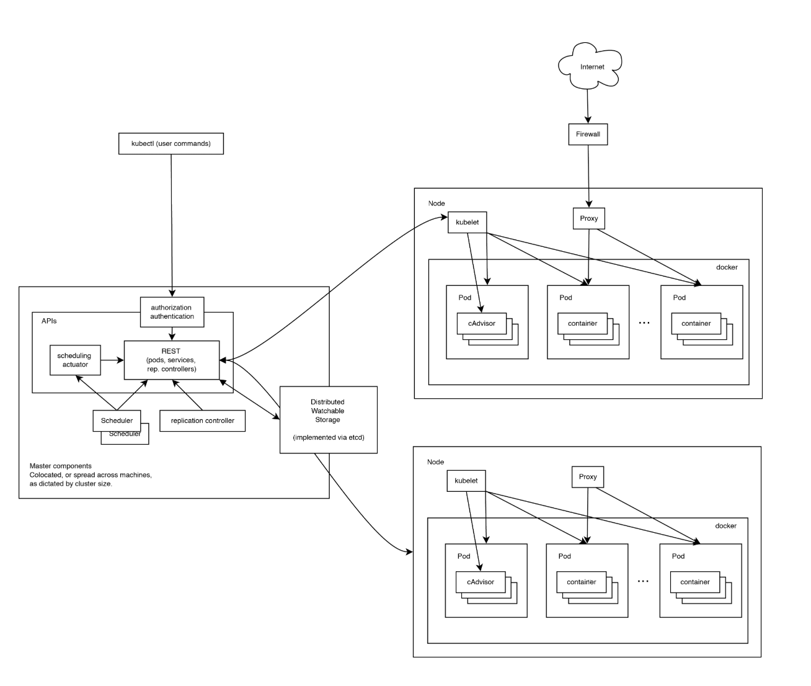

# Kubernetes架构

## 1. 运行原理

Kubernetes 是一套分布式系统，由多个节点组成，**节点分为两类：一类是属于管理平面的主节点/控制节点（Master Node）；一类是属于运行平面的工作节点（Worker Node）**

复杂的工作由主节点负责，工作节点负责提供提供稳定的操作接口和能力抽象

注：从这张图上，我们没有能发现 Kubernetes 中对于控制平面的分布式实现，但是由于数据后端自身就是一套分布式的数据库 Etcd，因此可以很容易扩展到分布式实现。

## 2. 控制平面

### 2.1 主节点服务

主节点提供的管理服务：

- `apiserver` 是整个系统的对外接口，提供一套 RESTful 的 [Kubernetes API](https://github.com/kubernetes/kubernetes/tree/master/docs/api-reference)，供客户端和其它组件调用；
- `scheduler` 负责对资源进行调度，分配某个pod 到某个节点是上。是pluggable 的，意味着很容易选择其他实现方式
- `controller-manager` 负责管理控制器，包括endpoint-controller (刷新服务和pod的关联信息) 和 replication-controller（维护某个pod 的复制为配置的数值）

### 2.2 Etcd

Etcd既作为数据后端，又作为消息中间件

通过Etcd 来存储所有的主节点上的状态信息，很容易实现主节点的分布式扩展

组件可以自动的去侦测 Etcd 中的数值变化来获得通知，并且获得更新后的数据来执行相应的操作

### 2.3 工作节点

- Kubelet 是工作节点执行操作的agent，负责具体的容器生命周期管理，根据从数据库中获取的信息来管理容器，并上报pod运行状态等
- Kube-proxy 是一个简单的网络访问代理，同时也是一个 Load Balancer。它负责将访问到某个服务的请求具体分配给工作节点上的Pod（同一类标签）

