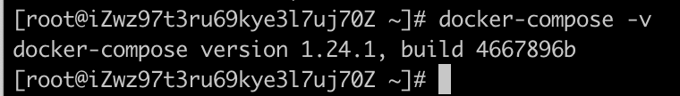

# Centos安装Docker

[Docker官方文档安装教程](https://docs.docker.com/install/linux/docker-ce/centos/)

[Docker Compose官方文档安装教程](https://docs.docker.com/compose/install/)

## 1. 安装步骤

### 1.1 卸载旧版本Docker（如果系统之前没安装过Docker，可以跳过）

```
yum remove docker \
                  docker-client \
                  docker-client-latest \
                  docker-common \
                  docker-latest \
                  docker-latest-logrotate \
                  docker-logrotate \
                  docker-engine
```

### 1.2 安装Docker所需要的包

```sh
yum install -y yum-utils \
  device-mapper-persistent-data \
  lvm2
```

### 1.3 设置稳定的仓库

```
yum-config-manager \
    --add-repo \
    https://download.docker.com/linux/centos/docker-ce.repo
```

### 1.4 安装最新版的Docker引擎

```
yum install docker-ce docker-ce-cli containerd.io
```

### 1.5 启动Docker

```
systemctl start docker
```

查看是否安装成功：


## 2 安装Docker Compose

### 2.1 获取Docker Compose的最新稳定版本：

```
curl -L "https://github.com/docker/compose/releases/download/1.24.1/docker-compose-$(uname -s)-$(uname -m)" -o /usr/local/bin/docker-compose
```

### 2.2 对二进制文件授予可执行权限

```
chmod +x /usr/local/bin/docker-compose
```

### 2.3 创建link：

```
ln -s /usr/local/bin/docker-compose /usr/bin/docker-compose
```

### 2.4 查看是否安装成功：



