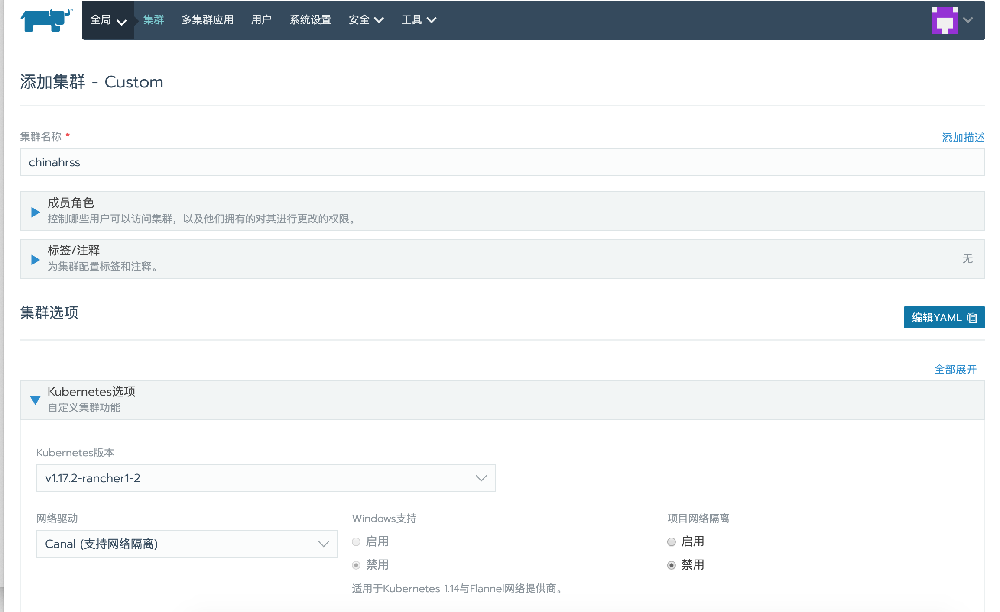
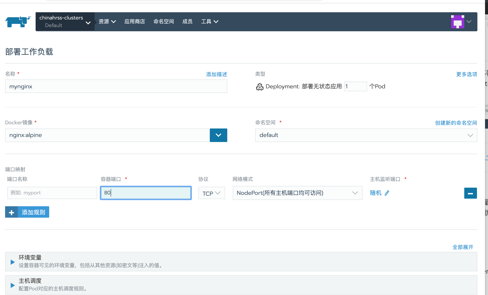

# 安装Rancher Server

## 1. 启动 RANCHER SERVER - 单容器部署 (NON-HA)

在安装了Docker的Linux服务器上，使用一个简单的命令就可以启动一个单实例的Rancher。

- **安装 2.* 的版本**

```
sudo docker run -d --restart=unless-stopped -p 8080:80 -p 443:443 rancher/rancher
```

本机8080端口映射到rancher 的80端口


## 2. Rancher UI

访问443 端口[https://120.79.200.111/](https://120.79.200.111/)


默认账号是admin，第一次需要设置密码

## 3. 添加集群

添加自定义集群


集群设置



集群设置二


- 由于只有一个节点，所有3个角色都要勾选
- 输入主机的外网和内网地址
- ssh终端输入复制的命令

## 4. 集群安装成功


点击集群也能够看到集群的仪表盘信息了：


## 5. 切换Default项目视图

集群创建完成后，默认会生成Default项目，点击Default可以切换到项目视图：


## 6. 部署工作负载

在rancher里工作负载是一个对象，包括pod以及部署应用程序所需的其他文件和信息。我们这里以nginx作为demo示例，在Default视图下，点击工作负载—部署服务


在部署工作负载页面，设置工作负载名称、副本数量、镜像名称、命名空间、端口映射，其他参数保持默认，不设置端口映射的话，默认是随机映射端口，我这里选择随机，最后点击启动：



## 7. 部署完成


## 参考文章

[安装 Rancher2.x 并部署工作负载](https://blog.51cto.com/zero01/2168999)