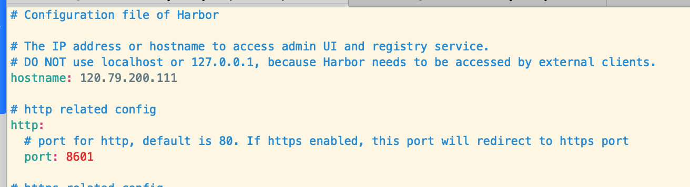
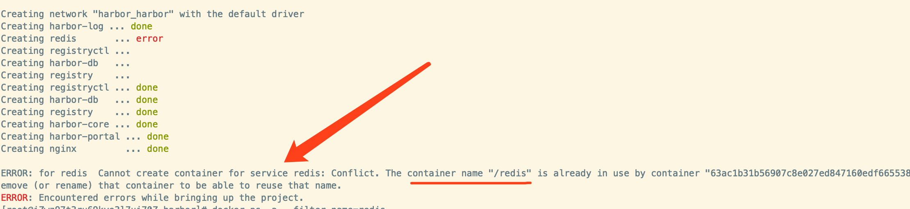
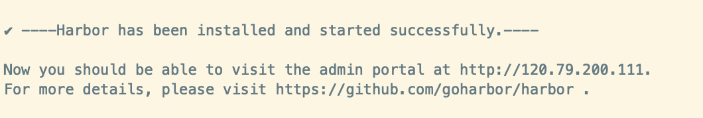
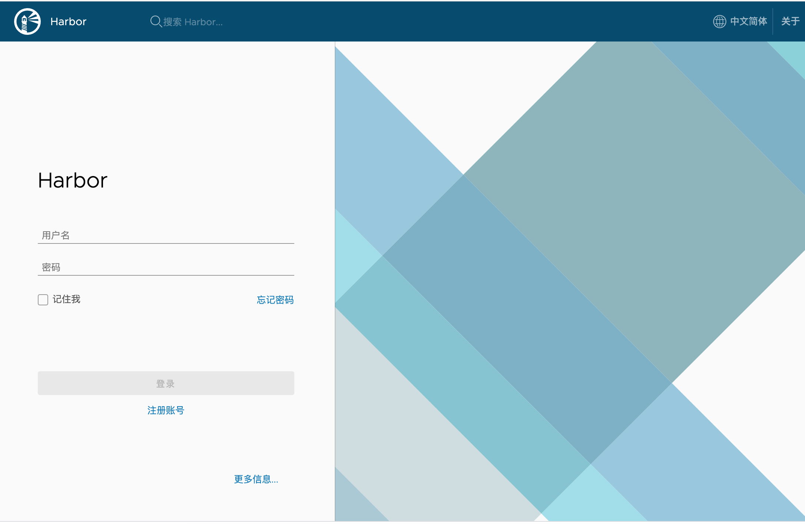
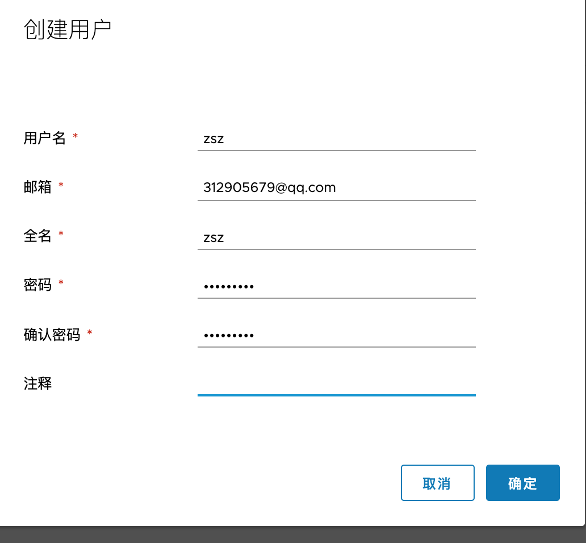
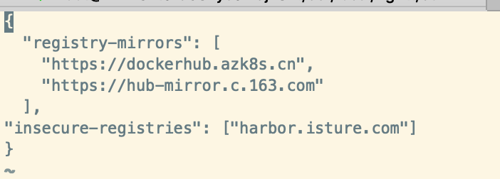
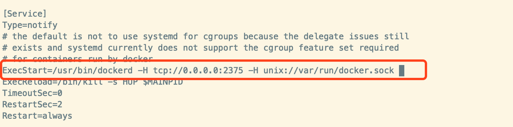
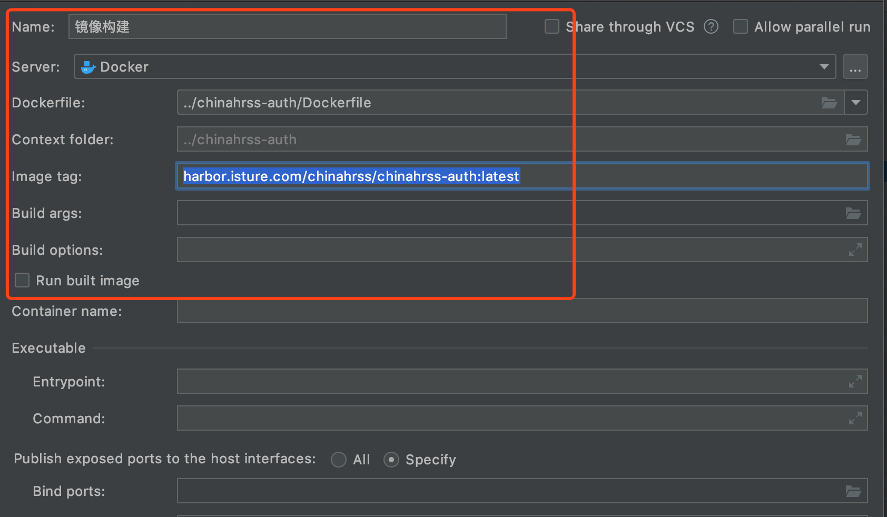
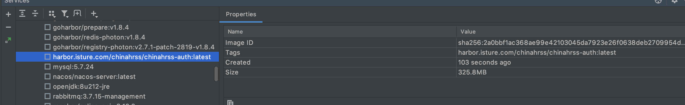

# Docker镜像仓库Harbor

## 1. 背景

我本地环境下（或者公司局域网），将Docker镜像推送到Docker Hub速度比较慢，推荐的做法就是安装一个第三方的Docker镜像仓库。这里推荐使用Harbor

## 2. 简介

Harbor是一框开源的Docker镜像存储仓库，其扩展了Docker Distribution，在此基础上添加了我们常用的功能，比如安全认证，RBAC用户权限管理，可视化页面操作等功能

## 3. 安装Harbor

### 3.1 下载Harbor离线安装包

```
wget https://storage.googleapis.com/harbor-releases/release-1.8.0/harbor-offline-installer-v1.8.4.tgz
```

### 3.2 解压Harbor

```
 tar -xzvf harbor-offline-installer-v1.8.4.tgz 
```

### 3.3 修改Harbor 配置文件

```
vim /software/harbor/harbor.yml
```

将hostname修改为宿主机IP和端口



- 端口8601
- ip：120.79.200.111

### 3.4 执行install.sh 脚本进行安装

```
sh harbor/install.sh
```

#### 如出现该异常

```
ERROR: for redis  Cannot create container for service redis: Conflict. The container name "/redis" is already in use by container "63ac1b31b56907c8e027ed847160edf6655380f34c3b944c31e745693e436764". You have to remove (or rename) that container to be able to reuse that name.
ERROR: Encountered errors while bringing up the project.
```



这里提示容器名冲突

解决步骤

1. 查找redis容器

   ```javascript
   docker ps -a --filter name=redis
   ```

2. 将他改名

   ```javascript
   docker rename redis micro-service-redis 
   ```

### 3.5 安装成功的提示信息



### 3.6 浏览器访问查看

http://120.79.200.111:8601/

为了方便日后管理，配置了域名解析

http://harbor.isture.com



默认的用户名：admin 	密码：Harbor12345

登录后


## 4. 创建用户和项目

### 4.1 在管理界面新增一个用户



密码需要大小写混用Zs16

### 4.2 新增项目


### 4.3 在该项目下添加用户


## 5. 服务器上登录harbor

### 5.1 添加私有仓库

```
vi /etc/docker/daemon.json
```

添加如下内容

```
"insecure-registries": ["harbor.isture.com"]
```



### 5.2 重启docker

```
service docker restart
```

因为Harbor的install.sh脚本实际上是基于Docker Compose的，所以重启Docker，Harbor也需要重启

### 5.3 重启Harbor

```
 sh /software/harbor/install.sh 
```

### 5.4 登录

```
docker login harbor.isture.com
```


## 6. 测试镜像推拉

接着测试下，是否能够顺利的将Docker镜像推送到Harbor仓库中

### 6.1 从官方Docker Hub中拉取busybox镜像

```
docker pull busybox
```

### 6.2 然后给该镜像打上标签：

```
docker tag busybox:latest harbor.isture.com/chinahrss/busybox:latest
```

标签格式为[docker仓库域名]/[项目名称]/[镜像:版本]。

### 6.3 镜像推送到Harbor仓库：

打好标签后，将 harbor.isture.com/chinahrss/busybox:latest 镜像推送到Harbor仓库：

```
docker push harbor.isture.com/chinahrss/busybox:latest
```

## 7 . 开启远程仓库

我们约定的做法是，通过IDEA Docker插件在master远程构建Docker镜像，再将这些镜像推送到Harbor仓库

### 7.1 修改Docker配置

要开始Docker服务的远程访问，需要修改Docker配置

```
vi /lib/systemd/system/docker.service
```

修改的地方如下图所示



### 7.2 重启Docker服务

```
systemctl daemon-reload 
systemctl restart docker.service
```

### 7.3 验证2375端口是否通

```
curl 120.79.200.111:2375/info
```

如果返回如下JSON说明开启Docker远程服务成功，端口为2735：

```
{"ID":"W73X:KQSA:FEKB:5OT5:X4A5:AQCD:MKNX:VES4:EWPK:V3GJ:UIYC:35D3","Containers":69,"ContainersRunning":30,"ContainersPaused":0,"ContainersStopped":39,"Images":43,"Driver":"overlay2","DriverStatus":[["Backing Filesystem","extfs"],["Supports d_type","true"],["Native Overlay Diff","true"]],"SystemStatus":null,"Plugins":{"Volume":["local"],"Network":["bridge","host","ipvlan","macvlan","null","overlay"],"Authorization":null,"Log":["awslogs","fluentd","gcplogs","gelf","journald","json-file","local","logentries","splunk","syslog"]},"MemoryLimit":true,"SwapLimit":true,"KernelMemory":true,"KernelMemoryTCP":true,"CpuCfsPeriod":true,"CpuCfsQuota":true,"CPUShares":true,"CPUSet":true,"PidsLimit":true,"IPv4Forwarding":true,"BridgeNfIptables":true,"BridgeNfIp6tables":true,"Debug":false,"NFd":207,"OomKillDisable":true,"NGoroutines":186,"SystemTime":"2020-01-30T14:31:37.954825827+08:00","LoggingDriver":"json-file","CgroupDriver":"cgroupfs","NEventsListener":0,"KernelVersion":"3.10.0-957.21.3.el7.x86_64","OperatingSystem":"CentOS Linux 7 (Core)","OSType":"linux","Architecture":"x86_64","IndexServerAddress":"https://index.docker.io/v1/","RegistryConfig":{"AllowNondistributableArtifactsCIDRs":[],"AllowNondistributableArtifactsHostnames":[],"InsecureRegistryCIDRs":["127.0.0.0/8"],"IndexConfigs":{"docker.io":{"Name":"docker.io","Mirrors":["https://dockerhub.azk8s.cn/","https://hub-mirror.c.163.com/"],"Secure":true,"Official":true},"harbor.isture.com":{"Name":"harbor.isture.com","Mirrors":[],"Secure":false,"Official":false}},"Mirrors":["https://dockerhub.azk8s.cn/","https://hub-mirror.c.163.com/"]},"NCPU":2,"MemTotal":8201396224,"GenericResources":null,"DockerRootDir":"/var/lib/docker","HttpProxy":"","HttpsProxy":"","NoProxy":"","Name":"iZwz97t3ru69kye3l7uj70Z","Labels":[],"ExperimentalBuild":false,"ServerVersion":"19.03.5","ClusterStore":"","ClusterAdvertise":"","Runtimes":{"runc":{"path":"runc"}},"DefaultRuntime":"runc","Swarm":{"NodeID":"","NodeAddr":"","LocalNodeState":"inactive","ControlAvailable":false,"Error":"","RemoteManagers":null},"LiveRestoreEnabled":false,"Isolation":"","InitBinary":"docker-init","ContainerdCommit":{"ID":"b34a5c8af56e510852c35414db4c1f4fa6172339","Expected":"b34a5c8af56e510852c35414db4c1f4fa6172339"},"RuncCommit":{"ID":"3e425f80a8c931f88e6d94a8c831b9d5aa481657","Expected":"3e425f80a8c931f88e6d94a8c831b9d5aa481657"},"InitCommit":{"ID":"fec3683","Expected":"fec3683"},"SecurityOptions":["name=seccomp,profile=default"],"Warnings":["WARNING: API is accessible on http://0.0.0.0:2375 without encryption.\n         Access to the remote API is equivalent to root access on the host. Refer\n         to the 'Docker daemon attack surface' section in the documentation for\n         more information: https://docs.docker.com/engine/security/security/#docker-daemon-attack-surface"]}
```

## 8. 构建Chinahrss服务Dokcer镜像

### 8.1 新建远程Docker服务

点击IDEA -> File -> Settings… -> Build,Execution,Deployment -> Docker：


填写远程Docker地址，如果显示Connection successful说明连接远程Docker服务成功。

### 8.2 构建chinahrss-auth镜像

准备好后，点击IDEA -> Run -> Edit Configrations…，添加Docker配置：


选择Dockerfile文件地址，并且添加镜像标签为 harbor.isture.com/chinahrss/chinahrss-auth:latest ，然后保存即可：



### 8.3 点击构建


在Services->Master Docker Service->Images上，我们可以看到远程仓库上已经部署好了



我们可以到远程服务器上核心一下：

```
docker images | grep chinahrss
```


这证明我们通过远程Docker服务构建镜像是OK的。

## 9. 镜像推送

这些镜像都构建好后，我们在服务器上将它们都推送到Harbor仓库，执行下面这条命令批量推送：

```
for i in $(docker images | grep harbor.isture.com | awk 'BEGIN{OFS=":"}{print $1,$2}'); do docker push $i; done
```

