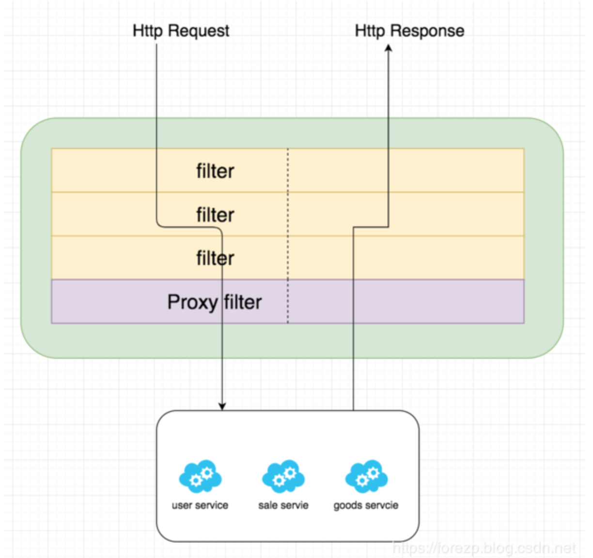

# Spring Cloud GateWay之Filter

## 1. Filter的作用

- “pre”类型的过滤器：参数校验、权限校验、流量监控、日志输出、协议转换等
- “post”类型的过滤器：响应内容、响应头的修改，日志的输出，流量监控等

### 1.1 Filter的作用实例

当我们有很多服务时，比如下图中的user-service、goods-service、sales-service等服务，客户端**请求各个服务的Api时，每个服务都需要做相同的事情，比如鉴权、限流、日志输出**等。


对于这样重复工作，有没有办法做得更好？我们可以在**微服务的上一层加一个全局的权限控制，限流、日志输出的Api Gateway服务**。然后再将请求转发到具体的业务服务层。这个Api Gateway服务就是起到一个服务边界的作用，**外界的请求访问系统，必须先通过网关层**。


## 2. 生命周期

Spring Cloud Gateway同zuul类似，**有“pre”和“post”两种方式的filter**。客户端的请求先经过“pre”类型的filter，然后将请求转发到具体的业务服务，比如上图中的user-service，收到业务服务的响应之后，再经过“post”类型的filter处理，最后返回响应到客户端。



## 3. 作用范围

- gateway filter：

  - 针对单个路由

  - 需要通过spring.cloud.routes.filters 配置在具体路由下，只作用在当前路由上或通过spring.cloud.default-filters配置在全局，作用在所有路由上

- global gateway filer

  - 针对所有路由
  - 全局过滤器，不需要在配置文件中配置，作用在所有的路由上，最终通过GatewayFilterAdapter包装成GatewayFilterChain可识别的过滤器，它为请求业务以及路由的URI转换为真实业务服务的请求地址的核心过滤器，不需要配置，系统初始化时加载，并作用在每个路由上。
    

## 4. 自定义GlobalFilter

自定义filter 需要实现GlobalFilter, Ordered

例如：该GlobalFilter会校验请求中是否包含了请求参数“token”，如何不包含请求参数“token”则不转发路由，否则执行正常的逻辑。代码如下：

```java
public class TokenFilter implements GlobalFilter, Ordered {

    Logger logger=LoggerFactory.getLogger( TokenFilter.class );
    @Override
    public Mono<Void> filter(ServerWebExchange exchange, GatewayFilterChain chain) {
        String token = exchange.getRequest().getQueryParams().getFirst("token");
        if (token == null || token.isEmpty()) {
            logger.info( "token is empty..." );
            exchange.getResponse().setStatusCode(HttpStatus.UNAUTHORIZED);
            return exchange.getResponse().setComplete();
        }
        return chain.filter(exchange);
    }

    @Override
    public int getOrder() {
        return -100;
    }
}
```

## 参考文章

[spring cloud gateway之filter篇](https://blog.csdn.net/forezp/article/details/85057268)

