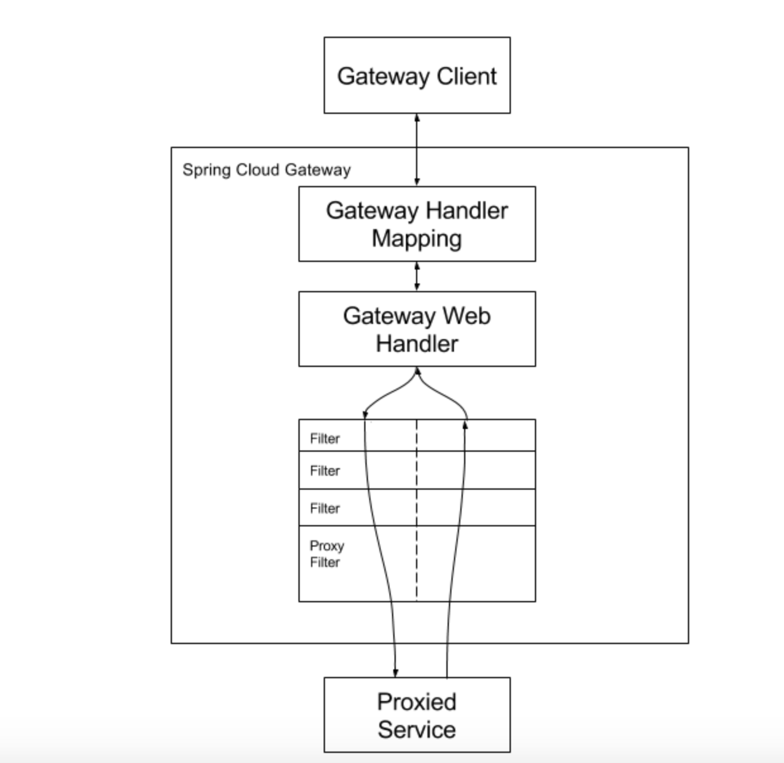

# 服务网关Spring Cloud GateWay基础

## 1. 与zuul（1.x）优势

zuul（1.0）基于Servlet,使用阻塞API，且不支持长连接，如WebSockets

优势：

- 使用非阻塞 API
- 支持 WebSockets
- 支持限流等新特性

## 2. 背景

Spring Cloud Gateway 是 Spring Cloud 的一个全新项目，该项目是基于 Spring 5.0，Spring Boot 2.0 和 Project Reactor 等技术开发的网关，它旨在为微服务架构提供一种简单有效的统一的 API 路由管理方式。

Spring Cloud Gateway 作为Spring Cloud 生态系统中的网关，**目标是替代Netflix Zuul**。其不仅提供统一的路由方式，并且基于 Filter 链的方式提供了网关基本的功能，例如：安全，监控/指标，和限流。

## 3.相关概念

- Route（路由）：这是网关的基本构建模块。它由一个ID，一个目标URL，一组断言和一组过滤器定义组成。如果断言为真，则路由匹配 
- Predicate（断言）：这是一个 Java8 的 Predicate。输入类型是ServerWebExchange。我们可以使用他来匹配来自Http请求的任何内容。例如headers或参数
- Filter(过滤器)：这是`org.springframework.cloud.gateway.filter.GatewayFilter`的实例，我们可以使用它修改请求和响应。

## 4. 工作流程

1. 客户端向 Spring Cloud Gateway 发出请求。
2. 如果Gateway handler Mapping 中找到与请求相匹配的路由，
3. 将其发送到Gateway Web Handler。
4. Handler 再通过指定的过滤器链来将请求发送到我们实际的服务执行业务逻辑
5. 过滤器之间用虚线分开是因为过滤器可能会发送代理请求之前（“pre”）或之后（“post”）执行业务逻辑。

## 5. Spring Cloud Gateway 的特征

- 基于 Spring Framework 5，Project Reactor 和 Spring Boot 2.0
- 动态路由
- Predicates 和 Filters 作用于特定路由
- 集成 Hystrix 断路器
- 集成 Spring Cloud DiscoveryClient
- 易于编写的 Predicates 和 Filters
- 限流
- 路径重写

## 参考文章

[springcloud(十五)：服务网关 Spring Cloud GateWay 入门](http://www.ityouknow.com/springcloud/2018/12/12/spring-cloud-gateway-start.html)