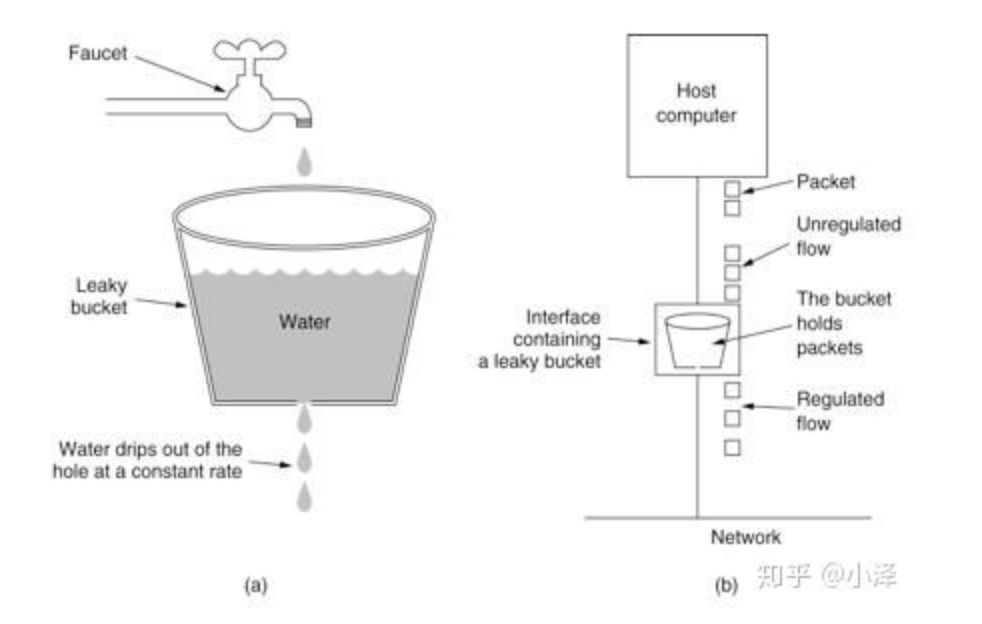
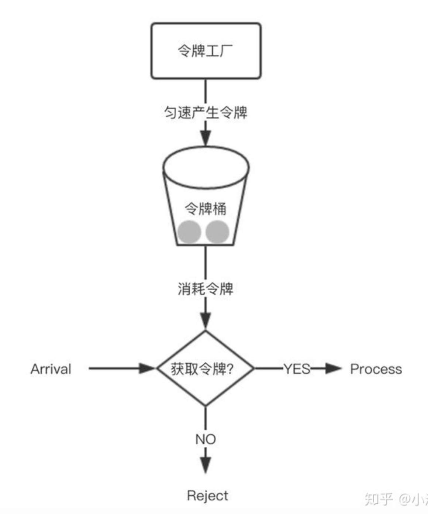

# 限流的算法

## 1. 为什么需要限流

按照服务的调用方，可以分为以下几种类型服务

1. **与用户打交道的服务**

   比如web服务，对外API,这种类型的服务有以下几种可能导致机制被拖垮

   - 用户增长过快
   - 因为某个热点事件（微博热搜）
   - 竞争对象爬虫
   - 恶意刷单

   这些情况都是无法预知的，不知道什么时候会有10倍甚至20倍的流量进来，碰上这种情况，扩容是根本来不及的（弹性扩容也不可能1秒钟扩充这么多）

2. **对内的RPC服务**

   一个服务A的接口可能被BCDE多个服务进行调用，在B服务发生重发流量时，直接把A服务给调用挂了。导致A服务对CDE也无法提供服务。这种情况时有发生，解决方案有两种

   1. 每个调用方采用线程池进行资源隔离
   2. 使用限流手段对每个调用方进行限流

## 2. 限流算法实现

常见的限流算法有：计数器，漏桶、令牌桶

### 2.1 计数器算法

采用计数器实现限流简单粗暴，

1. 一般我们会限制一秒钟的能够通过的请求数，比如限流qps为100，
2. 算法的实现思路就是从第一个请求进来开始计时
3. 在接下来的1s内，每来一个请求，就把计数加1
4. 如果累加的数字达到100，那么后续的请求就会被全部拒绝
5. 等到1s结束后，把计数恢复成0，重新开始计数

具体实现：

```
对于每次服务调用，可以通过 AtomicLong#incrementAndGet()方法来给计数器加1并返回最新值，通过这个最新值和阈值进行比较。
```

**弊端**：

如果我在单位时间1s内的钱10ms，已经通过了100个请求，那后面的990s，只能眼巴巴的请求拒绝，我们吧这种现象称为”突刺现象“   

## 2.2 漏桶算法

为了消除“突刺现象”，可以采用漏桶算法实现限流，漏桶算法这个名字很形象，算法内部有一个容器，类似生活用到的漏洞，当请求进来时，相当于水倒进漏斗，然后从下端小口慢慢匀速的流出。**不管上面流量多大，下面流出的速度始终不变**

不管服务调用方多么不稳定，通过漏桶算法进行限流，每10毫秒处理一次请求。因为处理速度是固定的，请求进来的速度是未知的，可能突然进来很多请求，没来得及处理得请求就先放在桶里，既然是个桶，肯定有容量上限，**如果桶满了，那么新进来的请求就丢弃。**



在算法实现方面，

- 可以准备一个队列，用来保存请求，
- 另外通过一个线程池定期从队列中获取请求并执行，可以一次性获取多个并发执行

**弊端：**无法对应短时间的突发流量

### 2.3 令牌桶算法

从某种意义上，令牌桶是对漏桶算法的一种改进，桶算法能够限制请求调用的速率，而**令牌桶算法能够在限制调用的平均速率的同时还允许一定程度的突发调用**

#### 2.3.1 概念

在令牌桶算法中，存在一个桶，用来存放固定数量的令牌。算法中存在一种机制，以一定的速率往桶中放令牌。每次请求调用需要先获取令牌，只有拿到令牌，才有机会继续执行，否则选择等待可用的令牌，或者直接拒绝。

放令牌这个动作是持续不断的进行，如果桶中令牌数达到上限，就丢弃令牌，所以就存在这种情况，**桶中一直有大量的可用令牌。这时进来的请求就可以直接拿到令牌执行**。比如设置qps为100，那么限流器初始化完成一秒后，桶中就已经有100个令牌了，这时服务还没完全启动好，等启动完成对外提供服务时，该限流器可以抵挡瞬时的100个请求。所以，只有桶中没有令牌时，请求才会进行等待，最后相当于以一定的速率执行。



#### 2.3.2 实现思路：

可以准备一个队列，用来保存令牌，另外通过一个线程池定期生成令牌放到队列中，每来一个请求，就从队列中获取一个令牌，并继续执行。

## 3. 集群限流

之前介绍的3中都是单机限流，单机限流无法满足五花八门的需求

比如：

- 限制某个资源被每个用户或者商户的访问次数，5秒只能访问2次，或者一天只能调用100次，单机限流无法实现，需要集群限流

### 3.1 如何实现

为了控制访问次数，肯定需要一个计数器，而且这个计数器只能保存在第三方服务，比如redis

1. 每次有相关操作的时候，就向redis服务器发送一个incr命令
2. 比如需要限制某个用户访问/index接口的次数，只需拼接用户id和接口名生成redis的key
3. 每次该用户访问此接口时，只需要对这个key执行ince命令。
4. 在这个key带上过期时间，就可以实现指定时间的访问频率


## 参考文章

[分布式之服务限流算法的几种实现](https://zhuanlan.zhihu.com/p/65900436)