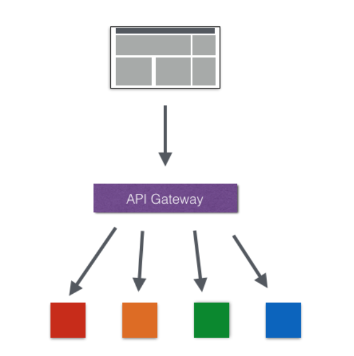
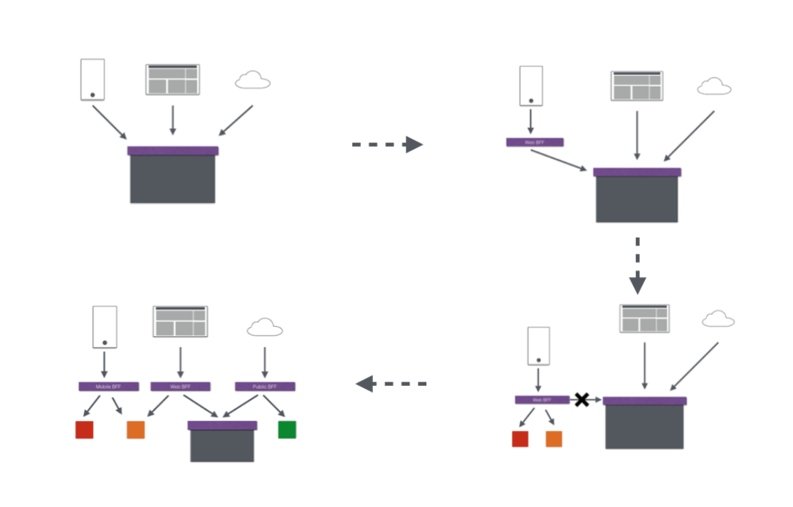

# zuul基础

在微服务中，外部的应用如何来访问内部各种各样的微服务的呢？**在微服务架构中，后端服务往往不直接开放给调用端，而是通过一个API 网关根据请求的url，路由到相应的服务**。当添加API网关后，在第三方调用端和服务提供方之间就创建了一面墙，这面墙直接与调用方通信进行权限控制，后将请求均衡分发给后台服务端

## 1. 为什么需要API Gateway

1. 简化客户端调用复杂度

   在微服务架构模式下后端服务的实例数一般是动态的，对于客户端而言很难发现动态改变的服务的访问地址信息。因此在基于微服务的项目中为了简化前端的调用逻辑，通常会引入API Gateway 作为轻量级网关，同时API Gateway 中**也会实现相关的认证逻辑从而简化内部服务之间相互调用的复杂度**

   

   

2. 数据裁剪以及聚合

   通常而言不同的客户端对于显示时对于数据的需求是不一致的，比如手机端或者Web端又或者在低延迟的网络环境或者高延迟的网络环境

   因此为了优化客户端的使用体验，API Gateway 可以对通用性的响应数据进行**裁剪以适应不同客户端的使用需求**。同时还将可以**将API 调用逻辑进行聚合，从而减少客户端的请求数**，优化客户端的用户体验

3. 多渠道的支持

   当然我们还可以针对不同的渠道和客户端提供不同的API Gateway，对于该模式的使用由另外一个大家熟知的方式叫Backend for front-end, 在Backend for front-end模式当中，我们**可以针对不同的客户端分别创建其BFF**

4. 遗留系统的微服务化改造

   对于系统而言进行微服务改造通常是由于原有的系统存在或多或少的问题，比如技术债务，代码质量，可维护性，可扩展性等等，API Gateway 的模式同样适用于这一类遗留系统的改造，通过微服务化的改造逐步实现对原有系统中的问题修复，从而提升对原有业务响应力的提升。通过引入抽象层，逐步使用新的实现替换旧的实现

   

## 2. Zuul

> zuul 提供负载均衡，反向代理，权限认证的一个API Gateway。
>
> 同时还提供动态路由，监控，弹性、安全等服务

## 参考文章

[springcloud(十)：服务网关zuul初级篇](http://www.ityouknow.com/springcloud/2017/06/01/gateway-service-zuul.html)

