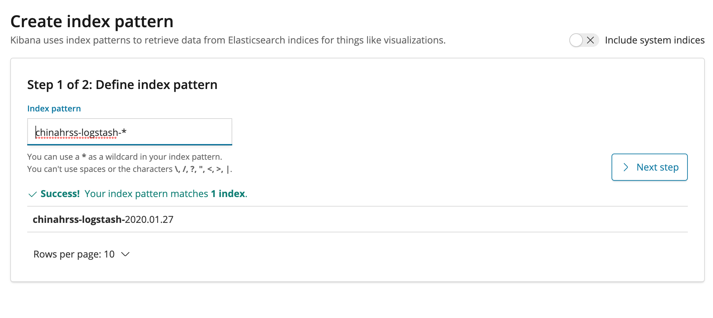
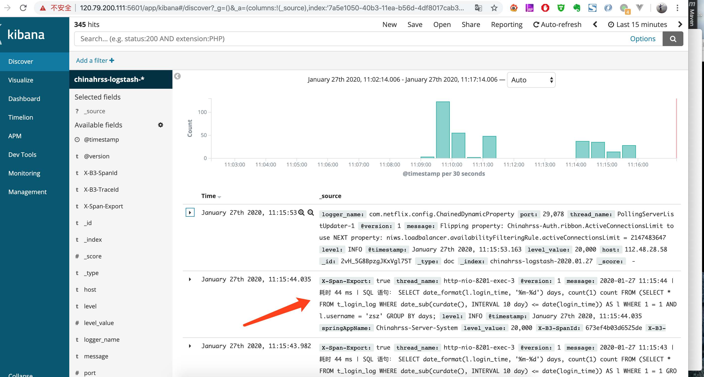

# 微服务ELK日志配置

我们在微服务模块中引入 Logstash 依赖

```xml
<dependency>
    <groupId>net.logstash.logback</groupId>
    <artifactId>logstash-logback-encoder</artifactId>
    <version>6.1</version>
</dependency>
```

在微服务的配置文件`logback-spring.xml`里添加如下配置：

```xml
<!--输出到 logstash的 appender-->
<appender name="logstash" class="net.logstash.logback.appender.LogstashTcpSocketAppender">
    <destination>120.79.200.111:4560</destination>
    <encoder charset="UTF-8" class="net.logstash.logback.encoder.LogstashEncoder"/>
</appender>

......
<root level="info">
    ......
    <appender-ref ref="logstash" />
</root>
```

120.79.200.111:4560对应我们刚刚搭建的Logstash地址。

## 2. 演示效果

Kibana UI地址  [http://120.79.200.111:5601/](http://120.79.200.111:5601/)

依次启动chinahrss-gateway、chinahrss-auth、chinahrss-server-system和chinahrss-server-test模块，然后回到Kibana管理界面创建Kinaba Index Patterns：


在Index pattern里输入我们在logstash配置文件`logstash-elk.conf`里`output.index`指定的值`chinahrss-logstash-*`：



点击Next Step，在下拉框里选择`@timestamp`：


最后点击Create Index Pattern按钮完成创建。

### 在Kibana里搜索日志：

