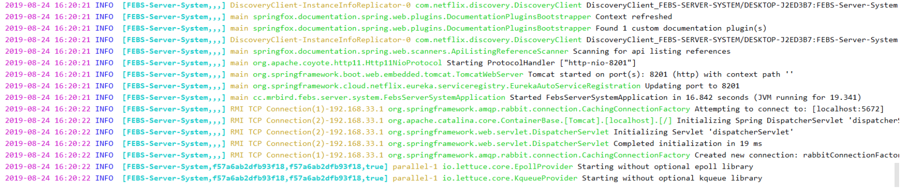

# logback日志打印

目前系统细致输出在控制台中，重启项目后，之前的日志就丢失了，我们可以借助logback将系统日志保存到日志文件中。

Spring Boot项目在引用了 `spring-boot-starter-logging `依赖后，默认使用了logback来记录日志。因为我们之前搭建的微服务系统都引用了`spring-boot-starter=`依赖，该依赖包含了`spring-boot-starter-logging`,所以无需再次引入


## 2. 集成logback

### 2.1 新建logback配置文件logback-spring.xml

```xml
<?xml version="1.0" encoding="UTF-8"?>
<configuration scan="true" scanPeriod="60 seconds" debug="false">
    <contextName>febs</contextName>
    <springProperty scope="context" name="springAppName" source="spring.application.name"/>
    <property name="log.path" value="log/febs-server-system" />
    <property name="log.maxHistory" value="15" />
    <property name="log.colorPattern" value="%magenta(%d{yyyy-MM-dd HH:mm:ss}) %highlight(%-5level) %boldCyan([${springAppName:-},%X{X-B3-TraceId:-},%X{X-B3-SpanId:-},%X{X-Span-Export:-}]) %yellow(%thread) %green(%logger) %msg%n"/>
    <property name="log.pattern" value="%d{yyyy-MM-dd HH:mm:ss} %-5level [${springAppName:-},%X{X-B3-TraceId:-},%X{X-B3-SpanId:-},%X{X-Span-Export:-}] %thread %logger %msg%n"/>

    <!--输出到控制台-->
    <appender name="console" class="ch.qos.logback.core.ConsoleAppender">
        <encoder>
            <pattern>${log.colorPattern}</pattern>
        </encoder>
    </appender>

    <!--输出到文件-->
    <appender name="file_info" class="ch.qos.logback.core.rolling.RollingFileAppender">
        <rollingPolicy class="ch.qos.logback.core.rolling.TimeBasedRollingPolicy">
            <fileNamePattern>${log.path}/info/info.%d{yyyy-MM-dd}.log</fileNamePattern>
            <MaxHistory>${log.maxHistory}</MaxHistory>
        </rollingPolicy>
        <encoder>
            <pattern>${log.pattern}</pattern>
        </encoder>
        <filter class="ch.qos.logback.classic.filter.LevelFilter">
            <level>INFO</level>
            <onMatch>ACCEPT</onMatch>
            <onMismatch>DENY</onMismatch>
        </filter>
    </appender>

    <appender name="file_error" class="ch.qos.logback.core.rolling.RollingFileAppender">
        <rollingPolicy class="ch.qos.logback.core.rolling.TimeBasedRollingPolicy">
            <fileNamePattern>${log.path}/error/error.%d{yyyy-MM-dd}.log</fileNamePattern>
        </rollingPolicy>
        <encoder>
            <pattern>${log.pattern}</pattern>
        </encoder>
        <filter class="ch.qos.logback.classic.filter.LevelFilter">
            <level>ERROR</level>
            <onMatch>ACCEPT</onMatch>
            <onMismatch>DENY</onMismatch>
        </filter>
    </appender>

    <root level="debug">
        <appender-ref ref="console" />
    </root>

    <root level="info">
        <appender-ref ref="file_info" />
        <appender-ref ref="file_error" />
    </root>
</configuration>
```

### 2.2 logback配置文件结构

```xml
<configuration>
   <property/>
   <appender/>
   <root/>
</configuration>
```

### 2.3  标签的作用

#### 2.3.1 configuration 标签

<configuration>是logback配置文件的跟标签

1. scan: 当此属性设置为true时，配置文件如果发生改变，将会被重新加载，默认值为true
2. scanPeriod：设置监测配置文件是否有修改的时间间隔，如果没有给出时间单位，默认单位是毫秒，当scan为true时，此属性生效。默认的时间间隔为1分钟
3. debug：当此属性为true时，将打印出logback内部日志信息，实时查看logback运行状态。默认值为false

#### 2.3.2 propert 标签

<property>

用来定义变量值标签，有两个属性，name和value，其中name的值是变量的名称，value的值是变量定义的值。通过定义的值会被插入到logger上下文中。定义变量后，可以使`${}`来使用变量

```
<springProperty scope="context" name="springAppName" source="spring.application.name"/>
```

这段配置用于引用Spring上下文变量。通过这段配置，我们可以在logback配置文件中使用用`${springAppName}`来引用配置文件application.yml里的`spring.application.name`配置值，在server-system模块中，该值为`Server-System`。

```
<property name="log.path" value="log/febs-server-system" />
```

上面这段配置定义了`log.path`变量，用于指定日志文件存储路径。

```
<property name="log.maxHistory" value="15" />
```

上面这段配置定义了`log.maxHistory`变量，用于指定日志文件存储的天数，这里指定为15天。

```
 <property name="log.colorPattern" value="%magenta(%d{yyyy-MM-dd HH:mm:ss}) %highlight(%-5level) %boldCyan([${springAppName:-},%X{X-B3-TraceId:-},%X{X-B3-SpanId:-},%X{X-Span-Export:-}]) %yellow(%thread) %green(%logger) %msg%n"/>
```

这段配置定义了彩色日志打印的格式。在logback配置文件中，我们可以使用`%magenta()`、`%boldCyan()`等标识指定日志的颜色；`%d{yyyy-MM-dd HH:mm:ss}`用于格式化日志打印时间；`%highlight(%-5level)`配置了不同日志级别使用不同的颜色高亮显示；`%X{X-B3-TraceId:-},%X{X-B3-SpanId:-},%X{X-Span-Export:-}`用于打印Spring Cloud Sleuth提供的`TraceId`和`SpanId`等信息，如果不配置这些信息，我们在上一章搭建的Zipkin Server就无法追踪我们的请求链了。

。

```
 <property name="log.pattern" value="%d{yyyy-MM-dd HH:mm:ss} %-5level [${springAppName:-},%X{X-B3-TraceId:-},%X{X-B3-SpanId:-},%X{X-Span-Export:-}] %thread %logger %msg%n"/>
```

这段配置定义了普通日志打印格式，大体上和上面彩色日志配置差不多，却别就是去掉了颜色配置。

如果微服务项目没有使用Spring Cloud Sleuth进行请求追踪，那么`TraceId`和`SpanId`打印出来都是空的，可以用下面这段配置来替代：

```
<property name="log.colorPattern" value="%magenta(%d{yyyy-MM-dd HH:mm:ss}) %highlight(%-5level) %yellow(%thread) %green(%logger) %msg%n"/>
<property name="log.pattern" value="%d{yyyy-MM-dd HH:mm:ss} %-5level %thread %logger %msg%n"/>
```

appender用来格式化日志输出节点，有俩个属性name和class，class用来指定哪种输出策略，常用就是控制台输出策略和文件输出策略。

```
<appender name="console" class="ch.qos.logback.core.ConsoleAppender">
    <encoder>
        <pattern>${log.colorPattern}</pattern>
    </encoder>
</appender>
```

上面这段配置用于指定日志输出到控制台，日志打印格式采用上面定义的彩色日志打印（IDEA控制台支持彩色日志输出），这样在开发的时候，控制台输出的日志会更为美观，易于分析问题。

```
<appender name="file_info" class="ch.qos.logback.core.rolling.RollingFileAppender">
    <rollingPolicy class="ch.qos.logback.core.rolling.TimeBasedRollingPolicy">
        <fileNamePattern>${log.path}/info/info.%d{yyyy-MM-dd}.log</fileNamePattern>
        <MaxHistory>${log.maxHistory}</MaxHistory>
    </rollingPolicy>
    <encoder>
        <pattern>${log.pattern}</pattern>
    </encoder>
    <filter class="ch.qos.logback.classic.filter.LevelFilter">
        <level>INFO</level>
        <onMatch>ACCEPT</onMatch>
        <onMismatch>DENY</onMismatch>
    </filter>
</appender>

<appender name="file_error" class="ch.qos.logback.core.rolling.RollingFileAppender">
    <rollingPolicy class="ch.qos.logback.core.rolling.TimeBasedRollingPolicy">
        <fileNamePattern>${log.path}/error/error.%d{yyyy-MM-dd}.log</fileNamePattern>
    </rollingPolicy>
    <encoder>
        <pattern>${log.pattern}</pattern>
    </encoder>
    <filter class="ch.qos.logback.classic.filter.LevelFilter">
        <level>ERROR</level>
        <onMatch>ACCEPT</onMatch>
        <onMismatch>DENY</onMismatch>
    </filter>
</appender>
```

这两段配置用于指定日志输出到日志文件。其中，名称为`file_info`的`appender`指定了INFO级别的日志输出到log/febs-server-system/info目录下，文件名称为info.日期.log，并且日志格式为普通格式，因为文件一般不支持彩色显示；名称为`file_error`的`appender`指定了ERROR级别的日志输出到log/febs-server-system/error目录下，文件名称为error.日期.log，日志格式也为普通格式。

#### 2.3.3 root标签

<root>

root节点是必选节点，用来指定最基础的日志输出级别，只有一个level属性，用来设置打印级别。如果在appender里制定了日志打印的级别，那么root指定的级别将会被覆盖。

剩下的模块照着febs-server-system模块配置即可。编写好日志配置文件后，在启动各个微服务系统的时候，控制台输出如下所示：



### 2.4 查看日志

