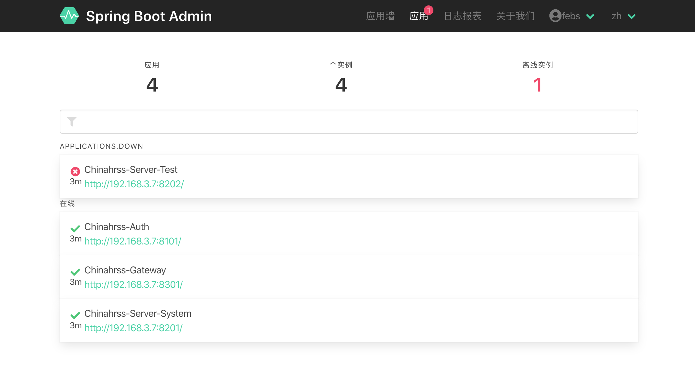
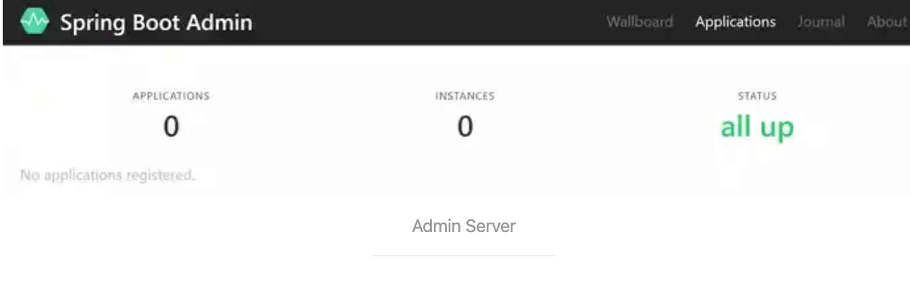

# Spring Boot Admin入门指南

## 1. Spring Boot Actuator

Actuator 是Spring Boot 的模块，他在应用中添加了REST/JMS 端点，方便监控和管理应用。端点提供了监控检测、指标监控、访问日志、线程转储、堆转储和环境信息等等。

## 2. Spring Boot Admin

Actuator功能强大，便于其他应用使用端点（只需要简单的REST调用）。但是开发人员使用时就没那么方便，对于开发人员，有良好的交互界面会更方便浏览监控数据和管理应用。这正是Spirng Boot Admin做的工作，他的actuator端点提供了良好的交互界面，并提供了额外的特性

## 3. Spring Boot Admin 的组成

- Client

  Client部分是包含被监控应用中，并注册到Admin Server

- Server

  Server部分包括 **Admin用户界面并独立运行于被监控应用**

所以应用挂掉欧哲不能正常运行，监控的Server依然正常运行。假如你有多个应用（比如Spirng boot微服务应用），每个应用运行多个实例。对于传统的Actuator监控，很难单独访问每个应用，因为你要跟踪有多少实例及他们在哪运行

对于Spring Boot Admin，**被监控应用的每个实例（client）在启动时注册到Server**，每个实例在Admin Server 就有一个单点，就可以检查他们的状态了



## 4. Server端集成使用

### 4.1 POM依赖

```xml
<dependency>
    <groupId>de.codecentric</groupId>
    <artifactId>spring-boot-admin-starter-server</artifactId>
    <version>2.1.0</version>
</dependency>
```

### 4.2 启动类中加入注解`@EnableAdminServer`

启动类中加入注解`@EnableAdminServer`来开启Admin Server。

```java
@EnableAdminServer
@SpringBootApplication
public class ChinahrssMonitorAdminApplication {

    public static void main(String[] args) {
        SpringApplication.run(ChinahrssMonitorAdminApplication.class, args);
    }

}
```

现在运行程序并在浏览器打开`http://localhost:8080/`，可以看到如下界面：



Server运行正常，但是没有Client 注册

## 5. Client 集成使用

### 5.1 POM 依赖

和Server一样，第一步是向新建Client工程添加依赖：

```xml
<dependency>
    <groupId>de.codecentric</groupId>
    <artifactId>spring-boot-admin-starter-client</artifactId>
    <version>2.2.0</version>
</dependency>
```

### 5.2 指定 Admin Server的url

然后指定运行的Admin Server的url，即在`application.properties`中添加：

```cpp
spring.boot.admin.client.url=http://localhost:8080
```

### 5.3 添加Actuator

```xml
<dependency>
    <groupId>org.springframework.boot</groupId>
    <artifactId>spring-boot-starter-actuator</artifactId>
</dependency>
```

大部分的端点默认是不对外暴露的，所以需要在`application.properties`添加配置使它们暴露：

```php
management.endpoints.web.exposure.include=*
```

暴露Actuator端点后就可以在Admin Server上看到更多的信息了。


## 6. 安全配置

现在所有服务都能正常运行，但是我们要保证Actuator端点和Admin管理界面的安全性

### 6.1 Client安全

如果你已经使用了Spring Security，上面的内容不会起作用，因为Actuator端点默认是被保护的，Admin Server 不能访问他们。如果没有使用Spring Security，首先需要添加依赖

```xml
<dependency>
    <groupId>org.springframework.boot</groupId>
    <artifactId>spring-boot-starter-security</artifactId>
</dependency>
```

为了方便测试，可以配置`management.security.enabled=false`临时禁用Actuator端点的保护。如果使用基本身份认证，需要在配置文件中提供用户名和密码。Admin Server使用这些凭证来认证Client的Actuator端点。

```undefined
spring.boot.admin.client.instance.metadata.user.name=client
spring.boot.admin.client.instance.metadata.user.password=client
```

默认情况下，如果没有配置Spring Boot使用默认用户`user`并在应用启动时自动生成密码。启动时你可以在控制台找到密码。如果你要在应用中明确指定用户名和密码，可以在配置文件中配置：

```undefined
spring.security.user.name=client
spring.security.user.password=client
```

### 6.2 Server安全

和Client一样，在Admin Server添加依赖：


```xml
<dependency>
    <groupId>org.springframework.boot</groupId>
    <artifactId>spring-boot-starter-security</artifactId>
</dependency>
```

在`application.properties`配置登录Admin Server的用户名和密码：


```undefined
spring.security.user.name=server
spring.security.user.password=server
```

然后在**Client**端也要添加这些凭证，否则不能注册到server。

。


```undefined
spring.boot.admin.client.username=server
spring.boot.admin.client.password=server
```

回到**Server**模块，最后一件事是添加Spring Security配置来保证Admin管理界面的安全性。


```java
@Configuration
public class SecurityConfig extends WebSecurityConfigurerAdapter {

    @Override
    protected void configure(HttpSecurity http) throws Exception {
        SavedRequestAwareAuthenticationSuccessHandler successHandler 
            = new SavedRequestAwareAuthenticationSuccessHandler();
        successHandler.setTargetUrlParameter("redirectTo");
        successHandler.setDefaultTargetUrl("/");

        http.authorizeRequests()
            .antMatchers("/assets/**").permitAll()
            .antMatchers("/login").permitAll()
            .anyRequest().authenticated().and()
            .formLogin().loginPage("/login")
            .successHandler(successHandler).and()
            .logout().logoutUrl("/logout").and()
            .httpBasic().and()
            .csrf()
            .csrfTokenRepository(CookieCsrfTokenRepository.withHttpOnlyFalse())
            .ignoringAntMatchers(
                "/instances",
                "/actuator/**"
             );
    }
}
```

这段代码的作用是：限制只有通过HTTP基本认证和登录用户可以使用Admin管理界面。登录界面和静态资源（javascript, HTML, CSS）是公开的，否则无法登录。它是基于cookie的CSRF保护。你可以看到在CSRF保护中有些路径被忽略了，因为Admin Server[缺少适当的支持](http://codecentric.github.io/spring-boot-admin/current/#_csrf_on_actuator_endpoints)。

重启Server，可以看到更加美观的登录界面。


## 参考文章

[Spring Boot Admin入门指南](https://www.jianshu.com/p/1749f04105fb)