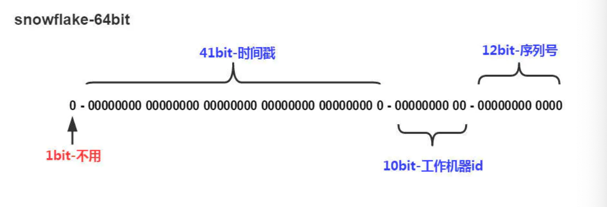

# 分布式id生成方案

## 1.简介

ID是数据的唯一标识

- 传统的做法：

  利用UUID和数据库自增ID来实现

- 互联网企业做法

  背景：大部分公司使用的都是Mysql，并且因为需要事务支持，所以通常会使用innodb存储引擎。

  - 采用传统方式UUID缺点：UUID太长而且无序，所以并不适合在innodb中来做主键
  - 自增ID缺点: 随着公司的业务发展，数据量将越来越大。需要对数据进行分表，而分表后，每个表汇总的数据都会按自己的节奏进行自增，很可能出现id冲突

  这时候就要一个单独的机制来负责生成唯一ID,生成出来的id也可以叫做分布式id，或者全局ID

## 2. 常用分布式ID方案

## 3. 雪花算法-snowflake

我们换个角度来对分布式ID进行思考，只要能让负责生成分布式ID的每台机器在每毫秒内生成不一样的id就行了

### 3.1 核心思想

**分布式ID固定是一个long型的数字，一个long型占8个字节，也就是占用64bit，原始snowflake算法对于bit分配如下图**

- **第一个bit位是标识部分**，在java中由于long的最高位是符号位，正数是0，负数是1，一般生成的ID为正数，所以固定为0。
- **时间戳部分占41bit**，这个是毫秒级的时间，一般实现上不会存储当前的时间戳，而是时间戳的差值（当前时间-固定的开始时间），这样可以使产生的ID从更小值开始；41位的时间戳可以使用69年，(1L << 41) / (1000L * 60 * 60 * 24 * 365) = 69年
- **工作机器id占10bit**，这里比较灵活，比如，可以使用前5位作为数据中心机房标识，后5位作为单机房机器标识，可以部署1024个节点。
- **序列号部分占12bit**，支持**同一毫秒内同一个节点可以生成4096个ID**

根据这个算法的逻辑，只需要将这个算法用Java语言实现出来，封装为一个工具方法，那么各个业务应用可以直接使用该工具方法来获取分布式ID，**只需保证每个业务应用有自己的工作机器id即可**，而不需要单独去搭建一个获取分布式ID的应用。

### 3.2 java实现

[snowflake算法java实现](https://github.com/beyondfengyu/SnowFlake)

## 4 为什么大厂不直接使用雪花算法

在大厂里，其实并没有直接使用snowflake，而是进行了改造，因为snowflake算法中最难实践的就是工作机器id，**原始的snowflake算法需要人工去为每台机器去指定一个机器id**，并配置在某个地方从而让snowflake从此处获取机器id。

但是在大厂里，机器是很多的，人力成本太大且容易出错，所以大厂对snowflake进行了改造。

### 4.1 百度（uid-generator）

github地址：[uid-generator](https://github.com/baidu/uid-generator)

id-generator使用的就是snowflake，只是在生产机器id，也叫做workId时有所不同。

uid-generator中的workId是由uid-generator自动生成的，并且考虑到了应用部署在docker上的情况，在uid-generator中用户可以自己去定义workId的生成策略，默认提供的策略是：应用启动时由数据库分配。说的简单一点就是：应用在启动时会往数据库表(uid-generator需要新增一个WORKER_NODE表)中去插入一条数据，数据插入成功后返回的该数据对应的自增唯一id就是该机器的workId，而数据由host，port组成。

**对于uid-generator中的workId，占用了22个bit位，时间占用了28个bit位，序列化占用了13个bit位**，需要注意的是，和原始的snowflake不太一样，**时间的单位是秒，而不是毫秒，workId也不一样，同一个应用每重启一次就会消费一个workId。**

### 4.2 美团（Leaf）

github地址：[Leaf](https://github.com/Meituan-Dianping/Leaf)

美团的Leaf也是一个分布式ID生成框架。它非常全面，即支持号段模式，也支持snowflake模式。号段模式这里就不介绍了，和上面的分析类似。

Leaf中的snowflake模式和原始snowflake算法的不同点，也主要在workId的生成，Leaf中workId是基于ZooKeeper的顺序Id来生成的，每个应用在使用Leaf-snowflake时，在启动时都会都在Zookeeper中生成一个顺序Id，相当于一台机器对应一个顺序节点，也就是一个workId。

## 参考文章

作者：1点25
链接：https://juejin.im/post/5d6fc8eff265da03ef7a324b
来源：掘金
著作权归作者所有。商业转载请联系作者获得授权，非商业转载请注明出处。

## 参考文章

[大型互联网公司分布式ID方案总结](https://juejin.im/post/5d6fc8eff265da03ef7a324b)