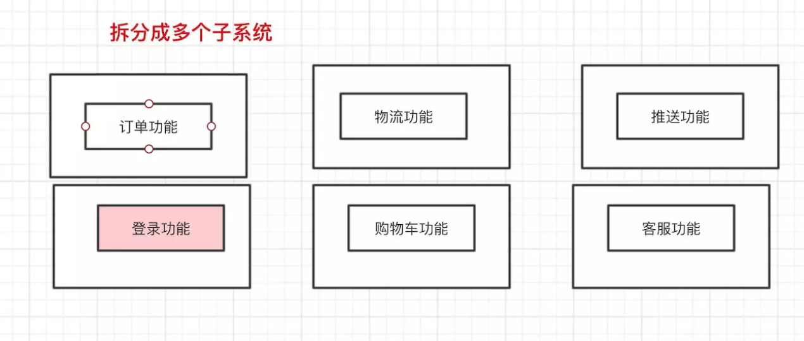
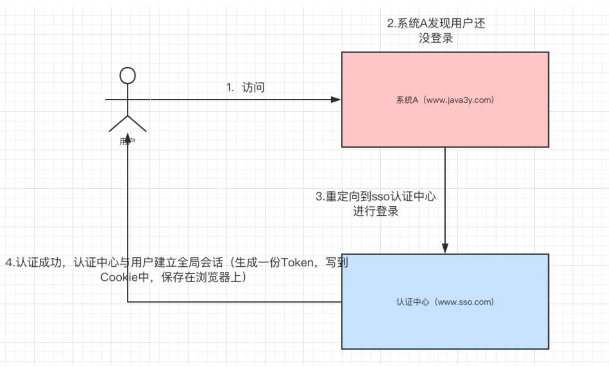
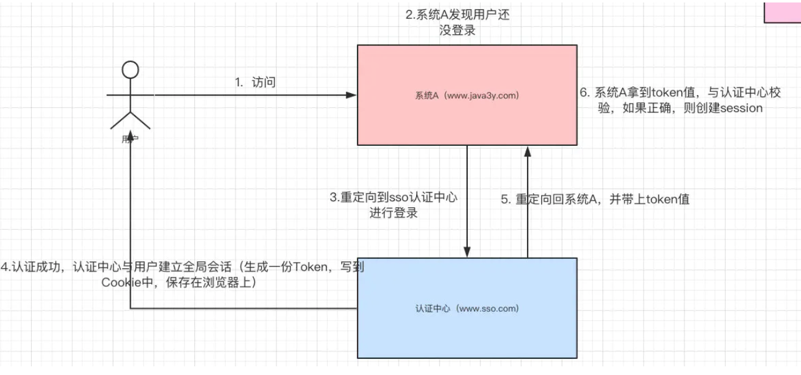

# 单点登录SSO

**在多个应用系统中，只需要登录一次，就可以访问其他相互信任的应用系统**

## 1. 什么是单点登录？

单点登录的英文名叫做：Single Sign On（简称SSO）

在初学/以前的时候，一般我们就**单系统**，所有的功能都在同一个系统上


后来，我们为了**合理利用资源和降低耦合性**，于是把单系统**拆分**成多个子系统

## 2. 案例

比如阿里系的淘宝和天猫，很明显地我们可以知道这是两个系统，但是你在使用的时候，登录了天猫，淘宝也会自动登录


简单来说，单点登录就是在多个系统中，用户只需要一次登录，各个系统即可感知该用户已经登录

## 3. 多系统登录的问题与解决

### 3.1 Session不共享问题

单系统登录功能主要是用Session保存用户信息来实现的，但我们清楚的事：多系统既可能有多个Tomcat，而Session是依赖当前系统的Tomcat，所以系统A的Session 和系统B的Session是**不共享的**


解决系统之间Session不共享问题有以下几种方案：

- Tomcat 集群Session全局复制（集群内每个tomcat的session完全同步）

  影响集群的性能，不建议

- 根据请求的IP进行Hash映射到对应的机器上（这就相当于请求的IP一直会访问同一个服务器）

  如果服务器宕机了，会丢失了一大部分Session的数据，不建议

- 把Session数据放在Redis中，（使用Redis模式Session）**建议**

我们可以把登录功能 **单独抽取 **出来，做成一个子系统



SSO（登录系统）的逻辑如下：

```java
// 登录功能(SSO单独的服务)
@Override
public TaotaoResult login(String username, String password) throws Exception {
	
	//根据用户名查询用户信息
	TbUserExample example = new TbUserExample();
	Criteria criteria = example.createCriteria();
	criteria.andUsernameEqualTo(username);
	List<TbUser> list = userMapper.selectByExample(example);
	if (null == list || list.isEmpty()) {
		return TaotaoResult.build(400, "用户不存在");
	}
	//核对密码
	TbUser user = list.get(0);
	if (!DigestUtils.md5DigestAsHex(password.getBytes()).equals(user.getPassword())) {
		return TaotaoResult.build(400, "密码错误");
	}
	//登录成功，把用户信息写入redis
	//生成一个用户token
	String token = UUID.randomUUID().toString();
	jedisCluster.set(USER_TOKEN_KEY + ":" + token, JsonUtils.objectToJson(user));
	//设置session过期时间
	jedisCluster.expire(USER_TOKEN_KEY + ":" + token, SESSION_EXPIRE_TIME);
	return TaotaoResult.ok(token);
}


```

其他子系统登录时，**请求SSO（登录系统）进行登录，将返回的token写到Cookie中**，下次访问时则把Cookie带上：

```java
public TaotaoResult login(String username, String password, 
		HttpServletRequest request, HttpServletResponse response) {
	//请求参数
	Map<String, String> param = new HashMap<>();
	param.put("username", username);
	param.put("password", password);
	//登录处理
	String stringResult = HttpClientUtil.doPost(REGISTER_USER_URL + USER_LOGIN_URL, param);
	TaotaoResult result = TaotaoResult.format(stringResult);
	//登录出错
	if (result.getStatus() != 200) {
		return result;
	}
	//登录成功后把取token信息，并写入cookie
	String token = (String) result.getData();
	//写入cookie
	CookieUtils.setCookie(request, response, "TT_TOKEN", token);
	//返回成功
	return result;
	
}

```

总结：

- SSO 系统生成一个token，并将用户信息存到Redis中，并设置过期时间
- 其他系统请求SSO系统进行登录，得到SSO返回token，写到Cookie中
- 每次请求时，Cookie都会带上，拦截得到token，判断是否已经登录

到这里，其实我们会发现其实就两个变化

- 将登录功能抽取为一个系统（SSO）,其他系统请求SSO进行登录
- 本来将用户信息存在Session，现在将用户信息存到Redis

### 3.2 Cookie 跨域问题

上面我们解决了Session不能共享的问题，其实还有另外一个问题。**Cookie是不能跨域的**

比如说，我们请求``时，浏览器会自动把`google.com`的Cookie带过去给`google`的服务器，而不会把`www.baidu.com`的Cookie带过去给`google`的服务器。

这就意味着，**由于域名不同**，用户向系统A登录后，系统A返回给浏览器的Cookie，用户再请求系统B的时候不会将系统A的Cookie带过去。

针对Cookie存在跨域问题，有几种解决方案：

1. 服务端将Cookie写到客户端后，客户端对Cookie进行解析，将Token解析出来，此后请求都把这个Token带上就行了
2. 多个域名共享Cookie，在写到客户端的时候设置Cookie的domain
3. 将Token保存在SessionStroage中（不依赖Cookie就没有跨域的问题了）

到这里就已经实现单点登录了

### 3.3 CAS原理

>SSO 仅仅是一种架构，一种设计，而 CAS 则是实现 SSO 的一种手段。两者是抽象与具体的关系。当然，除了 CAS 之外，实现 SSO 还有其他手段，比如简单的 cookie。

说到单点登录，就肯定会见到这个名词：CAS  （Central Authentication Service），下面说说CAS是怎么搞的。

**如果已经将登录单独抽取成系统出来**，我们还能这样玩。现在我们有两个系统，分别是`www.java3y.com`和`www.java4y.com`，一个SSO`www.sso.com`


首先，用户想要访问系统A`www.java3y.com` 受限的资源（比如说购物车功能，购物车功能需要登录后才能访问），系统A`www.java3y.com`发现用户并没有登录，于是**重定向到sso认证中心，并将自己的地址作为参数**。请求的地址如下：

- www.sso.com?service=www.java3y.com

sso认证中心发现用户未登录，将用户引导至登录页面，用户进行输入用户名和密码进行登录，用户与认证中心建立**全局会话（生成一份Token，写到Cookie中，保存在浏览器上）**



随后，认证中心 **重定向回系统A**，并把Token携带过去给系统A，重定向的地址如下

- www.java3y.com?token=xxxxxxx

接着，系统A去SSO 认证中心验证这个Token是否正确，如果正确，则系统A和用户建立局部会话（**创建Session**）。到此，系统A和用户已经是登录状态了。



此时，用户想要访问系统B`www.java4y.com`受限的资源(比如说订单功能，订单功能需要登录后才能访问)，系统B`www.java4y.com`发现用户并没有登录，于是**重定向到sso认证中心，并将自己的地址作为参数**。请求的地址如下：

- `www.sso.com?service=www.java4y.com`

注意，因为之前用户与认证中心`www.sso.com`已经建立了全局会话（当时已经把Cookie保存到浏览器上了），所以这次系统B**重定向**到认证中心`www.sso.com`是可以带上Cookie的。

认证中心**根据带过来的Cookie**发现已经与用户建立了全局会话了，认证中心**重定向回系统B**，并把Token携带过去给系统B，重定向的地址如下：

- `www.java4y.com?token=xxxxxxx`

接着，系统B去sso认证中心验证这个Token是否正确，如果正确，则系统B和用户建立局部会话（**创建Session**）。到此，系统B和用户已经是登录状态了。


看到这里，其实SSO认证中心就类似一个**中转站**。

>CAS原理
>
>1. 登录网址A的时候，发现用户并没有登录，重定向到SSO认证中心，并将自己的地址作为参数
>
>   www.sso.com?service=www.a.com
>
>2. 认证中心发现未登录，引导登录页登录，建立全局会话（生成token，写到cookie）
>
>3. 重定向回系统A，把token带到系统A
>
>   www.a.com?token=xxxxxxx
>
>4. 系统A去SSO认证中心，验证token是否正确。正确建立局部会话（创建session），系统A和用户就是登录状态
>
>5. 系统B访问受限资源，重定向到SSO认证中心
>
>   www.sso.com?service=www.b.com
>
>   因为之前用户与认证中心以及建立全局会话（cookie保存到浏览器），所以这次**重定向可以带上cookie**
>
>6. 认证中心根据带过来的cookie发现以及建立会话，重定向到B,并把token返回系统B
>
>   www.b.com?token=xxxxxxx
>
>7. 系统B去sso认证中心验证这个token是否正确。正确建立局部会话（创建session）到此，系统B和用户已经是登录状态了。

## 参考文章

[什么是单点登录(SSO)](https://juejin.im/post/5cdd42f9518825693f1ebf8d)