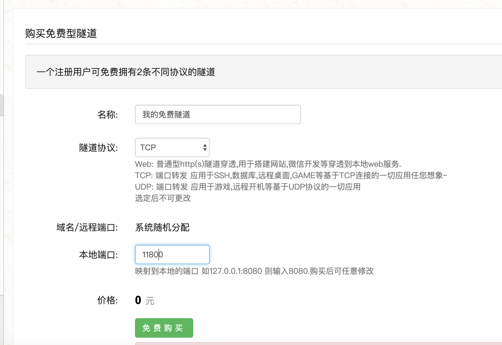
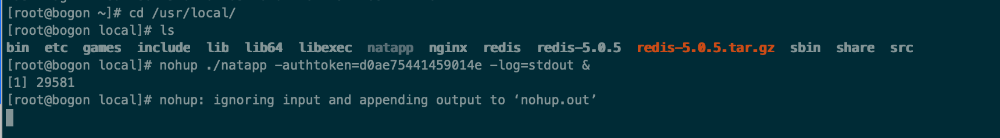
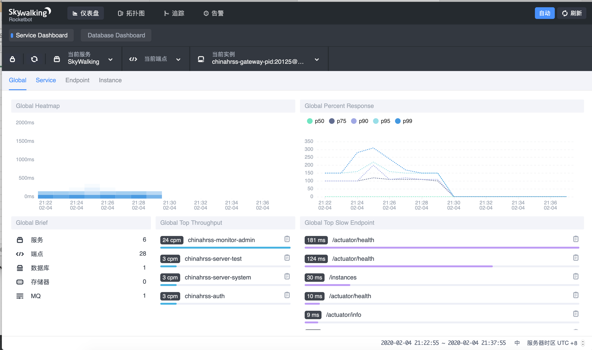

# SkyWalking收集之gRPC代理

## 1. 简介

在微服务体系中，各个微服务分布在各个服务器上，SkyWalking也不例外。如果能通过内网ip访问还好，但是如果 **SkyWalking 和 应用服务器 之间网络不通**。那么他们之间如何建立关联。

我们首先肯定想到可以通过 nginx 代理到SkyWalking 服务器，但是实际代理过程中我们发现 skywalking-oap 收集采用的是gRPC代理，而不是基于 http。

## 2. 解决方案

这里提供两个解决方案

- 通过nginx代理gRPC端口
- 使用natapp等内网穿透以tcp 方式代理

### 2.1 通过nginx代理gRPC端口

#### 2.1.1 前置条件，**nginx 支持http2**

[nginx支持http2](https://www.hi-linux.com/posts/24162.html)

#### 2.1.2 配置

```
  server {
    listen 8022 http2;

    location / {
      grpc_pass grpc://localhost:11800; # 映射到SkyWalking的 gRPC 端口11800
    }
  }
```


### 2.2 通过natapp等内网穿透以tcp 方式代理

### 2.2.1 下载natapp并正确配置启动

[NATAPP1分钟快速新手图文教程](https://natapp.cn/article/natapp_newbie)

### 2.2.2 购买tcp隧道



### 2.2.3 启动natapp

```
./natapp -authtoken=1027bdec1c8d8709
```


上面启动是前台启动，关闭页面就停止了。所以需要使用后台启动

**后台启动**

```
nohup ./natapp -authtoken=d0ae75441459014e -log=stdout -loglevel=ERROR &
```



查看是否启动

```
ps -ef|grep natapp
```


### 2.2.4 backend_service 地址更改

```
-Dskywalking.collector.backend_service=server.natappfree.cc:37444
```




## 参考文章

[Introducing gRPC Support with NGINX 1.13.10](https://www.nginx.com/blog/nginx-1-13-10-grpc/)

[nginx支持http2](https://www.hi-linux.com/posts/24162.html)

[natapp](https://natapp.cn/)