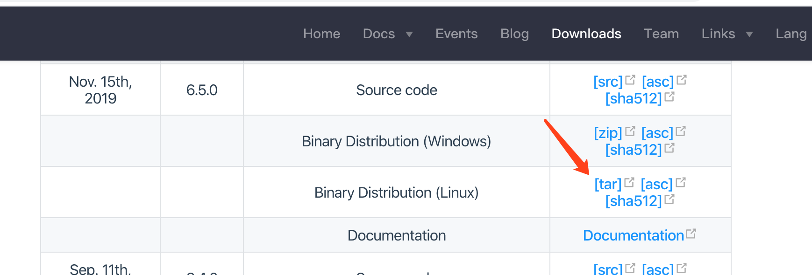
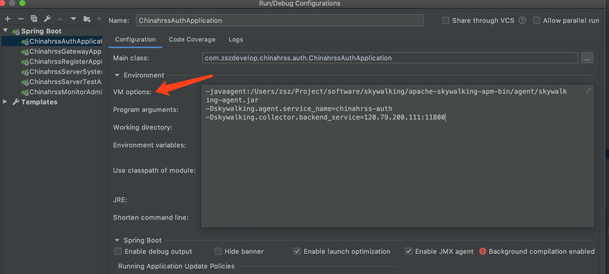
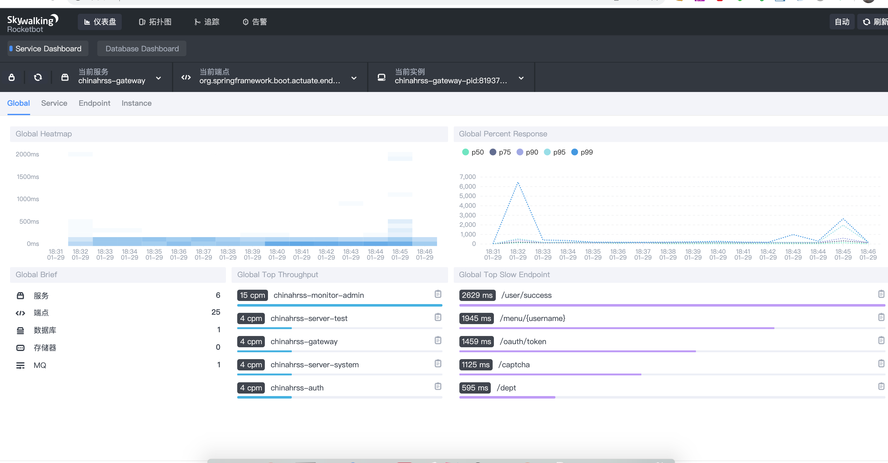
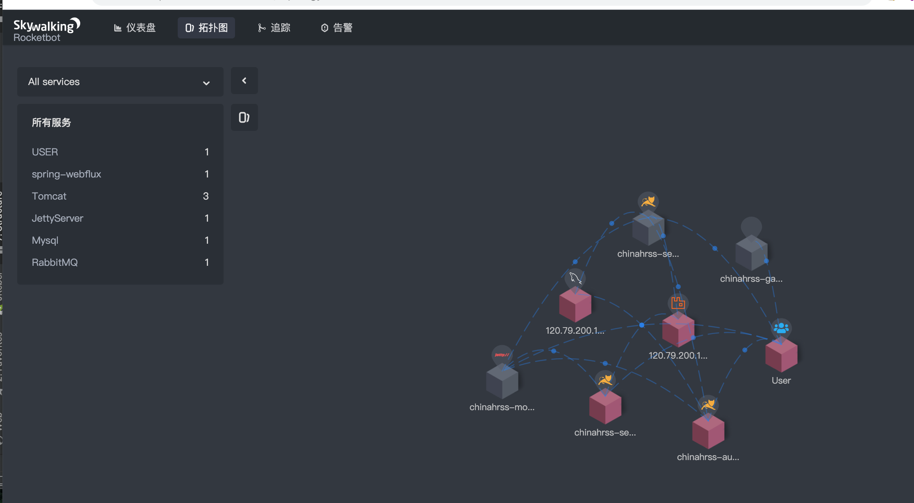
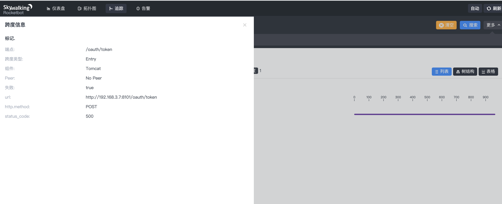
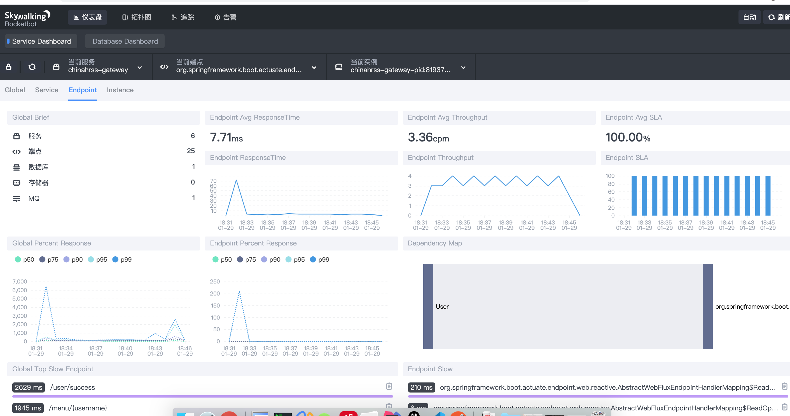

# Spring Cloud应用整合Skywalking

## 1. 下载Skywalking的压缩包

我们到 http://skywalking.apache.org/downloads/ 地址下载Skywalking的压缩包



下载解压后将agent文件。agent文件夹内容如下所示


## 2. 配置启动环境

在IDEA对应项目的启动配置中添加Skywalking agent探针配置

我们以chinahrss-auth为例

点击IDEA的Edit Configurations...，然后选择Environment -> VM Options，添加如下脚本：

```
-javaagent:/Users/zsz/Project/software/skywalking/apache-skywalking-apm-bin/agent/skywalking-agent.jar
-Dskywalking.agent.service_name=chinahrss-auth
-Dskywalking.collector.backend_service=120.79.200.111:11800
```



- -javaagent:/Users/zsz/Project/software/skywalking/apache-skywalking-apm-bin/agent/skywalking-agent.jar

  指定了探针应用agent的地址

- -Dskywalking.agent.service_name=chinahrss-auth

  指定了被手机的应用名称为chinahrss-auth

- -Dskywalking.collector.backend_service=120.79.200.111:11800

  指定了收集器的地址，即刚刚我们使用Docker Compose构建的skywalking-oap。

## 3. 查看效果

### 3.1 主页跟踪效果



### 3.2 拓扑图



### 3.3 请求链路跟踪


可以清晰的看到完整的请求调用链。查看一笔失败的调用，可以看到失败的具体异常堆栈：



### 3.4 仪表盘的Service

点击仪表盘页面的Service，可以看到一些服务相关的信息，如平均响应时间、平均吞吐量、平均时延统计，如下图所示：


### 3.5 仪表盘的Endpoint

点击仪表盘页面的Endpoint，可以看到一些端点相关的信息，如下图所示：



### 3.6 仪表盘的Instance

点击仪表盘页面的Instance，可以看到一些JVM相关的信息，如下图所示：


