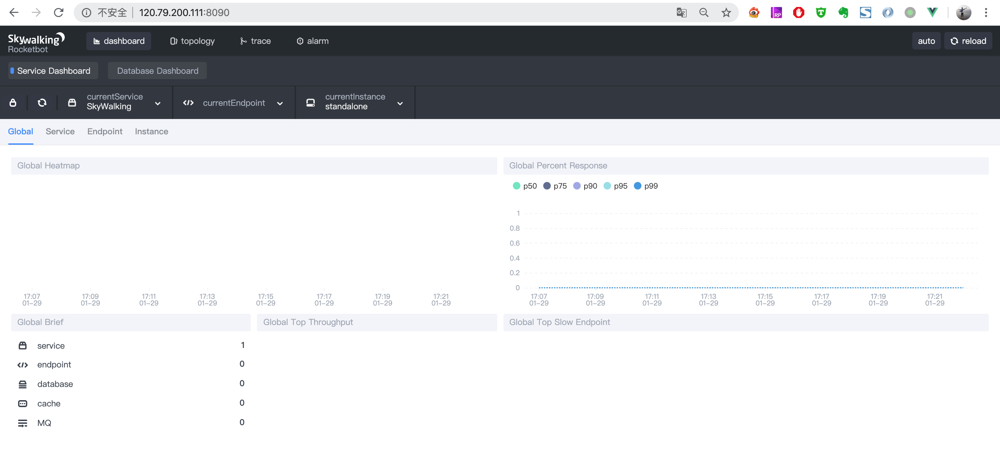

# skywalking分布式追踪

## 1. 简介

skywalking 主要包括了分布式追踪、性能指标分析、应用和服务依赖分析等功能，使用体验后感觉比zipkin更为直观，是替代zipkin的一个不错的选择

## 2. 架构


从上图可以看出skywalking主要分为四个模块：agent、collector、webapp-ui和storage。

- agent：

  Skywalking agent探针无侵入地接入Spring Cloud应用

- collector

  通过HTTP或者GRPC将应用数据采集到collector收集器

- storage

  collector中的数据存储与storage，支持MySQL、H2、Elasticsearch等存储

- webapp-ui

  最终这些数据集中在webapp-ui以图形化的方式呈现


## 3. 搭建skywalking

我们使用Docker Compose 搭建Skywalking，数据存储我们选择性能更高的Elasticsearch。

### 3.1 docker-compose.yml

完整的docker-compose.yml如下

```dockerfile
version: '3'

services:
  elasticsearch:
    image: elasticsearch:6.4.1
    container_name: elasticsearch
    restart: always
    environment:
      - cluster.name=elasticsearch
      - xpack.security.enabled=false
      - "ES_JAVA_OPTS=-Xms216m -Xmx216m"
      - node.name=elasticsearch_node_1
      - "TZ=Asia/Shanghai"
    volumes:
      - /elk/elasticsearch/data:/usr/share/elasticsearch/data
      - /elk/elasticsearch/logs:/usr/share/elasticsearch/logs
      - /elk/elasticsearch/elasticsearch.yml:/usr/share/elasticsearch/config/elasticsearch.yml
    ports:
      - 9200:9200
      - 9300:9300

  skywalking-oap:
    image: apache/skywalking-oap-server:6.4.0
    container_name: skywalking-oap
    depends_on:
      - elasticsearch
    links:
      - elasticsearch
    restart: always
    ports:
      - 11800:11800
      - 12800:12800
    environment:
      - "TZ=Asia/Shanghai"
    volumes:
      - /elk/skywalking/config:/apache-skywalking-apm-bin/config:ro

  skywalking-ui:
    image: apache/skywalking-ui:6.4.0
    container_name: skywalking-ui
    depends_on:
      - skywalking-oap
    links:
      - skywalking-oap
    restart: always
    ports:
      - 8090:8080
    environment:
      - "collector.ribbon.listOfServers=skywalking-oap:12800"
      - "TZ=Asia/Shanghai"
```

上面部署了三个容器：Elasticsearch、skywalking-oap（即collector）和skywalking-ui（即webapp-ui）。

### 3.2 创建挂载目录和配置文件

```
# 创建Elasticsearch的挂载目录
mkdir -p /elk/elasticsearch/data /elk/elasticsearch/logs

# 创建Elasticsearch的配置文件elasticsearch.yml
vim /elk/elasticsearch/elasticsearch.yml
```

### 3.3 编辑 elasticsearch.yml

配置文件elasticsearch.yml内容如下所示：

```
http.host: 0.0.0.0
http.cors.enabled: true
http.cors.allow-origin: "*"
transport.host: 0.0.0.0
```

### 3.4 授权

对Elasticsearch的挂载目录授予最高权限：

```
chmod 777 -R /elk/elasticsearch
```

### 3.5 创建skywalking-oap的挂载目录和配置文件

```
# 创建skywalking-oap的挂载目录
mkdir -p /elk/skywalking/config

# 创建skywalking-oap的配置文件skywalking.yml
touch /elk/skywalking/config/skywalking.yml
```

skywalking.yml内容如下所示：

```
# Licensed to the Apache Software Foundation (ASF) under one
# or more contributor license agreements.  See the NOTICE file
# distributed with this work for additional information
# regarding copyright ownership.  The ASF licenses this file
# to you under the Apache License, Version 2.0 (the
# "License"); you may not use this file except in compliance
# with the License.  You may obtain a copy of the License at
#
#     http://www.apache.org/licenses/LICENSE-2.0
#
# Unless required by applicable law or agreed to in writing, software
# distributed under the License is distributed on an "AS IS" BASIS,
# WITHOUT WARRANTIES OR CONDITIONS OF ANY KIND, either express or implied.
# See the License for the specific language governing permissions and
# limitations under the License.

cluster:
  standalone:
  # Please check your ZooKeeper is 3.5+, However, it is also compatible with ZooKeeper 3.4.x. Replace the ZooKeeper 3.5+
  # library the oap-libs folder with your ZooKeeper 3.4.x library.
#  zookeeper:
#    nameSpace: ${SW_NAMESPACE:""}
#    hostPort: ${SW_CLUSTER_ZK_HOST_PORT:localhost:2181}
#    #Retry Policy
#    baseSleepTimeMs: ${SW_CLUSTER_ZK_SLEEP_TIME:1000} # initial amount of time to wait between retries
#    maxRetries: ${SW_CLUSTER_ZK_MAX_RETRIES:3} # max number of times to retry
#  kubernetes:
#    watchTimeoutSeconds: ${SW_CLUSTER_K8S_WATCH_TIMEOUT:60}
#    namespace: ${SW_CLUSTER_K8S_NAMESPACE:default}
#    labelSelector: ${SW_CLUSTER_K8S_LABEL:app=collector,release=skywalking}
#    uidEnvName: ${SW_CLUSTER_K8S_UID:SKYWALKING_COLLECTOR_UID}
#  consul:
#    serviceName: ${SW_SERVICE_NAME:"SkyWalking_OAP_Cluster"}
#     Consul cluster nodes, example: 10.0.0.1:8500,10.0.0.2:8500,10.0.0.3:8500
#    hostPort: ${SW_CLUSTER_CONSUL_HOST_PORT:localhost:8500}
core:
  default:
    # Mixed: Receive agent data, Level 1 aggregate, Level 2 aggregate
    # Aggregator: Level 2 aggregate
    role: ${SW_CORE_ROLE:Mixed} # Mixed/Receiver/Aggregator
    restHost: ${SW_CORE_REST_HOST:0.0.0.0}
    restPort: ${SW_CORE_REST_PORT:12800}
    restContextPath: ${SW_CORE_REST_CONTEXT_PATH:/}
    gRPCHost: ${SW_CORE_GRPC_HOST:0.0.0.0}
    gRPCPort: ${SW_CORE_GRPC_PORT:11800}
    downsampling:
      - Hour
      - Day
      - Month
    # Set a timeout on metric data. After the timeout has expired, the metric data will automatically be deleted.
    recordDataTTL: ${SW_CORE_RECORD_DATA_TTL:90} # Unit is minute
    minuteMetricsDataTTL: ${SW_CORE_MINUTE_METRIC_DATA_TTL:90} # Unit is minute
    hourMetricsDataTTL: ${SW_CORE_HOUR_METRIC_DATA_TTL:36} # Unit is hour
    dayMetricsDataTTL: ${SW_CORE_DAY_METRIC_DATA_TTL:45} # Unit is day
    monthMetricsDataTTL: ${SW_CORE_MONTH_METRIC_DATA_TTL:18} # Unit is month
storage:
  elasticsearch:
    # set the namespace in elasticsearch
    clusterNodes: ${SW_STORAGE_ES_CLUSTER_NODES:elasticsearch:9200}
    indexShardsNumber: ${SW_STORAGE_ES_INDEX_SHARDS_NUMBER:2}
    indexReplicasNumber: ${SW_STORAGE_ES_INDEX_REPLICAS_NUMBER:0}
    # Batch process setting, refer to https://www.elastic.co/guide/en/elasticsearch/client/java-api/5.5/java-docs-bulk-processor.html
    bulkActions: ${SW_STORAGE_ES_BULK_ACTIONS:2000} # Execute the bulk every 2000 requests
    bulkSize: ${SW_STORAGE_ES_BULK_SIZE:20} # flush the bulk every 20mb
    flushInterval: ${SW_STORAGE_ES_FLUSH_INTERVAL:10} # flush the bulk every 10 seconds whatever the number of requests
    concurrentRequests: ${SW_STORAGE_ES_CONCURRENT_REQUESTS:2} # the number of concurrent requests
    metadataQueryMaxSize: ${SW_STORAGE_ES_QUERY_MAX_SIZE:5000}
    segmentQueryMaxSize: ${SW_STORAGE_ES_QUERY_SEGMENT_SIZE:200}
#  h2:
#    driver: ${SW_STORAGE_H2_DRIVER:org.h2.jdbcx.JdbcDataSource}
#    url: ${SW_STORAGE_H2_URL:jdbc:h2:mem:skywalking-oap-db}
#    user: ${SW_STORAGE_H2_USER:sa}
#    metadataQueryMaxSize: ${SW_STORAGE_H2_QUERY_MAX_SIZE:5000}
#  mysql:
#    metadataQueryMaxSize: ${SW_STORAGE_H2_QUERY_MAX_SIZE:5000}
receiver-sharing-server:
  default:
receiver-register:
  default:
receiver-trace:
  default:
    bufferPath: ${SW_RECEIVER_BUFFER_PATH:../trace-buffer/}  # Path to trace buffer files, suggest to use absolute path
    bufferOffsetMaxFileSize: ${SW_RECEIVER_BUFFER_OFFSET_MAX_FILE_SIZE:100} # Unit is MB
    bufferDataMaxFileSize: ${SW_RECEIVER_BUFFER_DATA_MAX_FILE_SIZE:500} # Unit is MB
    bufferFileCleanWhenRestart: ${SW_RECEIVER_BUFFER_FILE_CLEAN_WHEN_RESTART:false}
    sampleRate: ${SW_TRACE_SAMPLE_RATE:10000} # The sample rate precision is 1/10000. 10000 means 100% sample in default.
    slowDBAccessThreshold: ${SW_SLOW_DB_THRESHOLD:default:200,mongodb:100} # The slow database access thresholds. Unit ms.
receiver-jvm:
  default:
service-mesh:
  default:
    bufferPath: ${SW_SERVICE_MESH_BUFFER_PATH:../mesh-buffer/}  # Path to trace buffer files, suggest to use absolute path
    bufferOffsetMaxFileSize: ${SW_SERVICE_MESH_OFFSET_MAX_FILE_SIZE:100} # Unit is MB
    bufferDataMaxFileSize: ${SW_SERVICE_MESH_BUFFER_DATA_MAX_FILE_SIZE:500} # Unit is MB
    bufferFileCleanWhenRestart: ${SW_SERVICE_MESH_BUFFER_FILE_CLEAN_WHEN_RESTART:false}
istio-telemetry:
  default:
envoy-metric:
  default:
# receiver_zipkin:
#   default:
#     host: ${SW_RECEIVER_ZIPKIN_HOST:0.0.0.0}
#     port: ${SW_RECEIVER_ZIPKIN_PORT:9411}
#     contextPath: ${SW_RECEIVER_ZIPKIN_CONTEXT_PATH:/}
query:
  graphql:
    path: ${SW_QUERY_GRAPHQL_PATH:/graphql}
alarm:
  default:
telemetry:
  none:
```

上面配置中，

- 存储选择了Elasticsearch代替默认的H2，其他配置均为skywalking-oap的默认配置。
- Skywalking的UI。默认是8080端口。和我应用端口冲突了，我改成8090

上面docker-compose.yml中我们通过`TZ=Asia/Shanghai`设置了时区，如果不指定时区的话默认是UTC时区，你会看到收集到的数据会比实际早8个小时。

### 3.6 设置内存权限

在启动之前我们还需要通过`sysctl -w vm.max_map_count=262144`命令设置内存权限，`262144`是构建Elasticsearch的最小内存。

### 3.7 启动容器

在目录/elk/DockerCompos， 使用`docker-compose up -d`启动这几个容器：

#### 3.8 查看 Elasticsearch 

稍等片刻后，在浏览器访问 [http://120.79.200.111:9200/](http://120.79.200.111:9200/) 地址，如下所示表示Elasticsearch已经启动成功：

### 3.9 访问 Skywalking的UI

访问Skywalking的UI界面：http://120.79.200.111:8090/



因为还没有整合agent所以现在还没有数据，界面是空的。