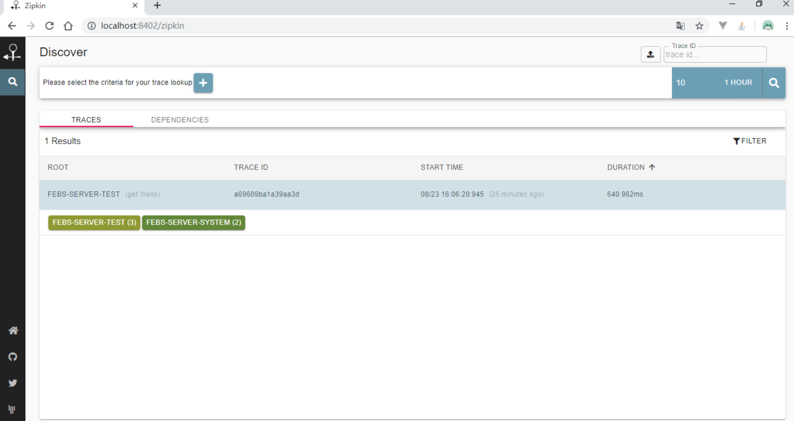
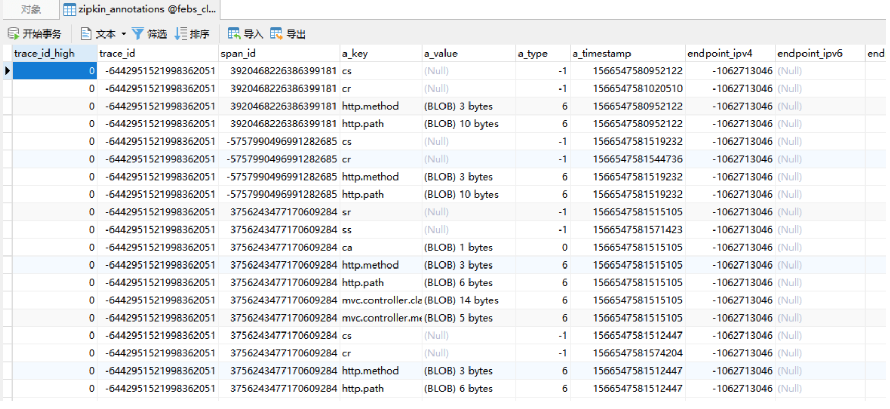

# Sleuth Zipkin链路追踪

一个复杂的业务流程通常会被拆分多个微服务系统来完成，微服务间通过Feign来通信。当业务系统足够复杂时，一个完整的HTTP请求调用链一般会经过多个微服务系统，要通过日志来跟踪一整个调用链变得不再那么简单。

我们通过Spring Cloud Feign来远程访问受保护的资源，通过Spring Cloud Sleuth来跟踪这个过程，并借助Zipkin以图形化界面的方式展示

## 2. 整合Spring Cloud Sleuth

### 2.1 引入sleuth依赖

```xml
<dependency>
    <groupId>org.springframework.cloud</groupId>
    <artifactId>spring-cloud-starter-sleuth</artifactId>
</dependency>
```

### 2.2 打印日志

### 2.2.1 客户端ModuleA打印日志

```java
@Slf4j
@RestController
public class TestController {

    @Autowired
    private IHelloService helloService;

    @GetMapping("hello")
    public String hello(String name) {
        log.info("Feign调用febs-server-system的/hello服务");
        return this.helloService.hello(name);
    }
    ......
}
```

### 2.2.2 服务端ModuleB打印日志

```java
@Slf4j
@RestController
public class TestController {

    ......
    @GetMapping("hello")
    public String hello(String name) {
        log.info("/hello服务被调用");
        return "hello" + name;
    }
}
```

### 2.3 观察打印的日志

观察客户端ModuleA 打印的日志

```
2019-08-23 14:22:51.774  INFO [ModuleA,72bb0469bee07104,72bb0469bee07104,false] 22728 --- [nio-8202-exec-1] c.m.f.s.test.controller.TestController   : Feign调用febs-server-system的/hello服务
```

观察服务端ModuleB打印的日志

```
2019-08-23 14:22:52.469  INFO [ModuleB-System,72bb0469bee07104,43597a6edded6f2e,false] 812 --- [nio-8201-exec-2] c.m.f.s.s.controller.TestController      : /hello服务被调用

```

可以看到，日志里出现了`[ModuleB,72bb0469bee07104,72bb0469bee07104,false]`信息，这些信息由Spring Cloud Sleuth生成，用于跟踪微服务请求链路。这些信息包含了4个部分的值，它们的含义如下：

1. ModuleB微服务的名称，与`spring.application.name`对应；
2. `72bb0469bee07104`称为Trace ID，在一条完整的请求链路中，这个值是固定的。观察上面的日志即可证实这一点；
3. `43597a6edded6f2e`称为Span ID，它表示一个基本的工作单元；
4. `false`表示是否要将该信息输出到Zipkin等服务中来收集和展示，这里我们还没有集成Zipkin，所以为false。

现在我们要跟踪整条请求链路，就可以通过traceId来完成，但是，从海量日志里捞取traceID并追踪也不是一件轻松的事。下面我们介绍借助zipkin实现使用图形化界面的方式追踪请求链路

## 3. 整合Zipkin

在整合Zipkin之前，我们需要先搭建RabbitMQ。RabbitMQ用于收集Sleuth提供的追踪信息，然后zipkin Server 从RabbitMQ里获取，这样可以提升性能

### 3.1 安装RabbitMQ

[RabbitMQ安装](mq/RabbitMQ/action/RabbitMQ安装.md)

### 3.2 安装Zipkin

```
curl -sSL https://zipkin.io/quickstart.sh | bash -s
```

网络原因可能比较慢

### 3.3 新建zipkin数据库表

[官方数据库表地址](https://github.com/openzipkin/zipkin/blob/master/zipkin-storage/mysql-v1/src/main/resources/mysql.sql)


### 3.4 启动zipkin.jar

```
java -jar zipkin.jar --server.port=8402 --zipkin.storage.type=mysql --zipkin.storage.mysql.db=febs_cloud_base --zipkin.storage.mysql.username=root --zipkin.storage.mysql.password=123456 --zipkin.storage.mysql.host=localhost --zipkin.storage.mysql.port=3306 --zipkin.collector.rabbitmq.addresses=localhost:5672 --zipkin.collector.rabbitmq.username=febs --zipkin.collector.rabbitmq.password=123456
```

上面命令指定了数据库链接和RabbitMQ链接信息。更多可选配置可以解压zipkin.jar，查看`zipkin\BOOT-INF\classes`路径下的`zipkin-server-shared.yml`配置类源码。

### 3.5 引入相关依赖

```xml
<dependency>
    <groupId>org.springframework.cloud</groupId>
    <artifactId>spring-cloud-starter-zipkin</artifactId>
</dependency>
<dependency>
    <groupId>org.springframework.amqp</groupId>
    <artifactId>spring-rabbit</artifactId>
</dependency>
```

### 3.6 application.yml里添加如下配置:

```yml
spring:
  zipkin:
    sender:
      type: rabbit
  sleuth:
    sampler:
      probability: 1
  rabbitmq:
    host: localhost
    port: 5672
    username: febs
    password: 123456
```

- `spring.zipkin.sender.type`指定了使用RabbitMQ收集追踪信息；
- `spring.sleuth.sampler.probability`默认值为0.1，即采样率才1/10，发送10笔请求只有一笔会被采集。为了测试方便，我们可以将它设置为1，即100%采样；
- `spring.rabbitmq`用于配置RabbitMQ连接信息，你可能会问，为什么刚刚RabbitMQ端口是15672，这里却配置为5672，是不是写错了呢？其实不是，15672是RabbitMQ的管理页面端口，5672是AMPQ端口。

### 3.7 浏览器访问

http://localhost:8402/zipkin/链接





查看依赖关系


### 3.8 查看数据表，看是否存储了信息：

