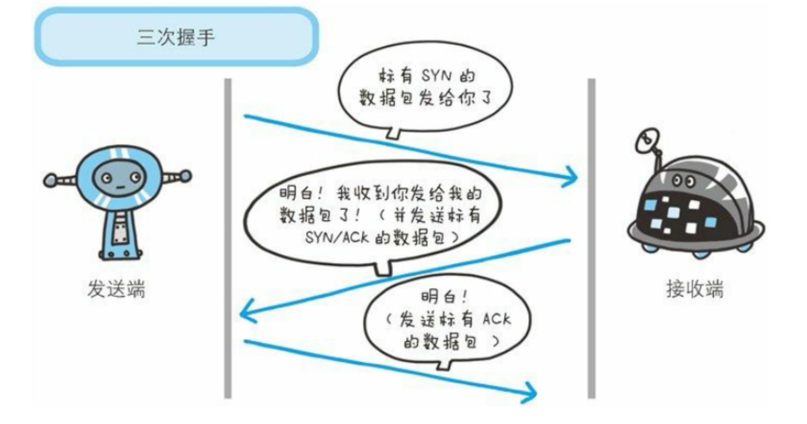
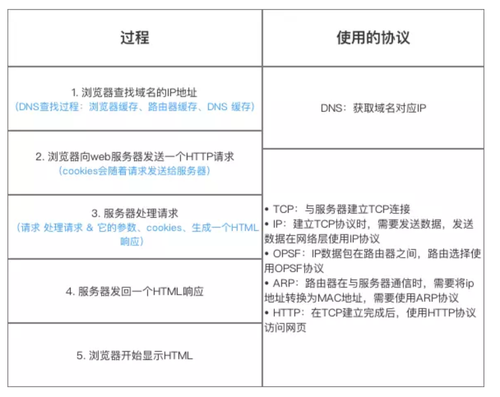

# 计算机网络常见知识点

## 1. OSI 与 TCP/IP 各层的结构与功能，都有哪些协议

我们一般采用比较折中的办法，就是中和 OSI 和 TCP/IP 的优点，采用一种只有五层协议的体系结构


我们自上而下的介绍一下各层的作用

### 1.1 应用层

应用层（application-layer）的任务是通过应用**进程间的交互**来完成特定的网络应用

主要协议包括

- 域名系统DNS
- HTTP协议
- 电子邮件的SMTP协议

### 1.2 运输层

运输层（transport layer）的主要任务就是负责**向两台主机进程**之间的通信提供通用的数据传输服务

传输层的主要协议：

- **传输控制协议TCP**（Transmission Control Protocol）

  提供**面向连接**的，**可靠的**数据传输服务。

- **用户数据协议 UDP**（User Datagram Protocol）

  提供**无连接**的，尽最大努力的数据传输服务（**不保证数据传输的可靠性**）。

### 1.3 网络层

在计算机网络中进行通信的两个计算机之间**可能会经过很多个数据链路**，也可能还要经过很多通信子网，网络层的任务就是**选择合适的网间路由和交换结点，确保数据及时传送**。

在发送数据时，网络层把运输层产生的报文段或用户数据报封装成分组和包进行传送。在 TCP/IP 体系结构中，由于网络层使用 **IP 协议**，因此分组也叫 **IP 数据报** ，简称 **数据报**。

### 1.4 数据链路层

**数据链路层(data link layer)通常简称为链路层。两台主机之间的数据传输，总是在一段一段的链路上传送的，这就需要使用专门的链路层的协议。** 在两个相邻节点之间传送数据时，**数据链路层将网络层交下来的 IP 数据报组装成帧**，在两个相邻节点间的链路上传送帧。每一帧包括数据和必要的控制信息（如同步信息，地址信息，差错控制等）。

### 1.5 物理层

在物理层上所传送的数据单位是比特。 **物理层(physical layer)的作用是实现相邻计算机节点之间比特流的透明传送，尽可能屏蔽掉具体传输介质和物理设备的差异。**

## 2. TCP 三次握手和四次挥手（常问）

为了准确无误的把数据送达目标处，TCP协议采用了三次握手策略

### 2.1 TCP 三次握手漫画图解

如下图所示，下面的两个机器人通过3次握手确定了对方能正确接收和发送消息




简单示意图：

- 客户端：发送带有SYN 标志的数据包  一次握手-服务端
- 服务端- 发送带有SYN/ACK 标志的数据包— 二次握手— 客户端
- 客户端— 发送带有ACK 标志的数据包  三次握手 服务端

### 2.2 为什么要三次握手

三次握手的目的是建立可靠的通信信道，说到通讯，简单来说就是数据发送与接收，而三次握手最主要的目的就是**双方确认与对方的发送和接收是正常的**

- 第一次握手：Client 什么都不能确认；Server 确认了对方发送正常，自己接收正常

- 第二次握手：Client 确认了：自己发送、接收正常，对方发送、接收正常；Server 确认了：对方发送正常，自己接收正常

- 第三次握手：Client 确认了：自己发送、接收正常，对方发送、接收正常；Server 确认了：自己发送、接收正常，对方发送、接收正常

所以三次握手就能确认双发收发功能都正常，缺一不可。

### 2.3 第二次握手为什么要回传SYN和ACK?

- 回传SYN

  **发送端**确认自己**发送能力**没有问题

- 回传ACK

  **接收端**还不知道自己**发送能力**有没有问题，需要通过ACK来确认

## 3. TCP 四次挥手（常问）


断开一个TCP 连接则需要”四次挥手“

- 客户端-发送一个FIN，用来关闭客户端到服务器的数据传送
- 服务器-收到这个FIN，它发回一个ACK，确认序号为收到的序号加1。和SYN 一样，一个FIN 将占用一个序号
- 服务器-**关闭与客户端连接**，发送送一个FIN 给客户端
- 客户端- 发送ACK 报文确认，并将确认序号设置为收到序号加1

### 3.1 为什么要四次挥手

**任何一方都可以在数据传送结束后发出发出释放通知**，待对方确认后**进入半关闭状态**，当另一方也没有数据在发送的时候，则发送链接释放通知。**对方确认后就完全关闭了TCP 链接**

>举个例子：A 和 B 打电话，通话即将结束后，A 说“我没啥要说的了”，B回答“我知道了”，但是 B 可能还会有要说的话，A 不能要求 B 跟着自己的节奏结束通话，于是 B 可能又巴拉巴拉说了一通，最后 B 说“我说完了”，A 回答“知道了”，这样通话才算结束。

## 4. TCP,UDP 协议的区别


- **UDP 在传送数据之前不需要建立连接，远地主机在收到UDP 报文后，不需要给出任何确认**
  - QQ语言
  - QQ视频
  - 直播等
- **TCP提供面向连接的服务。在传送数据之前必须建立连接，数据传送结束后释放连接**。
  -  文件传输
  - 发送和接收邮件
  - 远程登录

## 5. TCP 协议如何保证可靠传输

1. **确认和重传**：接收方收到报文就会确认，发送方发送一段时间后没有收到确认就重传。

2. **数据校验**：TCP报文头有校验和，用于校验报文是否损坏

3. **数据合理分片和排序**：

   - tcp会按MTU合理分片，接收方会缓存未按序到达的数据，重新排序后再交给应用层

   - UDP：IP数据报大于1500字节,大于MTU.这个时候发送方IP层就需要分片(fragmentation).把数据报分成若干片,使每一片都小于MTU.而接收方IP层则需要进行数据报的重组.这样就会多做许多事情,而更严重的是,由于UDP的特性,当某一片数据传送中丢失时,接收方便无法重组数据报.将导致丢弃整个UDP数据报.

4. **流量控制**：当接收方来不及处理发送方的数据，能提示发送方降低发送的速率，防止包丢失。（TCP 利用滑动窗口实现流量控制）

5. **拥塞控制**：当网络拥塞时，减少数据的发送。

## 6. 在浏览器中输入url 地址>>显示主页的过程（常问）



总体来说分为以下几个过程

1. DNS 解析
2. TCP 连接
3. 发送HTTP 请求
4. 服务器处理请求并返回HTTP报文
5. 浏览器解析渲染页面
6. 连接结束

## 7. 状态码


## 8. 各种协议与HTTP协议之间的关系


## 9. HTTP 长连接、短连接

- **在HTTP1.0中默认使用短连接**

  也就是客户端和服务器每进行一次HTTP操作，就建立一次连接，**任务结束就中断连接**。当客户端浏览器访问的某个HTML 或其他类型的Web页中包含有其他web资源（如JavaScript文件、图像文件、CSS文件等），每遇到这样一个Web资源，浏览器就会重新建立一个HTTP会话。

- **从HTTP/1.1起默认使用长连接** 

  http1.1 默认使用长连接，用以保持连接特性，使用长连接的HTTP协议，会在响应体加入这行代码

  ```
  Connection:keep-alive
  ```

  在使用长连接的情况下，当一个网页打开完成后，客户端和服务器之间用于传输HTTP数据的**TCP连接不会关闭，客户端再次访问这个服务器时，会继续使用这一条已经建立的连接**。Keep-Alive不会永久保持连接，它有一个保持时间，可以在不同的服务器软件（如Apache）中设定这个时间。实现长连接需要客户端和服务端都支持长连接。

**HTTP协议的长连接和短连接，实质上是TCP协议的长连接和短连接。**

## 10. HTTP 是不保存状态协议，如何保存用户状态

HTTP 是一种不保存状态，即无状态（stateless）协议。也就是说 HTTP 协议自身不对请求和响应之间的通信状态进行保存。那么我们保存用户状态呢？

- Session机制

  - session 的主要作用就是通过服务端记录用户的状态

  - 典型的应用场景就是购物车，当你要添加商品到购物车时，系统不知道是哪个用户操作的，因为HTTP协议是无状态的。服务器给特定的用户创建特定的session之后就可以标识这个用户并且跟踪这个用户
  - 一般情况下，服务器会在一定时间内保存这个 Session，过了时间限制，就会销毁这个Session

### 10.1 服务端如何保存session

保存的方式有很多，最常用的就是内存和数据库（比如内存数据库redis）

### 10.2 如何实现session跟踪

session保存在服务端，那么如何实现session跟踪呢？

大部分情况下，我们都是通过cookie中附加一个 Session ID来跟踪

### 10.3 如果cookie 被禁用如何跟踪

最常用的就是利用URL 重写吧Session ID 直接附加到URL 路径后面

## 11. Cookie 的作用是什么？和Session 有什么区别？

Cookie 和 Session 都是用来**跟踪浏览器用户身份的会话方式**（会话跟踪的方式）

因为Cookie数据保存在客户端（浏览器端），Session数据保存在服务端。所以造成他们的使用场景不同，安全性不同

- Cookie的应用场景
  - 记住用户名
  - 历史记录
- Session 的应用场景
  - 购物车

## 12. HTTP 1.0 和HTTP 1.1 的主要区别

1. 长连接

  - **在HTTP/1.0中，默认使用的是短连接**‘
  - **HTTP 1.1起，默认使用长连接**

2. **错误状态响应码** 

  - 在HTTP1.1中新增了24个错误状态响应码

3. **缓存处理**
   - 在HTTP1.0中主要使用header里的If-Modified-Since,Expires来做为缓存判断的标准
   - HTTP1.1则引入了更多的缓存控制策略例如Entity tag，If-Unmodified-Since, If-Match, If-None-Match等**更多可供选择的缓存头来控制缓存策略**。
4. **带宽优化及网络连接的使用**（断点续传）
   - HTTP1.0中，存在一些浪费带宽的现象，例如客户端只是需要某个对象的一部分，而服务器却将整个对象送过来了，并且**不支持断点续传**功能
   - HTTP1.1则在请求头引入了range头域，它允许只请求资源的某个部分，即返回码是206（Partial Content），这样就方便了开发者自由的选择以便于充分利用带宽和连接。

## 13. URI 和URL 的区别

- URI(Uniform Resource Identifier) 是统一资源标志符，可以唯一标识一个资源。
- URL(Uniform Resource Location) 是统一资源定位符，可以提供该资源的路径。**它是一种具体的 URI**，即 URL 可以用来标识一个资源，而且还指明了如何 locate 这个资源。

## 14. HTTP 和 HTTPS 的区别？

1. **端口**：HTTP的URL由“http://”起始且默认使用端口80，而HTTPS的URL由“https://”起始且默认使用端口443。

2. 安全性（传输内容明文）

   HTTP 安全性没有 HTTPS高

   - HTTP协议运行在TCP之上，所有传输的内容都是明文，客户端和服务器端都无法验证对方的身份。
   - HTTPS是运行在SSL/TLS之上的HTTP协议，SSL/TLS 运行在TCP之上。所有传输的内容都经过加密，加密采用对称加密，但对称加密的密钥用服务器方的证书进行了非对称加密

3. 资源消耗上

   HTTPS 比HTTP耗费更多服务器资源