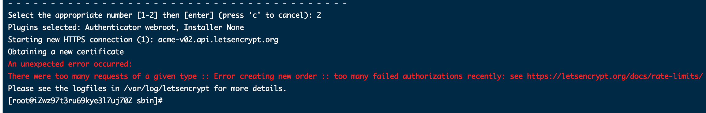

# 网站支持https

## 1. 使用免费的 Let's Encrypt 证书

Let's Encrypt 能够免费签名一个证书，所以假如要求不高，可以使用它签名的证书，使用也非常的简单，只要验证邮箱地址就能使用了，不过有 90 天的有效期（到期前可以续）。

为了生成证书，Let's Encrypt 提供了一个软件 Certbot 来进行管理，这个软件有很多插件，可以生成证书并自动化配置 Nginx/Apache ，不过我还是选择使用它生成密钥对和证书，然后自己在 WEB 服务器上进行配置，使用很简单。


## 2. 生成指定域名证书

### 2.1 执行生成命令

```bash
certbot certonly --email 312905679@qq.com -d test.isture.com 
```


这里选择第二项

### 2.2 nginx的配置

 # 商城app 接口
```sh
 server {
    listen          80;
    listen  443 ssl;
    server_name     test.isture.com;
    ssl_certificate /etc/letsencrypt/live/test.isture.com/fullchain.pem;
    ssl_certificate_key /etc/letsencrypt/live/test.isture.com/privkey.pem;
    location / {
            proxy_pass http://localhost:8085;
    }
}
```
## 3. certbot 常用指令

### 3.1 列出证书和到期时间

```sh
certbot certificates
```


以上可以看出此https 证书已经过期了

### 3.2 测试是否能更新

```
certbot renew --dry-run
```

### 3.3 手动立即更新SSL证书

```
certbot renew 
```

## 4. 集成问题

### 4.1 Let's Encrypt 配置 SSL 证书的时候，提示DNS problem: NXDOMAIN looking up A for xxx.com

问题标的比较明确： DNS Problem .

ping 不通该域名，可能是域名解析没有配置

### 4.2 最近授权太多次



## 参考文章

[使用Certot](https://learnku.com/laravel/t/2525/using-certbot-lets-encrypt-small-step-run-towards-https)

