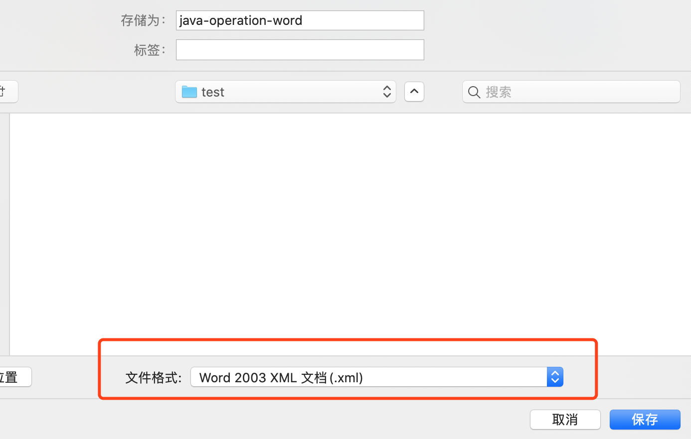
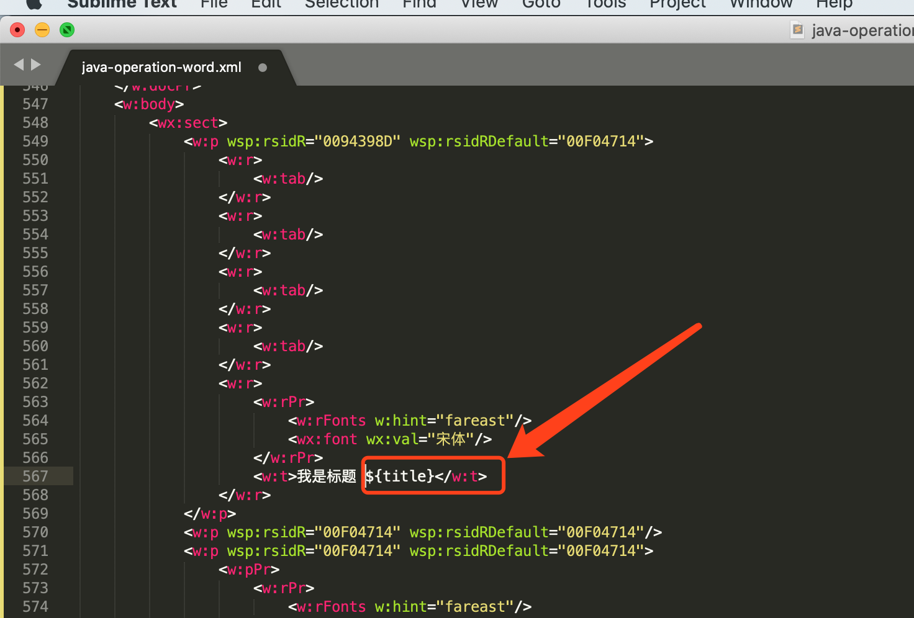

# java导出生成word之XML方式

## 1. 简介

Word从2003开始支持XML格式，操作流程

- 先用office2003或者2007编辑好word的样式，然后另存为xml，
- 将xml翻译为FreeMarker模板，
- 最后用java来解析FreeMarker模板并输出Doc。

经测试这样方式生成的word文档完全符合office标准，样式、内容控制非常便利，打印也不会变形，生成的文档和office中编辑文档完全一样。

## 2. 集成使用

1. 新建项目

2. 引入相关pom依赖 `FreeMarker`

   ```
   <dependency>
       <groupId>org.springframework.boot</groupId>
       <artifactId>spring-boot-starter-freemarker</artifactId>
   </dependency>
   ```

3. 在application.propertes中添加相应配置

   ```
   ## Freemarker 配置
   ##模版存放路径（默认为 classpath:/templates/）
   spring.freemarker.template-loader-path=classpath:/templates/
   ##是否生成缓存，生成环境建议开启（默认为true）
   spring.freemarker.cache=false
   ##编码
   spring.freemarker.charset=UTF-8
   spring.freemarker.check-template-location=true
   ##content-type类型(默认为test/html)
   spring.freemarker.content-type=text/html
   ## 设定所有request的属性在merge到模板的时候，是否要都添加到model中（默认为false）
   spring.freemarker.expose-request-attributes=false
   ##设定所有HttpSession的属性在merge到模板的时候，是否要都添加到model中.(默认为false)
   spring.freemarker.expose-session-attributes=false
   ##RequestContext属性的名称（默认为-）
   spring.freemarker.request-context-attribute=request
   ##模板后缀(默认为.ftl)
   spring.freemarker.suffix=.html
   ```

4. 简单准备一份word文档

   

5. 将word保存为xml格式

   

6. 打开xml将你要的文字用`${title}` 来替代。并保存为freemarker模板.ftl文件

   

7. 将.ftl 文件放在templates目录下

   

8. 使用freemarker模板设置对应属性值

   ```java
   public class WordTest {
   
       private Configuration configuration = null;
   
       public WordTest(){
           configuration = new Configuration();
           configuration.setDefaultEncoding("UTF-8");
       }
   
       public static void main(String[] args) {
           WordTest test = new WordTest();
           test.createWord();
       }
   
       public void createWord(){
           Map<String,Object> dataMap=new HashMap<String,Object>();
           getData(dataMap);
           try {
               configuration.setDirectoryForTemplateLoading(new File("/Users/zsz/Project/demo/2020year/4yue/operationword/src/main/resources/templates"));
           } catch (IOException e) {
               e.printStackTrace();
           }
           Template t=null;
           try {
               t = configuration.getTemplate("java-operation-word.ftl"); //获取模板文件
           } catch (IOException e) {
               e.printStackTrace();
           }
           File outFile = new File("/Users/zsz/Project/demo/2020year/4yue/operationword/toword+"+System.currentTimeMillis()+".doc"); //导出文件
           Writer out = null;
           try {
               out = new BufferedWriter(new OutputStreamWriter(new FileOutputStream(outFile)));
           } catch (FileNotFoundException e1) {
               e1.printStackTrace();
           }
   
           try {
               t.process(dataMap, out); //将填充数据填入模板文件并输出到目标文件
           } catch (TemplateException e) {
               e.printStackTrace();
           } catch (IOException e) {
               e.printStackTrace();
           }
       }
   
       private void getData(Map<String, Object> dataMap) {
           dataMap.put("title", "标题设计");
           dataMap.put("nian", "2016");
           dataMap.put("yue", "3");
           dataMap.put("ri", "6");
           dataMap.put("shenheren", "lc");
           dataMap.put("xwdd", "这是询问地点HHHHHHHHHHHH");
   
           List<Map<String,Object>> list = new ArrayList<Map<String,Object>>();
           for (int i = 0; i < 10; i++) {
               Map<String,Object> map = new HashMap<String,Object>();
               map.put("xuehao", i);
               map.put("neirong", "内容"+i);
               list.add(map);
           }
   
   
           dataMap.put("list", list);
       }
   
   //    @Test
       public void genFile() throws Exception {
           // 第一步：创建一个Configuration对象，直接new一个对象。构造方法的参数就是freemarker对于的版本号。
           Configuration configuration = new Configuration(Configuration.getVersion());
           // 第二步：设置模板文件所在的路径。
           configuration.setDirectoryForTemplateLoading(new File("D:/workspace/e3/e3-item-web/src/main/webapp/WEB-INF/ftl"));
           // 第三步：设置模板文件使用的字符集。一般就是utf-8.
           configuration.setDefaultEncoding("utf-8");
           // 第四步：加载一个模板，创建一个模板对象。
           Template template = configuration.getTemplate("hello.ftl");
           // 第五步：创建一个模板使用的数据集，可以是pojo也可以是map。一般是Map。
           Map dataModel = new HashMap<>();
           //向数据集中添加数据
           dataModel.put("hello", "this is my first freemarker test.");
           // 第六步：创建一个Writer对象，一般创建一FileWriter对象，指定生成的文件名。
           Writer out = new FileWriter(new File("D:/aaa/out/hello.html"));
           // 第七步：调用模板对象的process方法输出文件。
           template.process(dataModel, out);
           // 第八步：关闭流。
           out.close();
       }
   }
   ```

9. 查看word

   

