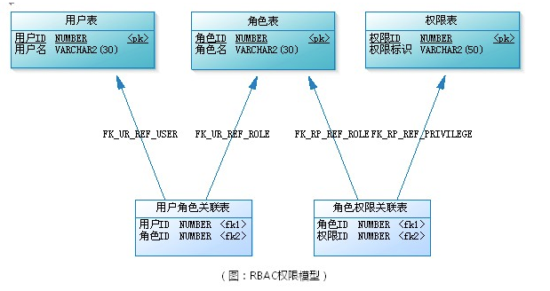

# RBAC权限管理

## 1. 简介

RBAC（Role-Based Access Control, 基于角色的访问控制），就是用户通过角色与权限进行关联。简单地说，一个用户拥有若干角色，每一个角色拥有若干权限。

这样就构成“用户-角色-权限”的授权模型，这种模型中，用户与角色，角色与权限之间，是多对多关系

### 1.1 角色是什么

可以理解为一定数量的权限的集合，权限的载体。

- 例如：一个论坛讨论系统，“超级管理员”，“版主”都是角色

### 1.2 权限是什么

版主可管理版内的帖子，可管理版内的用户等，这些就是权限

- 要给某个用户授予这些权限，不需要直接将权限授予用户，可将“版主”这个角色赋予用户

## 2. 用户分组（扩展）

用用户的数量非常大时，要给系统每个用户逐一授权（授角色），是件非常繁琐的事情，这时，就需要给用户分组，每个用户组内有多个用户，除了可给用户授权外，还可以给用户组授权。这样一来，**用户拥有的所有权限，就是用户个人拥有的权限与该用户组拥有的权限之和**

## 3. 权限的划分（扩展）

在应用系统中，权限表现成什么？对功能模块的操作，对上传文件的删改，菜单的访问，甚至是页面的按钮、某个图片的可见性控制，都可属于权限的范畴。

权限划分

- 功能操作作为一类，

- 而把文件，菜单、页面元素作为一类。

这样就构成了“用户-角色-权限-资源的授权模型”。而在做数据建模时，可把功能操作和资源统一管理。也就是都直接与权限进行关联，这样更具有便捷性和易扩展性

>小项目并不一定要按此划分，直接权限表就可以了，此方案是为了更好的扩展性

>注意：请留意权限表中有一列“权限类型”，我们根据它的取值来区分是哪一类权限，如“MENU”表示菜单的访问权限、“OPERATION”表示功能模块的操作权限、“FILE”表示文件的修改权限、“ELEMENT”表示页面元素的可见性控制等。
>
>好处：
>
>- 其一，不需要区分哪些是权限操作，哪些是资源，（实际上，有时候也不好区分，如菜单，把它理解为资源呢还是功能模块权限呢？）
>- 其二，方便扩展，当系统要对新的东西进行权限控制时，我只需要建立一个新的关联表“权限XX关联表”，并确定这类权限的权限类型字符串

## 4. RBAC 权限模型扩展模型完整设计

