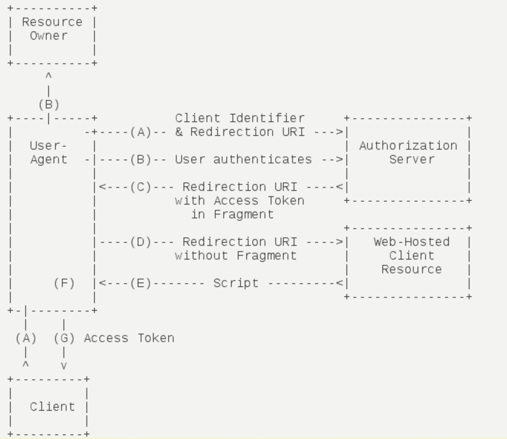

# OAuth2基础

## 1. 简介

OAuth 是一个关于授权（authorization）的开放网络标准，在全世界得到广泛应用，目前的版本是2.0版。

## 2. 应用场景

我们举个例子

有一个“云冲印”的网站，可以将用户存在Google 的招聘，冲印出来。用户为了使用该服务，必须让“云冲印”读取自己存储在Goodle上的照片

问题是只有得到用户的授权，google 才会同意“云冲印”读取这些招聘，那么，“云冲印”怎样获得用户的授权呢？

传统方法是，用户将自己的Google用户名和密码，告诉“云冲印”，后者就可以读取用户的照片了。但这样的做法有以下几个严重的缺点

1. “云冲印”为了后序的服务，会保存用户的密码，这样很不安全
2. google 不得不部署密码登录，而我们知道，单纯的密码登录并不安全
3. “云冲印”拥有了获取用户存储在Google所有资料的权利，用户没法限制“云冲印”获得授权的范围和有效期
4. 用户只有修改密码。才能收回赋予“云冲印”的权力，但是这样做，会使得其他所有获得用户授权的第三方应用程序全部失效
5. 只要有一个第三方应用程序被破解，就会导致用户密码泄露，以及所有被密码保护的数据泄露

## 3. 名词定义

- Third-party application: 第三方应用程序，本文又称“客户端”（client），既上一节的“云冲印”
- Http service：Http服务器提供商，本文中简称“服务提供商”，既上一节例子中的Google
- Resource owner: 资源所有者，本文中又称“用户”（user）
- User Agent：用户代理，本文中就是指浏览器
- Authorization server: 认证服务器，既服务提供商专门用来处理认证的服务器
- Resource server: 资源服务器，既服务提供商存放用户生成资源的服务器。他与认证服务器，可以是同一台服务器，也可以是不同的服务器

## 4. OAuth的思路

OAuth在“客户端”与“服务提供商”之间，设置了一个授权层（authorization layer）。“客户端”不能直接登录“服务提供商”，只能登录授权层，以此将用户与客户端区分开来。“客户端”登录授权层所用的令牌（token），与用户的密码不同，用户可以在登录的时候，**指定授权层令牌的权限范围和有效期**

“客户端”登录授权层以后。“服务提供商”根据令牌的权限范围和有效期，向“客户端”开发用户存储的资料

## 5. 运行流程

OAuth 2.0 的运行流程如下图

1. 用户打开客户端以后，客户端要求用于给予授权
2. **用户同意给予客户端授权**
3. 客户端使用上一步获得的授权，向认证服务器申请令牌
4. 认证服务器对客户端进行认证以后，确认无误，同意发放令牌
5. 客户端使用令牌，向资源服务器申请获取资源
6. 资源服务器确认令牌无误，同意向客户端开放资源

通过上面6个步骤，可以看出2是关键。既用户怎样才能给予客户端授权，有了这个授权以后，客户端就可以获取令牌，进而凭令牌获取资源

## 6. 客户端的授权模式

客户端必须得到用户的授权（authorization grant）,才能获得令牌（access token）。OAuth 2.0 定义了四种授权方式

- 授权码模式（authorization code）
- 简化模式（implicit）
- 密码模式（resource owner password credentials）
- 客户端模式（client credential）

### 6.1 授权码模式

授权码模式（authorization code）是功能最完整、流程最验密的授权模式。他的特点就是**通过客户端的后台服务器，与“服务提供商”的认证服务器进行互动**

他的步骤如下：

1. 用户访问客户端，后者将前者导向认证服务器
2. 用户选择是否给予客户端授权
3. 假设用户给予授权，认证服务器将用户导向客户端事先指定的“重定向URL”(redirection URL),同时附上一个授权码
4. 客户端收到授权码，附上早先的“重定向URI”,向认证服务器申请令牌。这一步是在客户端的后台的服务器上完成的，对用户不可见。
5. 认证服务器核对授权码和重定向URI，确认无误后，向客户端发送访问令牌（access token）和更新令牌（refresh token）

### 6.2 简化模式

简化模式（implicit grant type）**不通过第三方应用服务器，直接在浏览器中想认证服务器申请令牌，跳过了“授权码”这个步骤**。所有步骤都在浏览器中完成，令牌对访问者是可见的，且客户端不需要认证

1. 客户端将用户导向认证服务器
2. 用户决定是否给予客户端授权
3. 假设用户给予授权，认证服务器将用户导向客户端指定的“重定向URI”,并在URI 的Hash部分包含了访问令牌
4. 浏览器想资源服务器发出请求，其中不包括上一步收到的Hash值
5. 资源服务区返回一个网页，其中包含的代码可以获取Hash值中的令牌
6. 浏览器执行上一步获得的脚本，提取出令牌
7. 浏览器将令牌发给客户端

### 6.3 密码模式

密码模式（Resource Owner Password Credentials Grant）中，**用于向客户端提供自己的用户名和密码**。客户端使用这些信息，向“服务商提供商”索要授权

在这种模式中，用户必须要把自己的密码给客户端，但是客户端不得存储密码。**这通常用在用户对客户端高度信任的情况下**。比如客户端是操作系统的一部分，或者由一个著名公司出品。而认证服务器只有在其他授权模式无法执行的情况下，才能考虑使用这种模式

1. 用户向客户端提供用户名和密码
2. 客户端将用户名和密码发送给认证服务器，向后者请求令牌
3. 认证服务器确认无误后，向客户端提供访问令牌

### 6.4 客户端模式

客户端模式（Client Credentials Grant）指客户端以自己的名义，而不是以用户的名义，向“服务提供商”进行认证。严格的说，客户端模式并不属于OAuth框架所有解决的问题。在这种模式中，用户直接向客户端注册，客户端以自己的名义要求“服务提供商”，提供服务，其实不存在授权问题。

1. 客户端向认证服务器进行身份认证，并要求一个访问令牌
2. 认证服务器确认无误后，向客户端提供访问令牌

## 7. 更新令牌

如果用户访问的时候，客户端的“访问令牌”已经过期，则需要使用“更新令牌”申请一个新的访问令牌

## 参考文章

[理解OAuth 2.0](https://www.ruanyifeng.com/blog/2014/05/oauth_2_0.html)