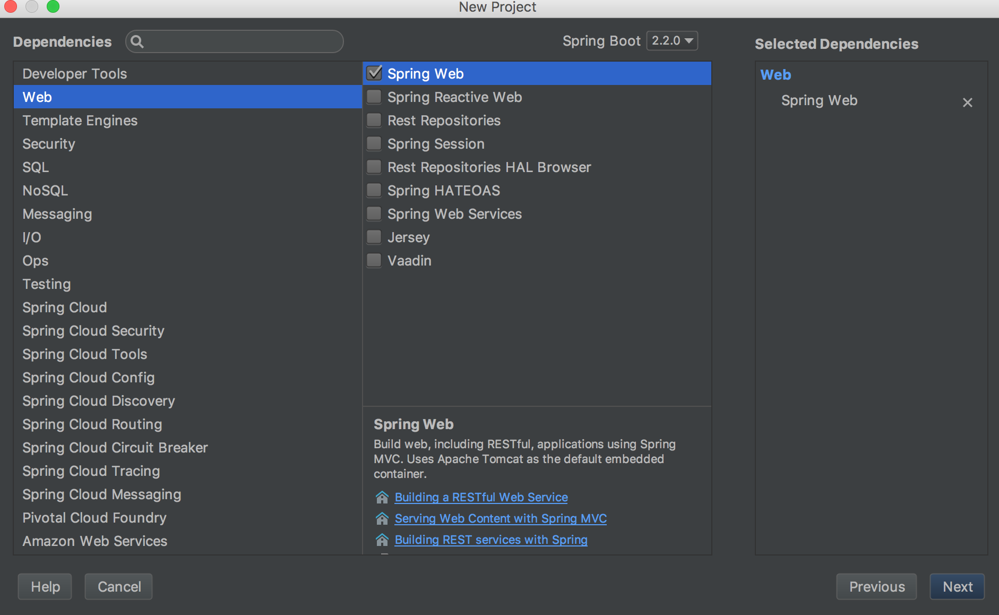
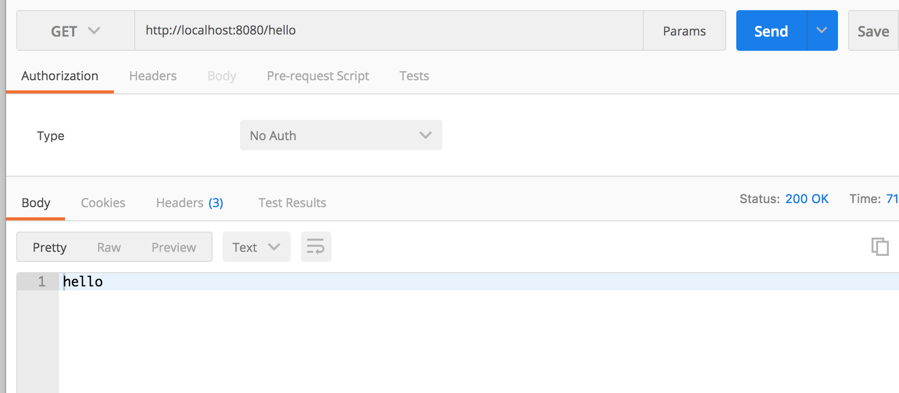

# SpringBoot整合shiro

## 1. 集成步骤

### 1.1 创建Spring Boot项目

创建一个SpringBoot 项目，添加Web依赖



同时添加shiro 依赖

```

		<dependency>
			<groupId>org.apache.shiro</groupId>
			<artifactId>shiro-spring-boot-web-starter</artifactId>
			<version>1.4.0</version>
		</dependency>

```

### 1.2 创建Realm

```java
import org.apache.shiro.authc.*;
import org.apache.shiro.authz.AuthorizationInfo;
import org.apache.shiro.realm.AuthorizingRealm;
import org.apache.shiro.subject.PrincipalCollection;

/**
 * @author zhangshengzhong
 * @date 2019/10/17
 */
public class MyRealm extends AuthorizingRealm {
    
    @Override
    protected AuthorizationInfo doGetAuthorizationInfo(PrincipalCollection principals) {
        return null;
    }
    @Override
    protected AuthenticationInfo doGetAuthenticationInfo(AuthenticationToken token) throws AuthenticationException {
        String username = (String) token.getPrincipal();
        if (!"javaboy".equals(username)) {
            throw new UnknownAccountException("账户不存在!");
        }
        return new SimpleAuthenticationInfo(username, "123", getName());
    }

}
```


### 1.3 配置Shiro基本信息

在application.properties 中配置shiro 基本信息

```
# 是否允许将sessionId 放到 cookie 中
shiro.sessionManager.sessionIdCookieEnabled=true
# 是否允许将 sessionId 放到 Url 地址拦中
shiro.sessionManager.sessionIdUrlRewritingEnabled=true
# 访问未获授权的页面时，默认的跳转路径
shiro.unauthorizedUrl=/unauthorizedurl
# 开启 shiro
shiro.web.enabled=true
# 登录成功的跳转页面
shiro.successUrl=/index
# 登录页面
shiro.loginUrl=/login
```

### 1.4 配置 ShiroConfig

```java
@Configuration
public class ShiroConfig {

    @Bean
    MyRealm myRealm() {
        return new MyRealm();
    }
    @Bean
    DefaultWebSecurityManager securityManager() {
        DefaultWebSecurityManager manager = new DefaultWebSecurityManager();
        manager.setRealm(myRealm());
        return manager;
    }
    @Bean
    ShiroFilterChainDefinition shiroFilterChainDefinition() {
        DefaultShiroFilterChainDefinition definition = new DefaultShiroFilterChainDefinition();
        definition.addPathDefinition("/doLogin", "anon");
        definition.addPathDefinition("/**", "authc");
        return definition;
    }


}
```

### 1.5 配置 controller

```java
@RestController
public class LoginController {

    @PostMapping("/doLogin")
    public String doLogin(String username, String password) {
        Subject subject = SecurityUtils.getSubject();
        try {
            subject.login(new UsernamePasswordToken(username, password));
           return "登录成功!";
        } catch (AuthenticationException e) {
            e.printStackTrace();
            return "登录失败!";
        }
    }
    
    @GetMapping("/hello")
    public String hello() {
        return "hello";
    }
    @GetMapping("/login")
    public String  login() {
        return "please login!";
    }


}
```

## 2. 测试

- 请求[http://localhost:8080/hello](http://localhost:8080/hello)由于未登录，所以会自动跳转到 /login 接口

  

- 调用doLogin完成登录

  

- 再次调用/hello，就可以成功访问了：

  

### 参考文章

[Spring Boot 整合 Shiro ，两种方式全总结！](<https://juejin.im/post/5cff0cfc5188250d28510681>)

