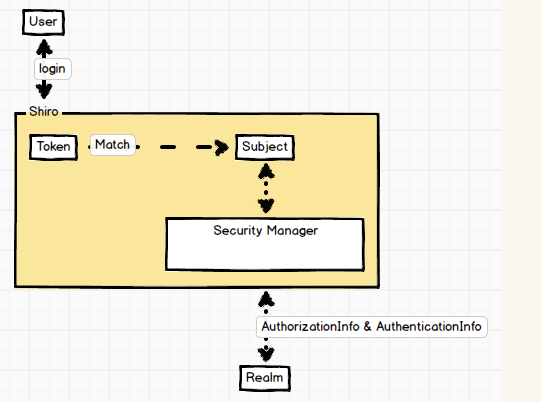

# shiro基础

## 1. 架构



黄色部分为shiro 内部

1. 使用用户的登录信息创建令牌

   ```java
   UsernamePasswordToken token = new UsernamePasswordToken(username, password);
   ```

   token 可以理解为用户令牌，登录的过程被抽象为Shiro验证令牌是否具有合法身份以及相关权限

2. 执行登录动作

   ```java
   SecurityUtils.setSecurityManager(securityManager); // 注入SecurityManager
   Subject subject = SecurityUtils.getSubject(); // 获取Subject单例对象
   subject.login(token); // 登陆
   ```

   - SecurityManager:

     Shiro的核心部分是SecurityManager，它负责安全认证与授权。Shiro本身已经实现了所有的细节，用户可以完全把它当做一个黑盒来使用

   - SecurityUtils对象

     本质上就是一个工厂类似Spring中的ApplicationContext

   - Subject

     肤浅一点可以理解为User

     官方翻译：项目。它是你目前所设计的需要通过Shiro保护的项目的一个抽象概念

   通过令牌（token）与项目（subject）的登陆（login）关系，Shiro保证了项目整体的安全。

3. 判断用户

   Shiro本身无法知道所持有令牌的用户是否合法，因为除了项目的设计人员恐怕谁都无法得知。

   > 因此Realm是整个框架中为数不多的必须由设计者自行实现的模块，当然Shiro提供了多种实现的途径
   >
   > - 数据库
   > - redis缓存中取

4. AuthenticationInfo&AuthorizationInfo

   用户具有角色和权限两种基本属性

   - Auth**entication**Info：代表用户角色信息集合

   - Auth**orization**Info：代表了角色的权限信息集合

## 2. 实现Realme

Realm就是提供AuthorizationInfo和AuthenticationInfo这两个混淆概念的地方

```java

public class UserRealm extends AuthorizingRealm {
    // 用户对应的角色信息与权限信息都保存在数据库中，通过UserService获取数据
    private UserService userService = new UserServiceImpl();


    /**
     * 提供用户信息返回权限信息
     */
    @Override
    protected AuthorizationInfo doGetAuthorizationInfo(PrincipalCollection principals) {
        String username = (String) principals.getPrimaryPrincipal();
        SimpleAuthorizationInfo authorizationInfo = new SimpleAuthorizationInfo();
        // 根据用户名查询当前用户拥有的角色
        Set<Role> roles = userService.findRoles(username);
        Set<String> roleNames = new HashSet<String>();
        for (Role role : roles) {
            roleNames.add(role.getRole());
        }
        // 将角色名称提供给info
        authorizationInfo.setRoles(roleNames);
        // 根据用户名查询当前用户权限
        Set<Permission> permissions = userService.findPermissions(username);
        Set<String> permissionNames = new HashSet<String>();
        for (Permission permission : permissions) {
            permissionNames.add(permission.getPermission());
        }
        // 将权限名称提供给info
        authorizationInfo.setStringPermissions(permissionNames);

        return authorizationInfo;
    }


    /**
     * 提供账户信息返回认证信息
     */
    @Override
    protected AuthenticationInfo doGetAuthenticationInfo(AuthenticationToken token) throws AuthenticationException {
        String username = (String) token.getPrincipal();
        User user = userService.findByUsername(username);
        if (user == null) {
            // 用户名不存在抛出异常
            throw new UnknownAccountException();
        }
        if (user.getLocked() == 0) {
            // 用户被管理员锁定抛出异常
            throw new LockedAccountException();
        }
        SimpleAuthenticationInfo authenticationInfo = new SimpleAuthenticationInfo(user.getUsername(),
                user.getPassword(), ByteSource.Util.bytes(user.getCredentialsSalt()), getName());
        return authenticationInfo;
    }
}

```

