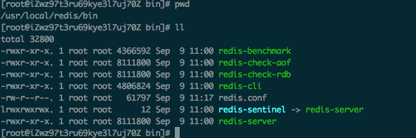
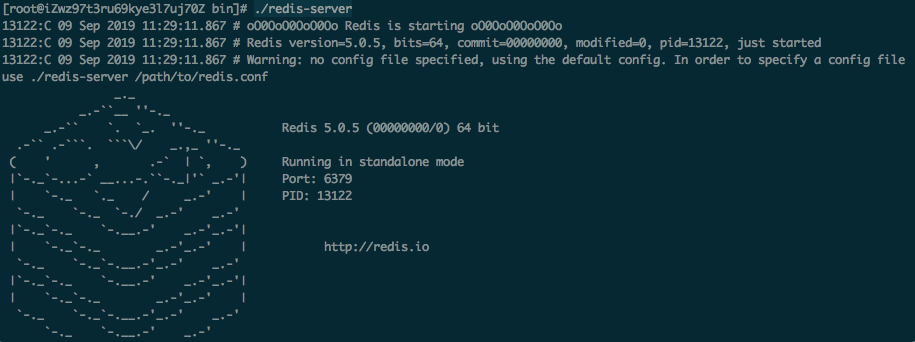
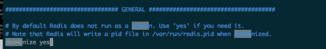
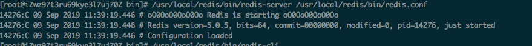

# Redis安装

## 1. 具体安装步骤

### 1.1 使用wget命令下载

```
wget http://download.redis.io/releases/redis-5.0.5.tar.gz
```

具体下载哪个版本可以在[redis官网](<http://download.redis.io/releases/>)上选择

### 1.2 拷贝到/usr/local 下

```
cp redis-5.0.5.tar.gz /usr/local
```

### 1.3 解压源码

```
tar -zxvf redis-5.0.5.tar.gz
```

### 1.4 编译

```
cd /usr/local/redis-5.0.5
make PREFIX=/usr/local/redis install
```

编译后的redis在 `/usr/local/redis`目录下

#### 1.4.1 如遇安装异常cc: command not found

/bin/sh: cc: command not found


**解决方案：**安装gcc命令

```
yum install gcc
```

#### 1.4.2 make时报如下错误

原因是jemalloc重载了Linux下的ANSI C的malloc和free函数。解决办法：make时添加参数。


### 1.5 redis的配置文件

redis.conf是redis的配置文件，redis.conf在redis源码目录。
拷贝配置文件到安装目录下
进入源码目录，里面有一份配置文件 redis.conf，然后将其拷贝到安装路径下

```
cp /usr/local/redis-5.0.5/redis.conf /usr/local/redis/bin/
```

## 2. bin目录结构

进入安装目录bin下

```
cd /usr/local/redis/bin
```

目录结构



- redis-benchmark: redis 性能检测工具
- redis-check-aof： AOF文件修复工具
- redis-check-rdb： RDB文件修复工具
- redis-cli：  客户端命令行
- redis.conf：  redis配置文件
- redis-sentinel： redis集群
- redis-server： redis 服务进程

## 3. 启动redis

### 3.1 前端模式启动

直接运行redis-server将以前端模式启动

**缺点**：ssh命令窗口关闭则redis-server程序结束，**不推荐**

```
./redis-server
```

如图



### 3.2 后端模式启动

修改redis.conf 配置文件。daemonize yes 以后端模式启动

```
vim /usr/local/redis/bin/redis.conf
```



执行如下命令

```
# 相对路径情况执行
./redis-server redis.conf

# 全路径执行
/usr/local/redis/bin/redis-server /usr/local/redis/bin/redis.conf
```



## 4. 连接redis

```
/usr/local/redis/bin/redis-cli
```

## 5.关闭redis

强行终止redis进程可能会导致redis持久化数据丢失。正确停止Redis的方式应该是向Redis发送SHUTDOWN命令，命令为：

```
cd /usr/local/redis
./bin/redis-cli shutdown
```

### 5.1 强行终止redis(不推荐)

会造成数据丢失

```
pkill redis-server
```

## 6. 开机自启动

在`/etc/rc.local`编辑

```
vim /etc/rc.local
```

添加

```
# redis 开机自启动
/usr/local/redis/bin/redis-server /usr/local/redis/etc/redis-conf
```

