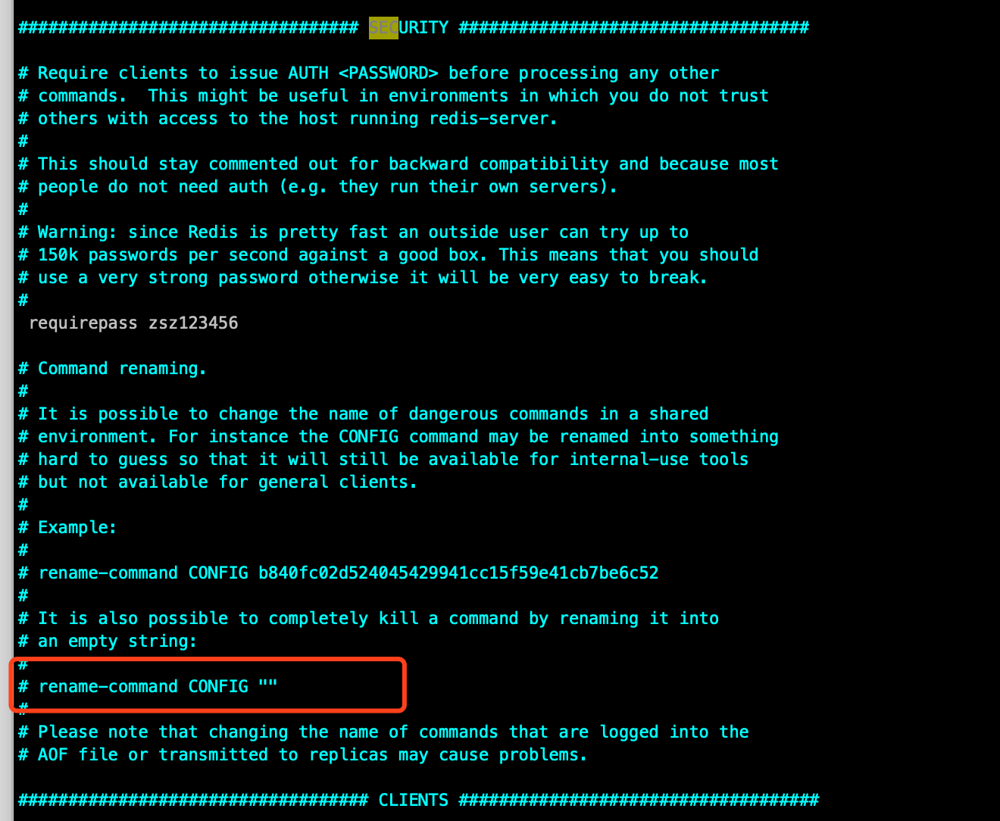

# Redist禁用危险命令

## 1. Redis线上不同使用危险的命令

1. keys *

   >虽然其模糊匹配功能使用非常方便也很强大，在小数据量情况使用没什么问题，数据量大会导致 Redis 锁住及 CPU 飙升，在生产环境建议禁用或者重命名！

2. flushdb

   >删除Redis 中当前所在数据库中所有记录，并且此命令从不会执行失败

3. flushall

   >删除 Redis 中所有数据库中的所有记录，不只是当前所在的数据库，并且此命令从不会执行失败

4. config

   >客户端可修改的 Redis 配置

## 2. 如何禁用或者重命名危险命令

1. 看下redis.config 默认配置文件，找到SECURITY 区域，如以下所示：



看说明，添加rename-command 配置即可达到安全目的

## 2. 禁用命令

```
rename-command KEYS     ""
rename-command FLUSHALL ""
rename-command FLUSHDB  ""
rename-command CONFIG   ""
```

## 3:重命名命令

```
rename-command KEYS     "XXXXXXXXXXXXXXXXXXXXXXXXXXXXXXX"
rename-command FLUSHALL "XXXXXXXXXXXXXXXXXXXXXXXXXXXXXXX"
rename-command FLUSHDB  "XXXXXXXXXXXXXXXXXXXXXXXXXXXXXXX"
rename-command CONFIG   "XXXXXXXXXXXXXXXXXXXXXXXXXXXXXXX"
```

上面的 XX 可以定义新命令名称，或者用随机字符代替。
经过以上的设置之后，危险命令就不会被客户端执行了


## 参考文章

[Redis禁用危险命令](https://blog.csdn.net/a169388842/article/details/82838818)