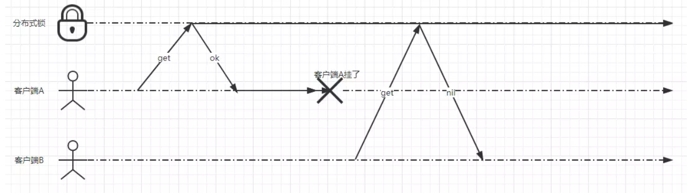

# 一步步实现单机redis的分布式锁（setnx）

## 1. 准备工作

### 1.1 定义常量

```java
public class LockConstants {

    public static final String OK = "OK";

    /** NX|XX, NX -- Only set the key if it does not already exist. XX -- Only set the key if it already exist. **/
    public static final String NOT_EXIST = "NX";
    public static final String EXIST = "XX";

    /** expx EX|PX, expire time units: EX = seconds; PX = milliseconds **/
    public static final String SECONDS = "EX";
    public static final String MILLISECONDS = "PX";

    private LockConstants() {}

}
```

### 1.2 定义锁的抽象类

抽象类RedisLock实现java.util.concurrent包下的Lock接口，然后对一些方法提供默认实现，子类只需实现lock方法和unlock方法即可。代码如下

```java
public abstract class RedisLock implements Lock {

    protected Jedis jedis;
    protected String lockKey;
    protected String lockValue;

    public RedisLock(Jedis jedis,String lockKey) {
        this.jedis = jedis;
        this.lockKey = lockKey;
        this.lockValue = UUID.randomUUID().toString()+Thread.currentThread().getId();
    }

    public void sleepBySencond(int sencond){
        try {
            Thread.sleep(sencond*1000);
        } catch (InterruptedException e) {
            e.printStackTrace();
        }
    }


    @Override
    public void lockInterruptibly() throws InterruptedException {

    }

    @Override
    public boolean tryLock() {
        return false;
    }

    @Override
    public boolean tryLock(long time, TimeUnit unit) throws InterruptedException {
        return false;
    }


    @Override
    public Condition newCondition() {
        return null;
    }

    protected volatile boolean isOpenExpirationRenewal = true;

    /**
     * 开启定时刷新
     */
    protected void scheduleExpirationRenewal(){
        Thread renewalThread = new Thread(new ExpirationRenewal());
        renewalThread.start();
    }

    /**
     * 刷新key的过期时间
     */
    private class ExpirationRenewal implements Runnable{
        @Override
        public void run() {
            while (isOpenExpirationRenewal){
                System.out.println("执行延迟失效时间中...");

                String checkAndExpireScript = "if redis.call('get', KEYS[1]) == ARGV[1] then " +
                        "return redis.call('expire',KEYS[1],ARGV[2]) " +
                        "else " +
                        "return 0 end";
                jedis.eval(checkAndExpireScript, 1, lockKey, lockValue, "30");

                //休眠10秒
                sleepBySencond(10);
            }
        }
    }


}
```

## 2. 基础版本1

先来一个最基础的版本，代码如下

```java
public class LockCase1 extends RedisLock{


    public LockCase1(Jedis jedis, String lockKey) {
        super(jedis, lockKey);
    }

    @Override
    public void lock() {
        while(true){
            String result = jedis.set(lockKey, "value", NOT_EXIST);
            if(OK.equals(result)){
                System.out.println(Thread.currentThread().getId()+"加锁成功!");
                break;
            }
        }


    }

    @Override
    public void unlock() {
        jedis.del(lockKey);
    }
}
```

LockCase1类提供了lock和unlock方法。
其中lock方法也就是在reids客户端执行如下命令

```
SET lockKey value NX
```

而unlock方法就是调用DEL命令将键删除。

### 2.1 版本1 面临的问题

- 客户端挂了，锁无法释放

  假设有两个客户端A和B，A获取到分布式的锁。A执行了一会，突然A所在的服务器断电了（或者其他什么的），也就是客户端A挂了。这时出现一个问题，这个锁一直存在，且不会被释放，其他客户端永远获取不到锁。如下示意图



可以通过设置过期时间来解决这个问题

## 3. 版本2 设置锁的过期时间

```java
@Override
public void lock() {
    while(true){
        String result = jedis.set(lockKey, "value", NOT_EXIST,SECONDS,30);
        if(OK.equals(result)){
            System.out.println(Thread.currentThread().getId()+"加锁成功!");
            break;
        }
    }
}
```

类似的Redis命令如下

```
SET lockKey value NX EX 30
```

> 注：要保证设置过期时间和设置锁具有原子性
>
> EX = seconds; PX = milliseconds

### 3.2  版本2 可能出现的问题

这时又出现一个问题，问题出现的步骤如下

1. 客户端A获取锁成功，过期时间30秒。
2. 客户端A在某个操作上阻塞了50秒。
3. 30秒时间到了，锁自动释放了。
4. 客户端B获取到了对应同一个资源的锁。
5. 客户端A从阻塞中恢复过来，释放掉了客户端B持有的锁。

示意图如下


这时会有两个问题

1. **过期时间如何保证大于业务执行时间?**
2. **如何保证锁不会被误删除?**

先来解决如何保证锁不会被误删除这个问题

这个问题可以通过设置value为当前客户端生成的一个随机字符串，且保证在**足够长的一段时间内在所有客户端的所有获取锁的请求中都是唯一**

### 4. 版本3 设置锁的value

抽象类RedisLock增加lockValue字段，lockValue字段的默认值为UUID随机值假设当前线程ID。

```
public abstract class RedisLock implements Lock {

    //...
    protected String lockValue;

    public RedisLock(Jedis jedis,String lockKey) {
        this(jedis, lockKey, UUID.randomUUID().toString()+Thread.currentThread().getId());
    }

    public RedisLock(Jedis jedis, String lockKey, String lockValue) {
        this.jedis = jedis;
        this.lockKey = lockKey;
        this.lockValue = lockValue;
    }

    //...
}
复制代码
```

加锁代码

```
public void lock() {
    while(true){
        String result = jedis.set(lockKey, lockValue, NOT_EXIST,SECONDS,30);
        if(OK.equals(result)){
            System.out.println(Thread.currentThread().getId()+"加锁成功!");
            break;
        }
    }
}
复制代码
```

解锁代码

```
public void unlock() {
    String lockValue = jedis.get(lockKey);
    if (lockValue.equals(lockValue)){
        jedis.del(lockKey);
    }
}
```

这时看看加锁代码，好像没有什么问题啊。
再来看看解锁的代码，这里的解锁操作包含三步操作：获取值、判断和删除锁。这时你有没有想到在多线程环境下的`i++`操作?

### 4.1 可能面试i++ 问题

`i++`操作也可分为三个步骤：读i的值，进行i+1，设置i的值。
 如果两个线程同时对i进行i++操作，会出现如下情况

1. i设置值为0
2. 线程A读到i的值为0
3. 线程B也读到i的值为0
4. 线程A执行了+1操作，将结果值1写入到内存
5. 线程B执行了+1操作，将结果值1写入到内存
6. 此时i进行了两次i++操作，但是结果却为1

在多线程环境下有什么方式可以避免这类情况发生?
 解决方式有很多种，例如用AtomicInteger、CAS、synchronized等等。
 这些解决方式的目的都是要确保`i++`   操作的原子性。那么回过头来看看解锁，同理我们也是要确保解锁的原子性。我们可以利用Redis的lua脚本来实现解锁操作的原子性。

## 5. 版本4- 具有原子性的释放锁

lua脚本内容如下

```
if redis.call("get",KEYS[1]) == ARGV[1] then
    return redis.call("del",KEYS[1])
else
    return 0
end
复制代码
```

这段Lua脚本在执行的时候要把的lockValue作为ARGV[1]的值传进去，把lockKey作为KEYS[1]的值传进去。现在来看看解锁的java代码

```
public void unlock() {
    // 使用lua脚本进行原子删除操作
    String checkAndDelScript = "if redis.call('get', KEYS[1]) == ARGV[1] then " +
                                "return redis.call('del', KEYS[1]) " +
                                "else " +
                                "return 0 " +
                                "end";
    jedis.eval(checkAndDelScript, 1, lockKey, lockValue);
}
```

## 6. 版本5-确保过期时间大于业务执行时间

抽象类RedisLock增加一个boolean类型的属性isOpenExpirationRenewal，用来标识是否开启定时刷新过期时间。
 在增加一个scheduleExpirationRenewal方法用于开启刷新过期时间的线程。

```
public abstract class RedisLock implements Lock {
	//...

    protected volatile boolean isOpenExpirationRenewal = true;

    /**
     * 开启定时刷新
     */
    protected void scheduleExpirationRenewal(){
        Thread renewalThread = new Thread(new ExpirationRenewal());
        renewalThread.start();
    }

    /**
     * 刷新key的过期时间
     */
    private class ExpirationRenewal implements Runnable{
        @Override
        public void run() {
            while (isOpenExpirationRenewal){
                System.out.println("执行延迟失效时间中...");

                String checkAndExpireScript = "if redis.call('get', KEYS[1]) == ARGV[1] then " +
                        "return redis.call('expire',KEYS[1],ARGV[2]) " +
                        "else " +
                        "return 0 end";
                jedis.eval(checkAndExpireScript, 1, lockKey, lockValue, "30");

                //休眠10秒
                sleepBySencond(10);
            }
        }
    }
}
复制代码
```

加锁代码在获取锁成功后将isOpenExpirationRenewal置为true，并且调用scheduleExpirationRenewal方法，开启刷新过期时间的线程。

```
public void lock() {
    while (true) {
        String result = jedis.set(lockKey, lockValue, NOT_EXIST, SECONDS, 30);
        if (OK.equals(result)) {
            System.out.println("线程id:"+Thread.currentThread().getId() + "加锁成功!时间:"+LocalTime.now());

            //开启定时刷新过期时间
            isOpenExpirationRenewal = true;
            scheduleExpirationRenewal();
            break;
        }
        System.out.println("线程id:"+Thread.currentThread().getId() + "获取锁失败，休眠10秒!时间:"+LocalTime.now());
        //休眠10秒
        sleepBySencond(10);
    }
}
复制代码
```

解锁代码增加一行代码，将isOpenExpirationRenewal属性置为false，停止刷新过期时间的线程轮询。

```
public void unlock() {
    //...
    isOpenExpirationRenewal = false;
}
```

## 7. 测试

```java
public class LockCase5Test {


    private String lockName="my+lockName";

    @Test
    public void testLockCase5() {
        //定义线程池
        ThreadPoolExecutor pool = new ThreadPoolExecutor(0, 10,
                1, TimeUnit.SECONDS,
                new SynchronousQueue<>());

        //添加10个线程获取锁
        for (int i = 0; i < 10; i++) {
            pool.submit(() -> {
                try {
                    Jedis jedis = new Jedis("120.79.200.111");
                    LockCase5 lock = new LockCase5(jedis, lockName);
                    lock.lock();

                    //模拟业务执行15秒
                    lock.sleepBySencond(15);

                    lock.unlock();
                } catch (Exception e){
                    e.printStackTrace();
                }
            });
        }

        //当线程池中的线程数为0时，退出
        while (pool.getPoolSize() != 0) {}
    }

}
```

### 7.1 测试结果

