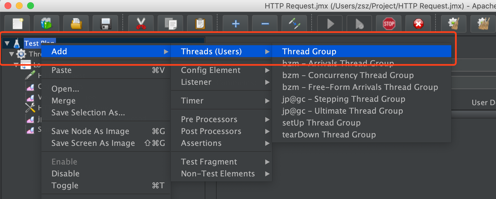
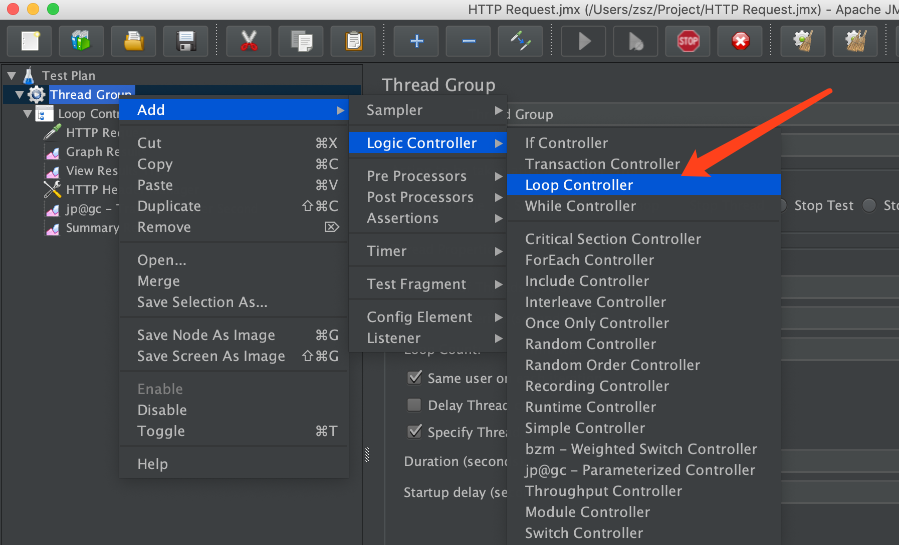
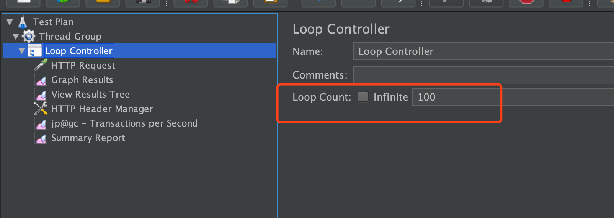
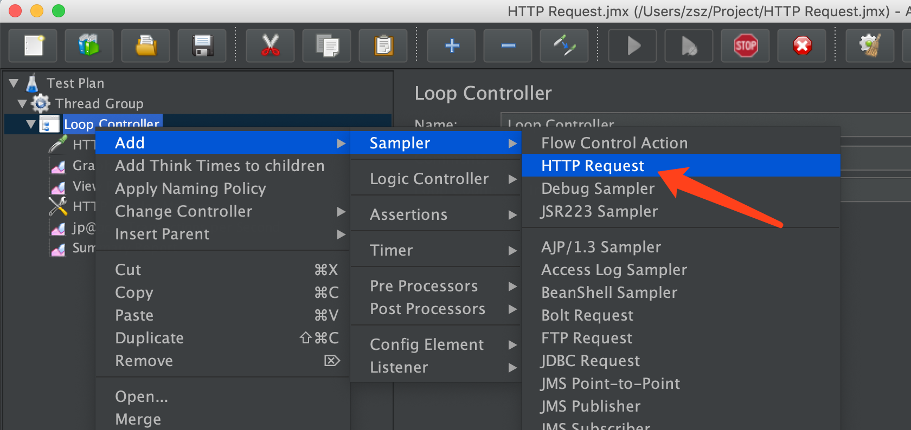
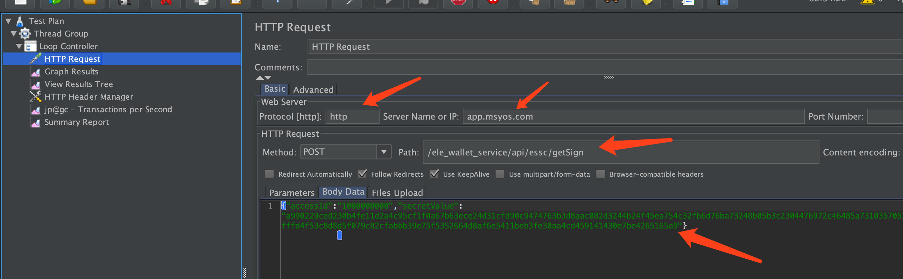
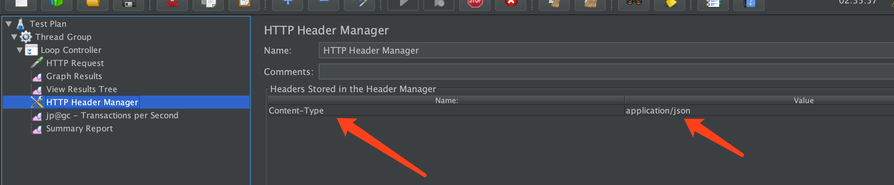
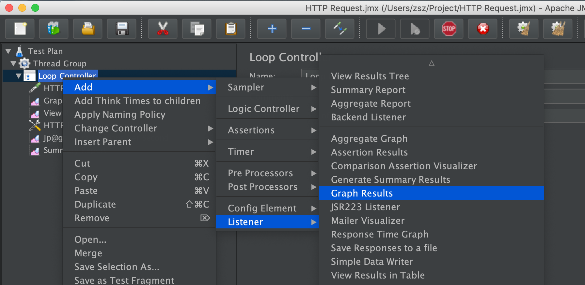
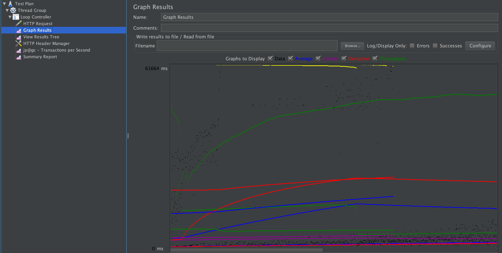
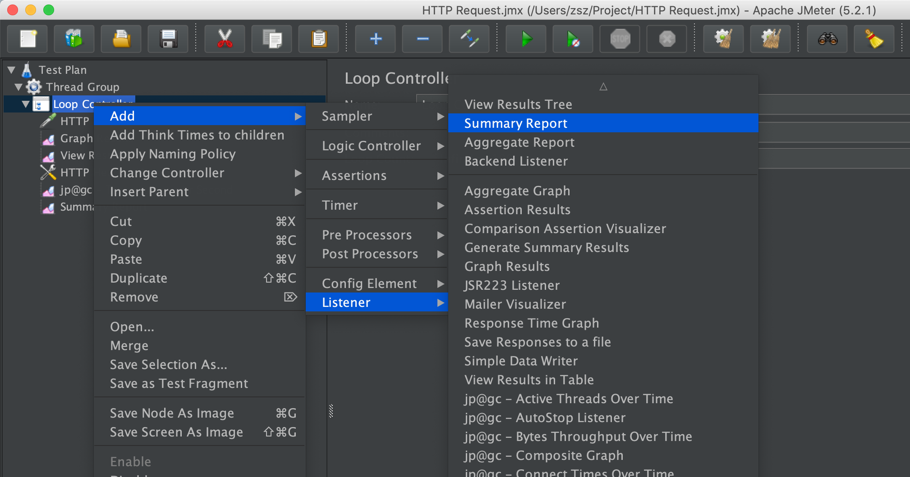
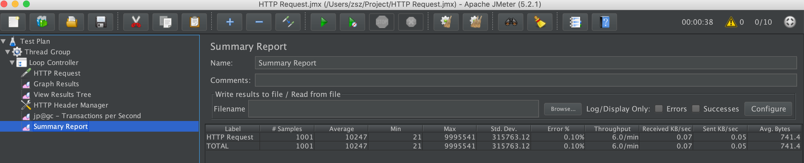

# JMeter的基本使用

## 1. 基本使用

### 1.1 步骤1

**在 Test Plan 上點右鍵， Add → Threads (Users) → Thread Group**



### 1.2 步骤2

设定有10个使用者来存取（测试）我们的服务


*Ramp-Up Period (in seconds)* 指得是「在幾秒內達到所設定的使用者人數」，可以讓受測服務一開始不會接受到太過巨量的 Requests

### 1.3 步骤3

模拟每个使用者，都会对我们的服务存取一定的次数

在 *Thread Group* 上點右鍵， *Add → Logic Controller → Loop Controller*



設定 Loop count (迴圈/重複執行次數)為 100 次



設定完 *Thread Group* 和 *Loop Count* 後，也就等於控制了對受測服務所發出的 request 數量，這邊作個簡單的計數的話就是：

```
10 (Users) * 100 (Loop Count) = 1,000 (Requests)
```

也就是我們的服務將接受 1,000 次 requests 的測試。

### 1.4 步骤4：设定要测试的Http Request请求

建立一個 *HTTP Request*。在 *Loop Controller* 上點右鍵， *Add → Sampler → HTTP Request*



输入要测试的内容



如果有需要添加请求header


例如这里添加到content-type 为json



### 1.5 建立测量图报表

我們一樣在 *Loop Controller* 上點右鍵， *Add → Listener → Graph Results* 加入圖形化的測量結果：



图标结果之后的展示页面



## 1.6 **View Results Tree**

*Loop Controller* 上點右鍵， *Add → Listener → View Results Tree* 加入 *View Results Tree* 來記錄每一筆 Request 的結果


View Results Tree 裡可以看到實際傳回的 request 和 response data.


### 1.7 看结果集概述



概览图



## 参考文章

[Apache JMeter 測試工具簡單基本教學](https://stackoverflow.max-everyday.com/2017/09/jmeter/)