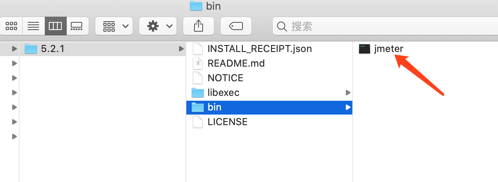

# JMeter的安装

## 1. 简介

Apache JMeter 是一個 Apache 專案，目的是用來作 load test 工具，可以提供於分析和測量各種服務的性能，主要目標是 Web application。 JMeter 也可以用來進行 JDBC數據庫連接，FTP，LDAP，WebService，JMS，HTTP，一般 TCP 連線和 OSnative processes 的單元測試工具。

## 2. 安装

安装方式有两种

### 2.1 手动安装

1. 下載並解壓 [Apache JMeter](https://jmeter.apache.org/download_jmeter.cgi)
2. 執行 `apache-jmeter-5.1.1/bin/jmeter.sh`

### 2.2 使用 homebrew

```bash
brew install jmeter
```

會自動加入環境變數，不用指定執行路徑

## 3. 启动

安装完成后提示的安装路径

```
/usr/local/Cellar/jmeter/5.2.1
```

点击bin下的



可以看到启动后的页面为：


### 3.1 直接启动

直接在终端（任意目录）输入`jmeter`，即可启动JMeter。

