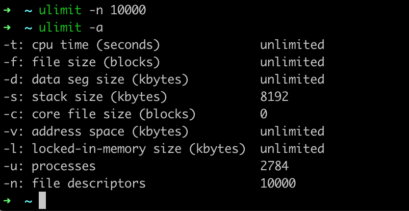
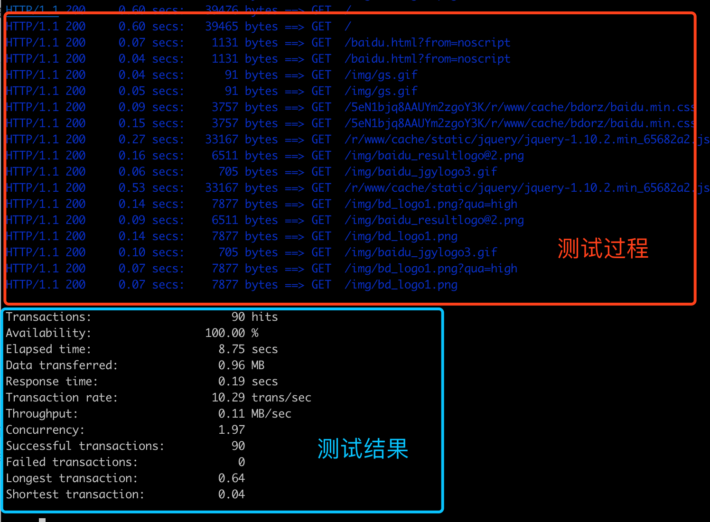

# Mac/Linux压测Siege

## 1. 安装

```
brew install siege
```

默认安装在`/usr/local/bin/`，并自动添加到系统环境变量中,在终端输入`siege` 如果可以显示出相应的命令介绍，如下图所示，则表示我们已经安装成功。


## 2. 压测前准备工作

### 2.1 修改系统的文件描述符限制

当我们需要模拟大并发情况下的压测，则需要开启数量可观的线程，以及要占用大量的文件描述符，而系统默认对能够使用的文件描述符数量做了限制。首先使用 `ulimit -a` 命令查看目前系统开启的文件描述符数量


可以看到目前系统允许使用的文件描述符的数量为 256，这是远远不够的。如果不修改该参数，要是进行大量并发的模拟场景时则会报`TOO MANY FILES OPEN` 错误。为此我们可以先使用 `ulimit -n 10000`命令来调大系统可打开的文件描述符数量。



## 3. 常用压测命令

下面列举出了一些siege的常用命令:

```
-C, --config 在屏幕上打印显示出当前的配置,配置是包括在他的配置文件$HOME/.siegerc中,可以编辑里面的参数,这样每次siege 都会按照它运行.
-v, --verbose 运行时能看到详细的运行信息.
-c, --concurrent=NUM 模拟有n个用户在同时访问,n不要设得太大,因为越大,siege消耗本地机器的资源越多.
-r, --reps=NUM 重复运行测试n次,不能与-t同时存在
-t, --time=NUMm 持续运行siege ‘n’秒(如10S),分钟(10M),小时(10H)
-d, --delay=NUM 每个url之间的延迟,在0-n之间.
-b, --benchmark 请求无需等待 delay=0.
-i, --internet 随机访问urls.txt中的url列表项.
-f, --file=FILE 指定用特定的urls文件运行 ,默认为urls.txt,位于siege安装目录下的etc/urls.txt
-R, --rc=FILE 指定用特定的siege 配置文件来运行,默认的为$HOME/.siegerc
-l, --log[=FILE] 运行结束,将统计数据保存到日志文件中siege .log,一般位于/usr/local/var/siege .log中,也可在.siegerc中自定义
```

## 4. 小试牛刀

做好了前面的准备工作，我们便可以使用siege进行压测的实践，就拿我们经常访问的百度来做一个测试，在命令行中执行下面的命令

```
siege -c 5 -r 5 http://www.baidu.com
```

测试的结果如下：



这些测试结果中的项目含义分别为：

>Transactions <———> 总共测试次数
>Availability <———> 成功次数百分比
>Elapsed time <———> 总共耗时多少秒
>Data transferred <———> 总共数据传输
>Response time <———> 等到响应耗时
>Transaction rate <———> 平均每秒处理请求数
>Throughput <———> 吞吐率
>Concurrency <———> 最高并发
>Successful transactions <———> 成功的请求数
>Failed transactions <———> 失败的请求数
>Longest transaction <———> 每次传输所花最长时间
>Shortest transaction <———> 每次传输所花最短时间

## 5. 常用命令总结

```
# 200个并发对百度发送请求100次
siege -c 200 -r 100 http://www.baidu.com

# 对urls.txt中列出所有的网址进行压测
siege -c 200 -r 100 -f urls.txt

# 随机选取urls.txt中列出的网址,按照100*100的并发度进行测试
siege -c 100 -r 100 -f urls.txt -i

# 指定http请求头 文档类型
siege -H "Content-Type:application/json" -c 200 -r 100 -f urls.txt -i -b

# 发送post请求，在网址后添加POST说明，并且紧跟参数在其后
siege -c 100 -r 100 http://www.baidu.com/ POST k1=v1&k2=v2
```

需要注意的是，如果地址和参数中含有中文或非ASCII字符时，首先需要对这些字符进行url编码，这样才可正确的进行测试。

## 参考文章

[Mac/Linux压力测试神器Siege详解(附安装过程](https://blog.csdn.net/lisongjia123/article/details/79718843)