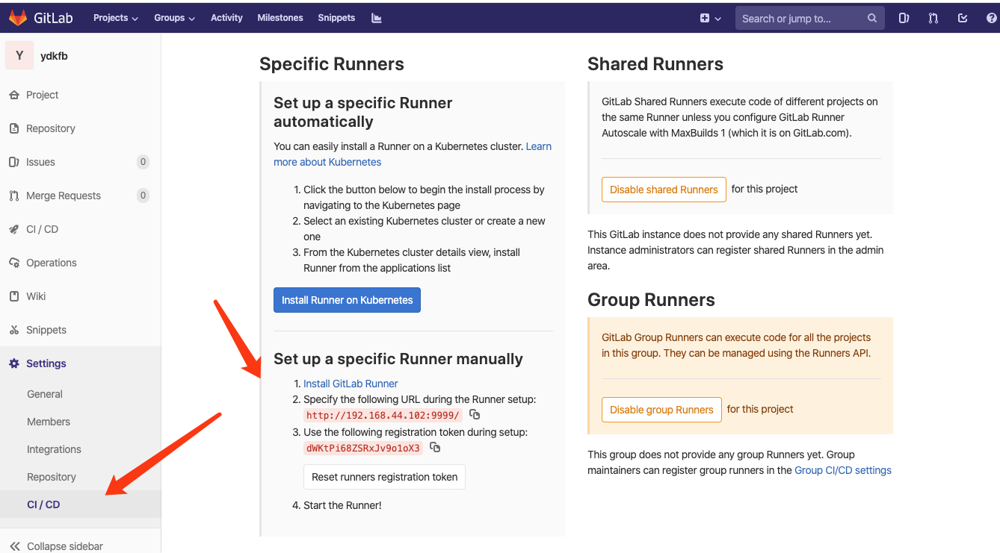
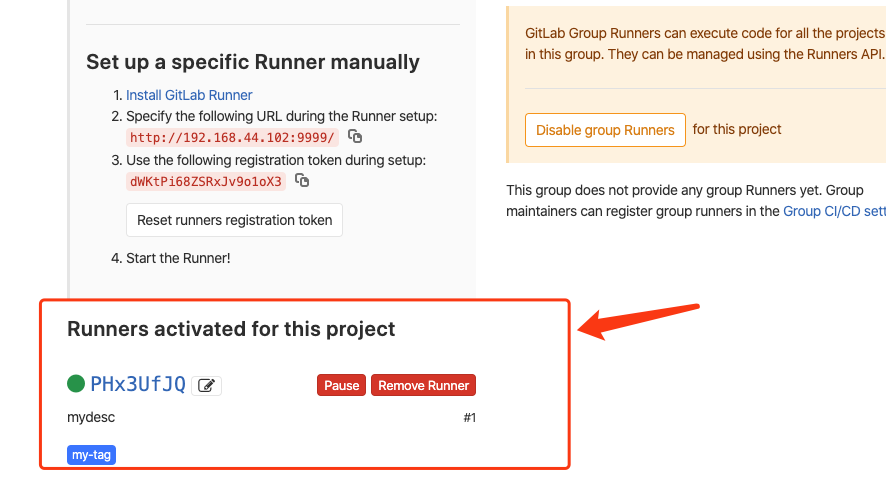

# Gitlab-Runner的安装与使用

## 1. 安装步骤

### 1.1 安装gitlab-ci-multi-runner

- 添加yum源

  ```
  curl -L https://packages.gitlab.com/install/repositories/runner/gitlab-ci-multi-runner/script.rpm.sh | sudo bash
  ```

- 安装

  ```
  yum install gitlab-ci-multi-runner
  ```

  这里是官网的安装教程，其它操作系统的请参考
  <https://gitlab.com/gitlab-org/gitlab-ci-multi-runner>

### 1.2 使用gitlab-ci-multi-runner注册Runner

安装好gitlab-ci-multi-runner这个软件之后，我们可以用它想gitlab-ci注册runner

向gitlab-CI注册runner需要两样东西:**GitLab-CI的url**和**注册token**。

其中，token是为了确定你这个Runner是**所有工程都能够使用的Shared Runner**还是具体**某一个工程才能使用的Specific Runner**。

#### 1.2.1 所有工程都能够使用的Shared Runner

如果要注册Shared Runner，你需要到管理界面的Runners页面里面去找注册token。如下图所示：

#### 1.2.2 某一个工程才能使用的Specific Runner

如果要注册Specific Runner，你需要到项目的设置的Runner页面里面去找注册token。如下图所示：



#### 1.2.3 注册runner

找到token之后，运行下面这条命令注册Runner（当然，除了url和token之外，还需要其他的信息，比如执行器`executor`、构建目录`builds_dir`等）。
`gitlab-ci-multi-runner register`


依据提示输入

### 注意事项

- Whether to run untagged builds [true/false]:

  是否运行在没有 tag 的 build 上面。在配置 gitlab-ci 时，会有很多 job，每个 job 可以通过 tags 属性来选择 Runner。**这里为 true 表示如果 job 没有配置 tags，也执行。**

- Whether to lock the Runner to current project [true/false]:

  是否锁定 Runner 到当前项目

- 选择 executor，这里列出了很多 executor

  shell


注册完成之后，GitLab-CI就会多出一条Runner记录，如下图所示：



### 1.3 让注册好的Runner运行起来

Runner注册完成之后还不行，还必须让它运行起来，否则它无法接收到GitLab-CI的通知并且执行软件集成脚本。怎么让Runner运行起来呢？`gitlab-ci-multi-runner`提供了这样一条命令`gitlab-ci-multi-runner run-single`，详情如下：

```
gitlab-ci-multi-runner start gitbook-runner
```

查看runner运行状态

```
ps -aux | grep gitlab-runner
```

gitlab运行成功了

### 参考文章

[GitLab-CI与GitLab-Runner](<https://www.jianshu.com/p/2b43151fb92e>)

