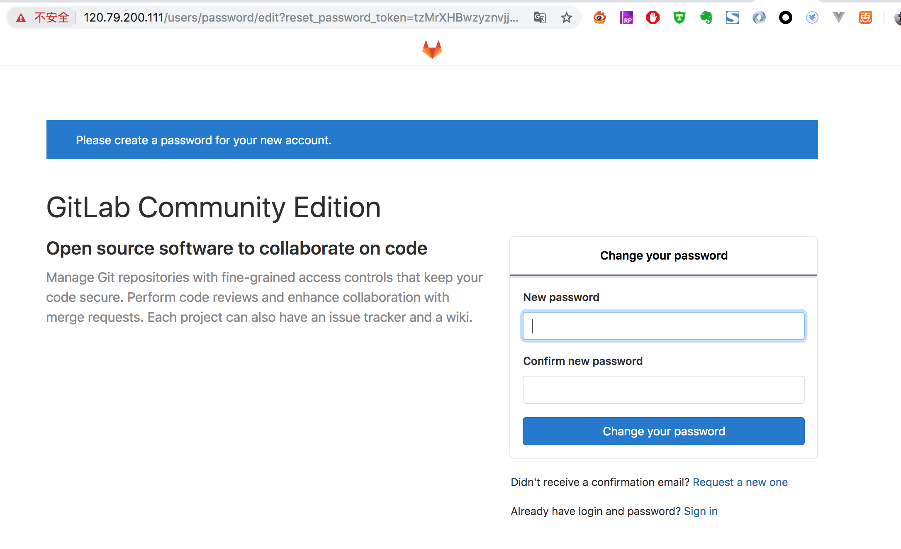

# gitlab搭建

## 1. 搭建方式

gitlab 搭建有两种方式

- 第一种方法

  说白了其实gitlab就是一个web端，打散后其实也是由（nginx，gitaly，redis，gitlab-workhorse...）等这些东西构成；所以你可以一个个组装一个个编译安装；这样你也可以深入去了解gitlab，同时也可以达到最简化（将不必要的东西去掉）

- 第二种方法

  rpm 安装。。。官方和社区都有提供


第一种太折腾人了，本文演示第二种方式

## 2. 安装

### 2.1 安装并配置必要的依赖关系

在 CentOS 系统上，下面的命令将会打开系统防火墙 HTTP 和 SSH 的访问。

```
sudo yum install curl policycoreutils openssh-server openssh-clients
sudo systemctl enable sshd
sudo systemctl start sshd
sudo yum install postfix
sudo systemctl enable postfix
sudo systemctl start postfix
sudo firewall-cmd --permanent --add-service=http
sudo systemctl reload firewalld
```

### 2.2  添加 GitLab 镜像源并安装

- 方式1：命令管道的方式安装镜像仓库

  ```
  curl -sS http://packages.gitlab.com.cn/install/gitlab-ce/script.rpm.sh | sudo bash
  sudo yum install gitlab-ce
  ```

  我使用不成功

- 方式2：使用命名手动安装

  ```
  curl -LJO https://mirrors.tuna.tsinghua.edu.cn/gitlab-ce/yum/el7/gitlab-ce-XXX.rpm
  rpm -i gitlab-ce-XXX.rpm
  ```

  gitlab-ce-xxx.rpm 具体是哪个版本可以进[gitlab镜像](<https://mirrors.tuna.tsinghua.edu.cn/gitlab-ce/yum/el7/>)中选择

#### 2.2.1 安装时异常

在使用命令rpm -i gitlab-ce-XXX.rpm 时提示

```
rpm -i gitlab-ce-12.2.4-ce.0.el7.x86_64.rpm
warning: gitlab-ce-12.2.4-ce.0.el7.x86_64.rpm: Header V4 RSA/SHA1 Signature, key ID f27eab47: NOKEY
error: Failed dependencies:
	policycoreutils-python is needed by gitlab-ce-12.2.4-ce.0.el7.x86_64
```

需要安装

```
yum install policycoreutils-python
```

#### 2.2.2 安装完成提示

```
[root@iZwz97t3ru69kye3l7uj70Z ~]# rpm -i gitlab-ce-12.2.4-ce.0.el7.x86_64.rpm
warning: gitlab-ce-12.2.4-ce.0.el7.x86_64.rpm: Header V4 RSA/SHA1 Signature, key ID f27eab47: NOKEY
It looks like GitLab has not been configured yet; skipping the upgrade script.

       *.                  *.
      ***                 ***
     *****               *****
    .******             *******
    ********            ********
   ,,,,,,,,,***********,,,,,,,,,
  ,,,,,,,,,,,*********,,,,,,,,,,,
  .,,,,,,,,,,,*******,,,,,,,,,,,,
      ,,,,,,,,,*****,,,,,,,,,.
         ,,,,,,,****,,,,,,
            .,,,***,,,,
                ,*,.


     _______ __  __          __
    / ____(_) /_/ /   ____ _/ /_
   / / __/ / __/ /   / __ `/ __ \
  / /_/ / / /_/ /___/ /_/ / /_/ /
  \____/_/\__/_____/\__,_/_.___/


Thank you for installing GitLab!
GitLab was unable to detect a valid hostname for your instance.
Please configure a URL for your GitLab instance by setting `external_url`
configuration in /etc/gitlab/gitlab.rb file.
Then, you can start your GitLab instance by running the following command:
  sudo gitlab-ctl reconfigure

For a comprehensive list of configuration options please see the Omnibus GitLab readme
https://gitlab.com/gitlab-org/omnibus-gitlab/blob/master/README.md
```

### 2.3 配置

#### 2.3.1 配置外网访问的地址(必须改)

修改/etc/gitlab/gitlab.rb，将默认external_url改成，你的ip或者域名

```
external_url 'http://gitlab.isture.com'
#external_url 'http://120.79.200.xxx'
```

#### 2.3.2 nginx端口冲突

gitlab 其实是个web，他自带了nginx。但是我们本身服务器也有一个nginx这样就冲突了

##### 2.3.2.1 解决方案

- 第一种（不建议）

  禁用gitlab自带的nginx，使用我们自己安装的nginx

- 第二种

  更改gitlab 自带的nginx的默认端口，域名加端口访问。

  如果有强迫症，可以在自己的服务器nginx映射到gitlab 的nginx就好了

##### 2.3.2.2 修改配置

修改/etc/gitlab/gitlab.rb的端口配置

```
 nginx['listen_port'] = 9999
```

#### 2.3.3 修改Gitlab数据存储路径（非必选）

默认的Gitlab数据存储路径在`/var/opt/gitlab/git-data`

修改/etc/gitlab/gitlab.rb

```
###!   path that doesn't contain symlinks.**
# git_data_dirs({
#   "default" => {
#     "path" => "你需要放置的路径"
#    }
# })
```

### 2.4 启用配置并启动GitLab

```
sudo gitlab-ctl reconfigure
```

其他gitlab 命令

```
sudo gitlab-ctl reconfigure
sudo gitlab-ctl restart
sudo gitlab-ctl status
```

### 2.5 浏览器打开配置的地址

- 在第一次访问时，将被重定向到密码重置页面

  默认账户是root，密码在此页面设置



## 3. 常用的几个Gitlab命令

```
# 重新应用gitlab的配置,每次修改/etc/gitlab/gitlab.rb文件之后执行
sudo gitlab-ctl reconfigure

# 启动gitlab服务
sudo gitlab-ctl start

# 重启gitlab服务
sudo gitlab-ctl restart

# 查看gitlab运行状态
sudo gitlab-ctl status

#停止gitlab服务
sudo gitlab-ctl stop

# 查看gitlab运行所有日志
sudo gitlab-ctl tail

#查看 nginx 访问日志
sudo gitlab-ctl tail nginx/gitlab_acces.log 

#查看 postgresql 日志
sudo gitlab-ctl tail postgresql 

# 停止相关数据连接服务
gitlab-ctl stop unicorn
gitlab-ctl stop sidekiq

# 系统信息监测
gitlab-rake gitlab:env:info       

```


## 4. gitlab相关目录

- /var/opt/gitlab/git-data/repositories/root：库默认存储目录
- /opt/gitlab：是gitlab的应用代码和相应的依赖程序
- /var/opt/gitlab：此目录下是运行gitlab-ctl reconfigure命令编译后的应用数据和配置文件，不需要人为修改配置
- /etc/gitlab：此目录下存放了以omnibus-gitlab包安装方式时的配置文件，这里的配置文件才需要管理员手动编译配置
- /var/log/gitlab：此目录下存放了gitlab各个组件产生的日志
- /opt/gitlab/backups/：默认备份文件生成的目录


### 参考文章

[搭建gitlab服务](https://segmentfault.com/a/1190000011632220)

[在CenterOS系统上安装GitLab并自定义域名访问GitLab管理页面](<https://blog.csdn.net/ouyang_peng/article/details/72903221>)