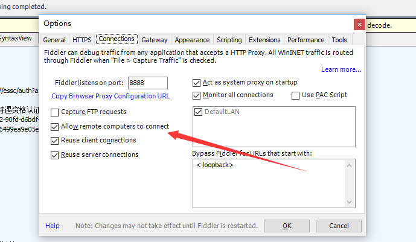
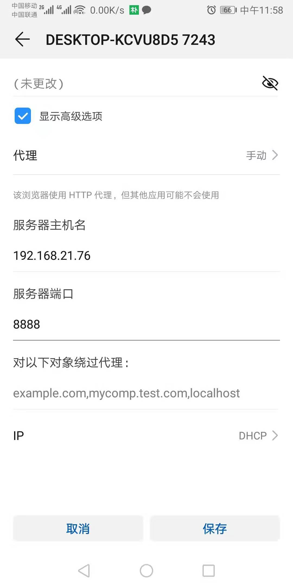

# fiddler(windows推荐)

[参考文档](<http://www.hangge.com/blog/cache/detail_1697.html#>)

## 1. 安装与使用

### 1.1 下载

[下载地址](<https://www.telerik.com/download/fiddler>)

## 1.2 安装

一步步next完成安装

### 1.3 浏览器抓包

我们随便请求一个地址，如www.baidu.com 在fiddler 就可以看到请求情况

## 2. 抓取 iPhone / Android 设备的数据包 

## 2.1 确保手机和电脑在同一个局域网内

## 2.2 开启远程连接代理模式

在tools->options->connections 开启allow remote computers to connect

## 2.3  手机设置代理

选择对应的wifi，设置代理

此时就可以看到手机的请求了

